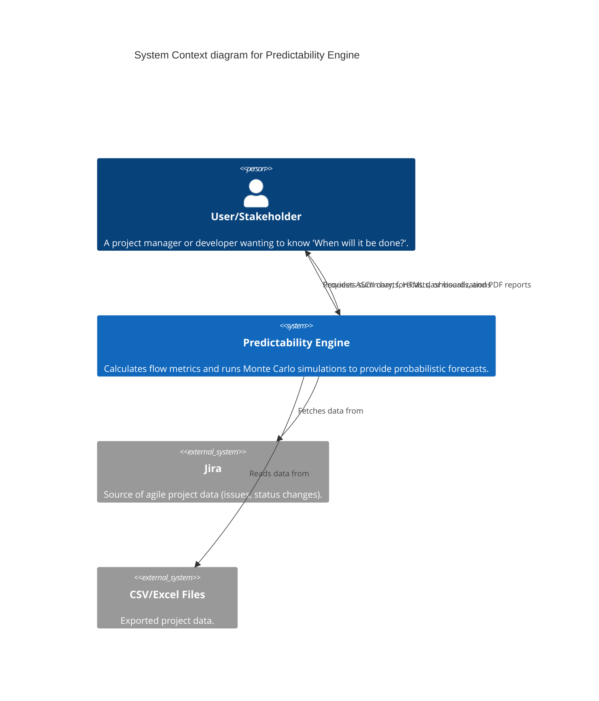
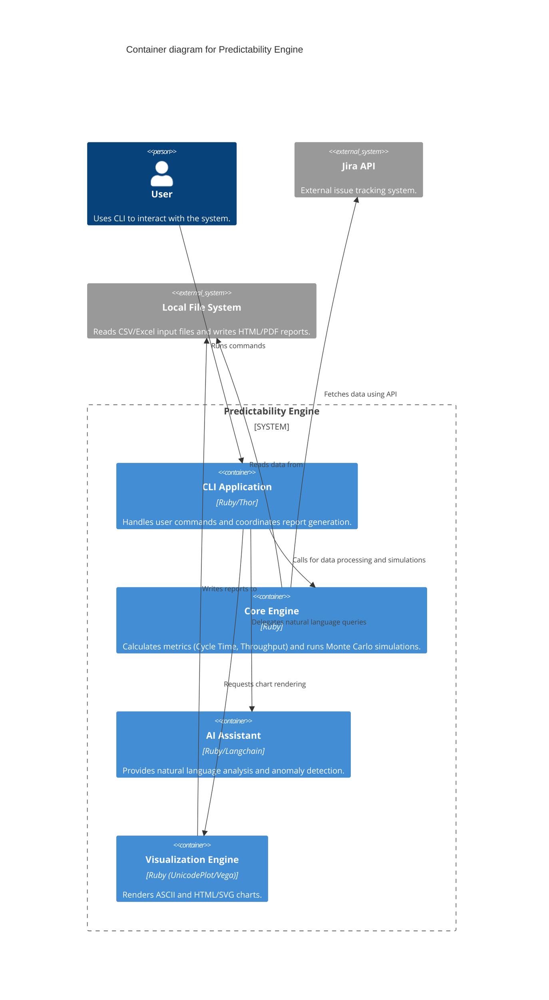

### ARCHITECTURE

#### Overview
The Predictability Engine is a tool designed to answer "When will it be done?" using historical flow metrics and probabilistic forecasting (Monte Carlo simulations).

#### System Context
The engine sits between the project data sources (like Jira or CSV files) and the user who needs to make informed decisions based on data.

#### Containers
The system is structured as a modular Ruby library with a CLI entry point.

#### Components
The **Core Engine** consists of several key components:
- **Models**: `WorkItem` represent the basic units of work.
- **Data Sources**: Strategy pattern for `Csv`, `Excel`, and `Jira` ingestion.
- **Calculators**: Logic for `CycleTime`, `Throughput`, and `Cfd` (Cumulative Flow Diagram).
- **Simulators**: `MonteCarlo` engine for probabilistic forecasting.

#### Patterns & Principles
- **Strategy Pattern**: Used for data ingestion (`DataSource::Base`).
- **Unified Reporting**: A single `Report` class orchestrates multiple visualizers for consistent output across mediums.
- **Clean Architecture**: Separation of concerns between CLI, business logic (Engine), and external integrations.
- **Agentic AI**: ReAct pattern for the AI Assistant to use engine tools for analysis.
