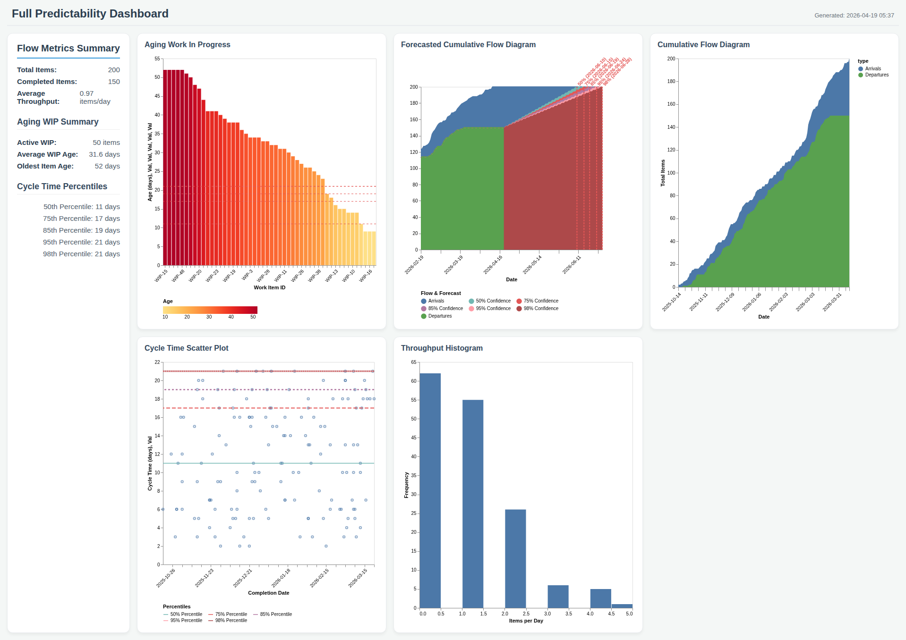

# Predictability Engine 📊

> A turn-key solution for implementing Daniel Vacanti's **Actionable Agile Metrics** and **Monte Carlo Forecasting** methodologies, enhanced with **Agentic AI** for advanced data analysis.

[](https://www.ruby-lang.org/)
[](https://opensource.org/licenses/MIT)
[]()
[]()

The **Predictability Engine** is designed to help teams and organizations move from "when will it be done?" guesses to data-driven probabilistic forecasting. It focuses on leading indicators—specifically **Aging WIP**—to manage flow and improve predictability.

---

## 📖 Table of Contents

- [🚀 Quick Start](#-quick-start)
- [✨ Key Features](#-key-features)
- [📦 Installation](#-installation)
- [📈 Usage](#-usage)
  - [Metrics Summary](#metrics-summary)
  - [Generating Dashboards](#generating-dashboards)
  - [Monte Carlo Forecasting](#monte-carlo-forecasting)
  - [AI-Powered Analysis](#ai-powered-analysis)
- [🔌 Data Integration](#-data-integration)
  - [CSV Files](#csv-files)
  - [JIRA Integration](#jira-integration)
- [🛠️ Development & Testing](#%EF%B8%8F-development--testing)
- [📚 Documentation & Methodology](#-documentation--methodology)
- [📜 License](#-license)

---

## 🚀 Quick Start

Get up and running in minutes:

1.  **Install Dependencies**:
    ```bash
    ./bin/setup
    ```
    This runs `bundle install` and installs Playwright + Chromium (needed for PDF / PNG / PPTX rendering). Set `SKIP_PLAYWRIGHT=1` to skip the browser install on systems where Chromium is already provisioned.
2.  **Setup AI (Optional)**:
    ```bash
    echo "OPENAI_API_KEY=your_key" > .env
    ```
3.  **Run a Summary**:
    ```bash
    ./bin/predictability-engine summary data/samples/sample_data.csv
    ```
4.  **Generate a Dashboard**:
    ```bash
    ./bin/predictability-engine batch data/samples/sample_data.csv
    ```

---

## 🖼️ Showcase

A single `./bin/predictability-engine batch <source>` produces a full responsive dashboard with Aging WIP, Forecasted CFD, Cycle Time Scatter, Throughput, and per-type sub-dashboards — plus matching PDF, PNG, PPTX, Markdown, and Confluence outputs.



---

## ✨ Key Features

- 🕵️ **Leading Indicators**: Prioritizes **Aging WIP** as the primary leading indicator for identifying flow risks before they impact delivery.
- 📉 **Flow Metrics**: Automated calculation of Cycle Time (distribution & percentiles), Throughput (daily & average), and WIP.
- 🎨 **Visualizations**: High-fidelity, responsive HTML dashboards, PDF/PNG/PPTX reports, and ASCII terminal charts.
- 🎲 **Monte Carlo Forecasting**: Probabilistic simulations for "When will it be done?" and "How many items?".
- 🤖 **Agentic AI Assistant**: A ReAct-based AI agent that can analyze your metrics, detect anomalies, and answer natural language questions.
- 🔗 **Multi-Source Support**: Seamlessly integrate with **CSV** files or **JIRA** (using JQL, Filters, or project keys).

---

## 📦 Installation

Add this line to your application's Gemfile:

```ruby
gem 'predictability-engine'
```

And then execute:

```bash
$ bundle install
```

Or install it yourself as:

```bash
$ gem install predictability-engine
```

### 🎭 Playwright Setup
High-fidelity PDF / PNG / PPTX rendering uses Playwright + Chromium. Running `./bin/setup` after a clone installs both automatically (also available via `bundle exec rake setup`). If you need to reinstall only the browser:

```bash
npx playwright install chromium --with-deps
```

---

## 📈 Usage

The engine is built around a single `SOURCE`—which can be a CSV file, a JIRA YAML configuration, or a JIRA project/keyword.

### Metrics Summary
Get a quick snapshot of your flow metrics directly in your terminal:
```bash
./bin/predictability-engine summary SOURCE
```

### Generating Dashboards
Run all report formats (Terminal, HTML, PDF, PNG, Markdown, Confluence, PPTX) at once:
```bash
./bin/predictability-engine batch SOURCE
```
The reports will be saved in a `reports/` subdirectory relative to the `SOURCE` file (e.g., `data/samples/reports/sample_data/`). The HTML dashboard is **responsive** and includes **sub-dashboards** automatically grouped by work item type (e.g., Story, Bug, Task).

### Report Resolution & Sizes
When generating PNG, PDF, or PPTX reports, you can specify the resolution or paper format using the `--size` option. 
- **Paper Formats**: `a0` through `a6` (landscape)
- **Screen Resolutions**: `5k`, `4k`, `hd`
- **Default**: `a4` (1918x1356, standard A4 landscape at 160 DPI approx)

```bash
./bin/predictability-engine viz png SOURCE --size=4k
./bin/predictability-engine viz pdf SOURCE --size=a0
./bin/predictability-engine batch SOURCE --size=hd
```

### Logging
The engine provides a comprehensive logging system. By default, it logs to the console at the `info` level. You can configure the log level and output to a file:
- **Options**: `--log-level` (debug, info, warn, error), `--log-file`
- **File Format**: Machine-readable JSON with log rotation (daily).

```bash
./bin/predictability-engine report SOURCE html --log-level=debug --log-file=engine.log
```

### Monte Carlo Forecasting
Run 10,000 simulations to predict completion for a backlog of X items:
```bash
./bin/predictability-engine forecast SOURCE BACKLOG_COUNT
```

### AI-Powered Analysis
Ask natural language questions about your data:
```bash
./bin/predictability-engine ask_ai SOURCE "When will the next 15 items be done? Are there any anomalies in our flow?"
```

---

## 🔌 Data Integration

### CSV Files
The engine expects a standard CSV with the following headers:
- `id`: Unique identifier for the item.
- `type`: Work item type (e.g., Story, Bug, Task, Improvement). Required for sub-dashboard generation.
- `title`: Short description.
- `start_date`: When work began (YYYY-MM-DD).
- `end_date`: When work finished (YYYY-MM-DD). Use an empty value for items in progress.

### JIRA Integration
The engine supports sophisticated JIRA integration with profile management and JQL/Filter support. It automatically detects start dates from issue changelogs.

See the [JIRA Integration Guide](documentation/jira.md) for detailed setup instructions.

---

## 🛠️ Development & Testing

We maintain high code quality standards using a robust testing suite:

- **BDD/Acceptance**: `bundle exec cucumber` (Using Aruba for CLI verification).
- **Unit Testing**: `bundle exec rspec` (Logic validation).
- **Style Enforcement**: `bundle exec rubocop` (0 offenses target).
- **Duplication Detection**: `npx jscpd .` (Target: < 0.8% duplication).

To run the full validation suite:
```bash
bundle exec rake
```

---

## 📚 Documentation & Methodology

- [Architecture Overview](ARCHITECTURE.md)
- [AI Agent Specifications](AGENT.md)
- [JIRA Integration Details](documentation/jira.md)
- [JIRA Pipeline Documentation](documentation/jira_pipeline.md)

### References
This engine is based on the principles described in:
- **"Actionable Agile Metrics for Predictability"** by Daniel S. Vacanti.
- **"When Will It Be Done?"** by Daniel S. Vacanti.

---

## 📜 License

The gem is available as open source under the terms of the [MIT License](https://opensource.org/licenses/MIT).
