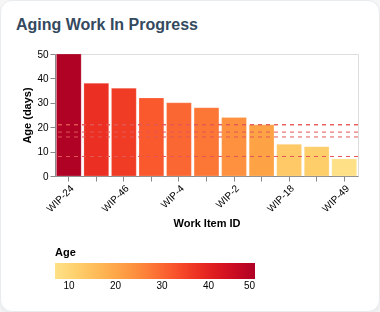
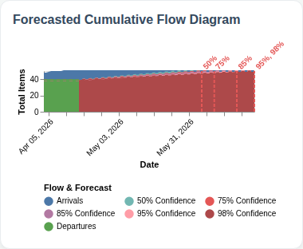
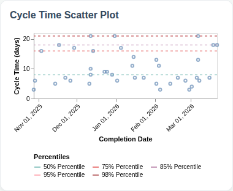
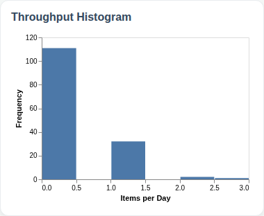

# Full Predictability Dashboard

## Flow Metrics Summary

* **Total Items:** 200
* **Completed Items:** 150
* **Average Throughput:** 0.97 items/day

### Aging WIP Summary

* **Active WIP:** 50 items
* **Average WIP Age:** 29.6 days
* **Oldest Item Age:** 50 days

### Cycle Time Percentiles

* **50th Percentile:** 11 days
* **75th Percentile:** 17 days
* **85th Percentile:** 19 days
* **95th Percentile:** 21 days
* **98th Percentile:** 21 days

## Aging Work In Progress

## Forecasted Cumulative Flow Diagram

## Cycle Time Scatter Plot

## Throughput Histogram
