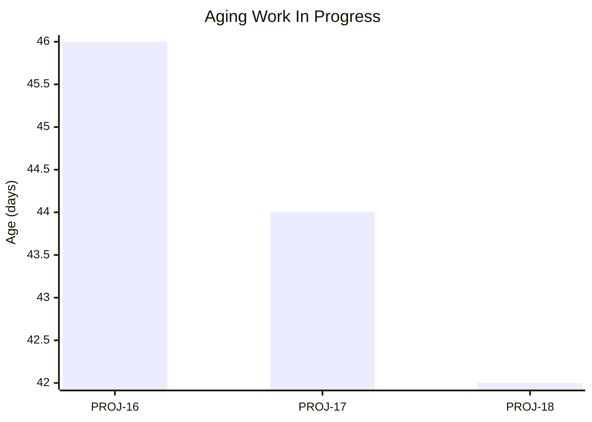
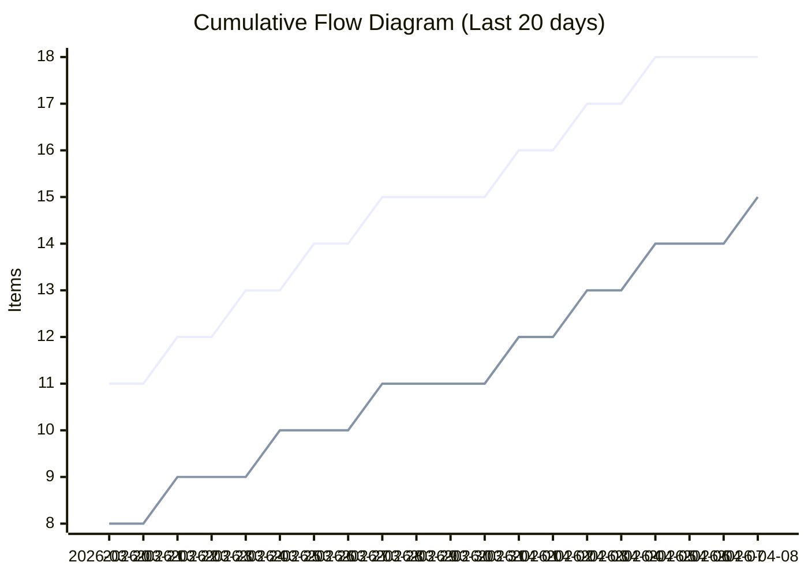
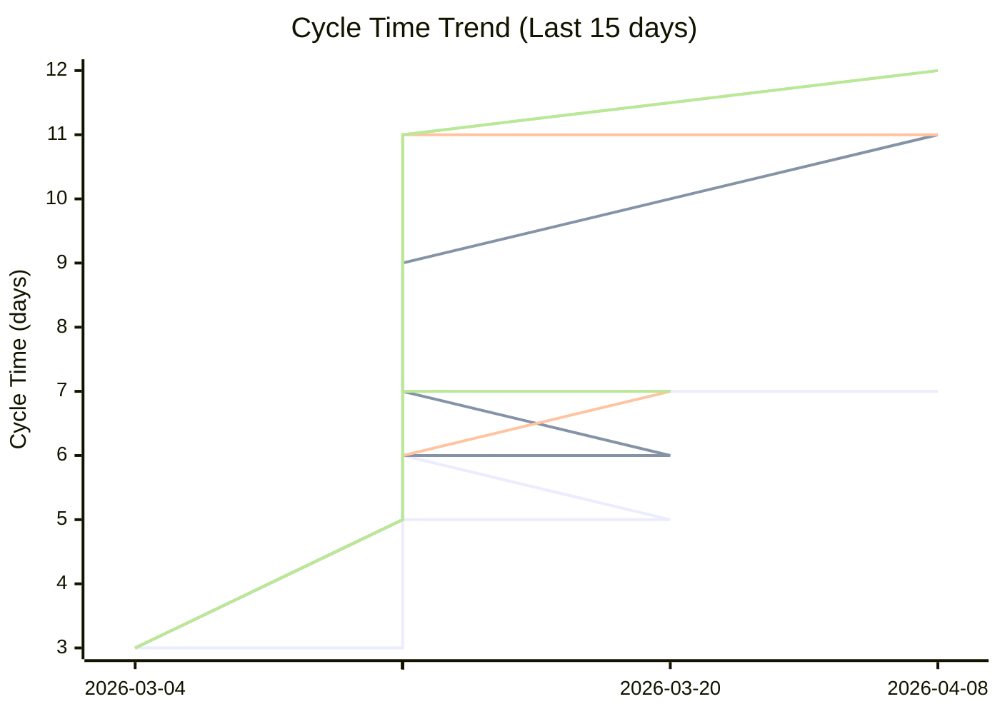
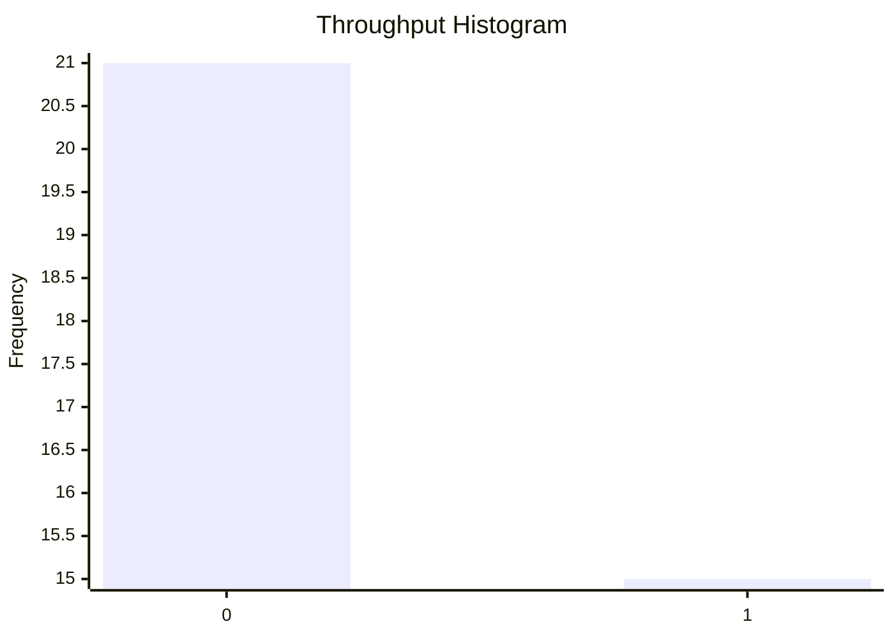

# Full Predictability Dashboard

## Flow Metrics Summary

* **Total Items:** 18
* **Completed Items:** 15
* **Average Throughput:** 0.42 items/day

### Aging WIP Summary

* **Active WIP:** 3 items
* **Average WIP Age:** 44.0 days
* **Oldest Item Age:** 46 days

### Cycle Time Percentiles

* **50th Percentile:** 7 days
* **75th Percentile:** 11 days
* **85th Percentile:** 11 days
* **95th Percentile:** 12 days
* **98th Percentile:** 12 days

## Aging Work In Progress


## Forecasted Cumulative Flow Diagram
```mermaid
xychart-beta
    title "Forecasted Cumulative Flow Diagram"
    x-axis ["2026-03-18", " ", " ", " ", " ", " ", " ", "2026-03-25", " ", " ", " ", " ", " ", " ", "2026-04-01", " ", " ", " ", " ", " ", " ", "2026-04-08", " ", " ", " ", " ", " ", " ", "2026-04-15", " ", " ", " ", " ", " ", " ", "2026-04-22", " ", " ", " ", " ", " ", " ", "2026-04-29", " ", " ", " ", " ", " ", " ", "2026-05-06", " ", " ", " ", " ", " ", " ", "2026-05-13", " ", " ", " ", " ", " ", " ", "2026-05-20", " ", " ", " ", " ", " ", " ", "2026-05-27", " ", " ", " ", " "]
    y-axis "Items"
    line "Arrivals" [10, 10, 11, 11, 12, 12, 13, 13, 14, 14, 15, 15, 15, 15, 16, 16, 17, 17, 18, 18, 18, 18, 18, 18, 18, 18, 18, 18, 18, 18, 18, 18, 18, 18, 18, 18, 18, 18, 18, 18, 18, 18, 18, 18, 18, 18, 18, 18, 18, 18, 18, 18, 18, 18, 18, 18, 18, 18, 18, 18, 18, 18, 18, 18, 18, 18, 18, 18, 18, 18, 18, 18, 18, 18, 18]
    line "Departures" [7, 7, 8, 8, 9, 9, 9, 10, 10, 10, 11, 11, 11, 11, 12, 12, 13, 13, 14, 14, 14, 15, 15, 15, 15, 15, 15, 15, 15, 15, 15, 15, 15, 15, 15, 15, 15, 15, 15, 15, 15, 15, 15, 15, 15, 15, 15, 15, 15, 15, 15, 15, 15, 15, 15, 15, 15, 15, 15, 15, NaN, NaN, NaN, NaN, NaN, NaN, NaN, NaN, NaN, NaN, NaN, NaN, NaN, NaN, NaN]
    line "50% Confidence" [7, 7, 8, 8, 9, 9, 9, 10, 10, 10, 11, 11, 11, 11, 12, 12, 13, 13, 14, 14, 14, 15, 15, 15, 15, 15, 15, 15, 15, 15, 15, 15, 15, 15, 15, 15, 15, 15, 15, 15, 15, 15, 15, 15, 15, 15, 15, 15, 15, 15, 15, 15, 15, 15, 15, 15, 15, 15, 15, 15, 15.428571428571429, 15.857142857142858, 16.285714285714285, 16.714285714285715, 17.142857142857142, 17.57142857142857, 18.0, 18, 18, 18, 18, 18, 18, 18, 18]
    line "50% Deadline" [NaN, NaN, NaN, NaN, NaN, NaN, NaN, NaN, NaN, NaN, NaN, NaN, NaN, NaN, NaN, NaN, NaN, NaN, NaN, NaN, NaN, NaN, NaN, NaN, NaN, NaN, NaN, NaN, NaN, NaN, NaN, NaN, NaN, NaN, NaN, NaN, NaN, NaN, NaN, NaN, NaN, NaN, NaN, NaN, NaN, NaN, NaN, NaN, NaN, NaN, NaN, NaN, NaN, NaN, NaN, NaN, NaN, NaN, NaN, NaN, NaN, NaN, NaN, NaN, NaN, NaN, 18, NaN, NaN, NaN, NaN, NaN, NaN, NaN, NaN]
    line "75% Confidence" [7, 7, 8, 8, 9, 9, 9, 10, 10, 10, 11, 11, 11, 11, 12, 12, 13, 13, 14, 14, 14, 15, 15, 15, 15, 15, 15, 15, 15, 15, 15, 15, 15, 15, 15, 15, 15, 15, 15, 15, 15, 15, 15, 15, 15, 15, 15, 15, 15, 15, 15, 15, 15, 15, 15, 15, 15, 15, 15, 15, 15.333333333333334, 15.666666666666666, 16.0, 16.333333333333332, 16.666666666666668, 17.0, 17.333333333333332, 17.666666666666668, 18.0, 18, 18, 18, 18, 18, 18]
    line "75% Deadline" [NaN, NaN, NaN, NaN, NaN, NaN, NaN, NaN, NaN, NaN, NaN, NaN, NaN, NaN, NaN, NaN, NaN, NaN, NaN, NaN, NaN, NaN, NaN, NaN, NaN, NaN, NaN, NaN, NaN, NaN, NaN, NaN, NaN, NaN, NaN, NaN, NaN, NaN, NaN, NaN, NaN, NaN, NaN, NaN, NaN, NaN, NaN, NaN, NaN, NaN, NaN, NaN, NaN, NaN, NaN, NaN, NaN, NaN, NaN, NaN, NaN, NaN, NaN, NaN, NaN, NaN, NaN, NaN, 18, NaN, NaN, NaN, NaN, NaN, NaN]
    line "85% Confidence" [7, 7, 8, 8, 9, 9, 9, 10, 10, 10, 11, 11, 11, 11, 12, 12, 13, 13, 14, 14, 14, 15, 15, 15, 15, 15, 15, 15, 15, 15, 15, 15, 15, 15, 15, 15, 15, 15, 15, 15, 15, 15, 15, 15, 15, 15, 15, 15, 15, 15, 15, 15, 15, 15, 15, 15, 15, 15, 15, 15, 15.3, 15.6, 15.9, 16.2, 16.5, 16.8, 17.1, 17.4, 17.7, 18.0, 18, 18, 18, 18, 18]
    line "85% Deadline" [NaN, NaN, NaN, NaN, NaN, NaN, NaN, NaN, NaN, NaN, NaN, NaN, NaN, NaN, NaN, NaN, NaN, NaN, NaN, NaN, NaN, NaN, NaN, NaN, NaN, NaN, NaN, NaN, NaN, NaN, NaN, NaN, NaN, NaN, NaN, NaN, NaN, NaN, NaN, NaN, NaN, NaN, NaN, NaN, NaN, NaN, NaN, NaN, NaN, NaN, NaN, NaN, NaN, NaN, NaN, NaN, NaN, NaN, NaN, NaN, NaN, NaN, NaN, NaN, NaN, NaN, NaN, NaN, NaN, 18, NaN, NaN, NaN, NaN, NaN]
    line "95% Confidence" [7, 7, 8, 8, 9, 9, 9, 10, 10, 10, 11, 11, 11, 11, 12, 12, 13, 13, 14, 14, 14, 15, 15, 15, 15, 15, 15, 15, 15, 15, 15, 15, 15, 15, 15, 15, 15, 15, 15, 15, 15, 15, 15, 15, 15, 15, 15, 15, 15, 15, 15, 15, 15, 15, 15, 15, 15, 15, 15, 15, 15.23076923076923, 15.461538461538462, 15.692307692307692, 15.923076923076923, 16.153846153846153, 16.384615384615383, 16.615384615384617, 16.846153846153847, 17.076923076923077, 17.307692307692307, 17.53846153846154, 17.76923076923077, 18.0, 18, 18]
    line "95% Deadline" [NaN, NaN, NaN, NaN, NaN, NaN, NaN, NaN, NaN, NaN, NaN, NaN, NaN, NaN, NaN, NaN, NaN, NaN, NaN, NaN, NaN, NaN, NaN, NaN, NaN, NaN, NaN, NaN, NaN, NaN, NaN, NaN, NaN, NaN, NaN, NaN, NaN, NaN, NaN, NaN, NaN, NaN, NaN, NaN, NaN, NaN, NaN, NaN, NaN, NaN, NaN, NaN, NaN, NaN, NaN, NaN, NaN, NaN, NaN, NaN, NaN, NaN, NaN, NaN, NaN, NaN, NaN, NaN, NaN, NaN, NaN, NaN, 18, NaN, NaN]
    line "98% Confidence" [7, 7, 8, 8, 9, 9, 9, 10, 10, 10, 11, 11, 11, 11, 12, 12, 13, 13, 14, 14, 14, 15, 15, 15, 15, 15, 15, 15, 15, 15, 15, 15, 15, 15, 15, 15, 15, 15, 15, 15, 15, 15, 15, 15, 15, 15, 15, 15, 15, 15, 15, 15, 15, 15, 15, 15, 15, 15, 15, 15, 15.2, 15.4, 15.6, 15.8, 16.0, 16.2, 16.4, 16.6, 16.8, 17.0, 17.2, 17.4, 17.6, 17.8, 18.0]
    line "98% Deadline" [NaN, NaN, NaN, NaN, NaN, NaN, NaN, NaN, NaN, NaN, NaN, NaN, NaN, NaN, NaN, NaN, NaN, NaN, NaN, NaN, NaN, NaN, NaN, NaN, NaN, NaN, NaN, NaN, NaN, NaN, NaN, NaN, NaN, NaN, NaN, NaN, NaN, NaN, NaN, NaN, NaN, NaN, NaN, NaN, NaN, NaN, NaN, NaN, NaN, NaN, NaN, NaN, NaN, NaN, NaN, NaN, NaN, NaN, NaN, NaN, NaN, NaN, NaN, NaN, NaN, NaN, NaN, NaN, NaN, NaN, NaN, NaN, NaN, NaN, 18]
```

**Legend:** Arrivals (blue), Departures (green), Projections (various colors). Vertical lines for: 50%, 75%, 85%, 95%, 98% confidence.

## Cumulative Flow Diagram


## Cycle Time Scatter Plot


## Throughput Histogram


## Cycle Time Bands Over Time
```
                    Cycle Time Bands Over Time
             ┌                                        ┐ 
     ≤ 1 day ┤ 0                                        
    ≤ 7 days ┤■■■■■■■■■■■■■■■■■■■■■■■■■■■■■■■■■■■■■ 9   
   ≤ 14 days ┤■■■■■■■■■■■■■■■■■■■■■■■■■ 6               
   ≤ 21 days ┤ 0                                        
   ≤ 28 days ┤ 0                                        
   > 28 days ┤ 0                                        
             └                                        ┘ 
                          Items Completed

```