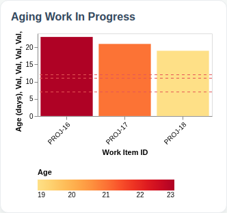
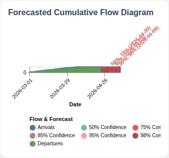
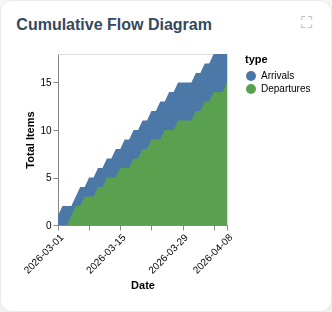
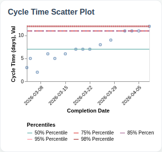
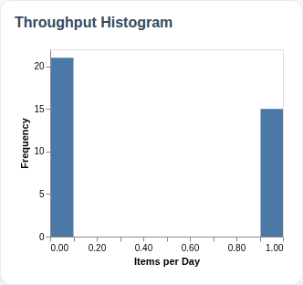

# Full Predictability Dashboard

## Flow Metrics Summary

* **Total Items:** 18
* **Completed Items:** 15
* **Average Throughput:** 0.42 items/day

### Aging WIP Summary

* **Active WIP:** 3 items
* **Average WIP Age:** 21.0 days
* **Oldest Item Age:** 23 days

### Cycle Time Percentiles

* **50th Percentile:** 7 days
* **75th Percentile:** 11 days
* **85th Percentile:** 11 days
* **95th Percentile:** 12 days
* **98th Percentile:** 12 days

## Aging Work In Progress

## Forecasted Cumulative Flow Diagram

## Cumulative Flow Diagram

## Cycle Time Scatter Plot

## Throughput Histogram
