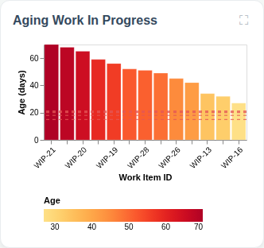
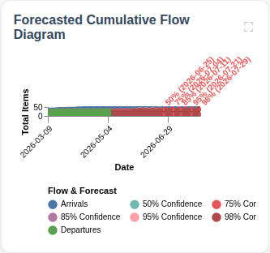
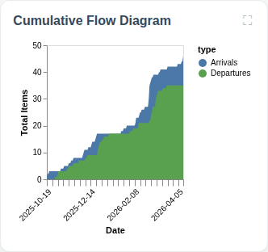
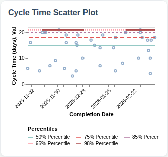
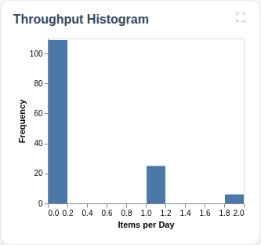
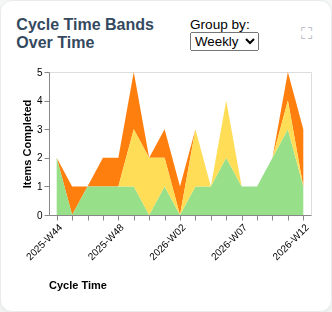

# Full Predictability Dashboard

## Flow Metrics Summary

* **Total Items:** 200
* **Completed Items:** 150
* **Average Throughput:** 0.97 items/day
* **Priority Breakdown:** 
  Highest: 6
  High: 35
  Medium: 68
  Low: 31
  Lowest: 10
* **Type Breakdown:** 
  Improvement: 39
  Story: 37
  Bug: 37
  Task: 37

### Aging WIP Summary

* **Active WIP:** 50 items
* **Average WIP Age:** 49.6 days
* **Oldest Item Age:** 70 days

### Cycle Time Percentiles

* **50th Percentile:** 11 days
* **75th Percentile:** 17 days
* **85th Percentile:** 19 days
* **95th Percentile:** 21 days
* **98th Percentile:** 21 days

## Aging Work In Progress

## Forecasted Cumulative Flow Diagram

## Cumulative Flow Diagram

## Cycle Time Scatter Plot

## Throughput Histogram

## Cycle Time Bands Over Time
