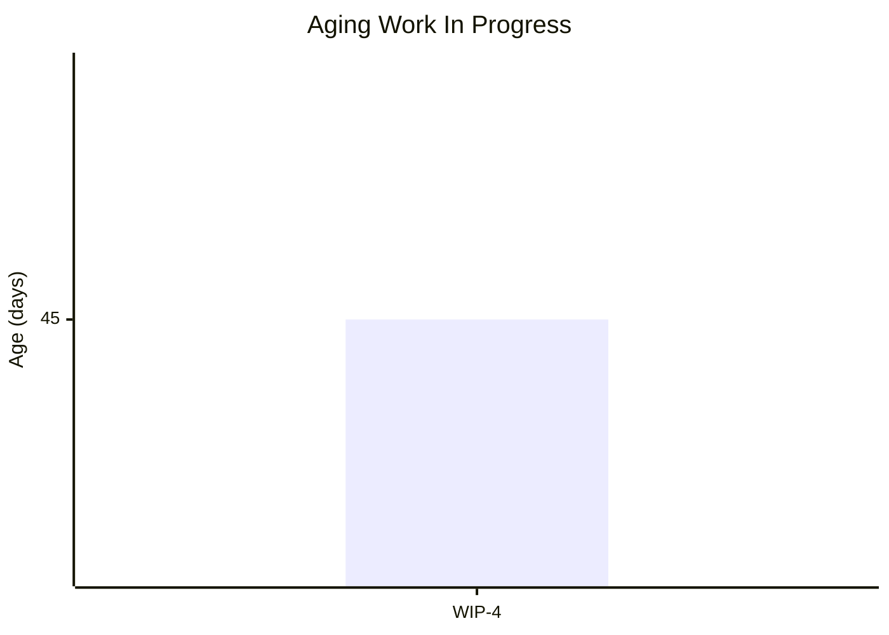
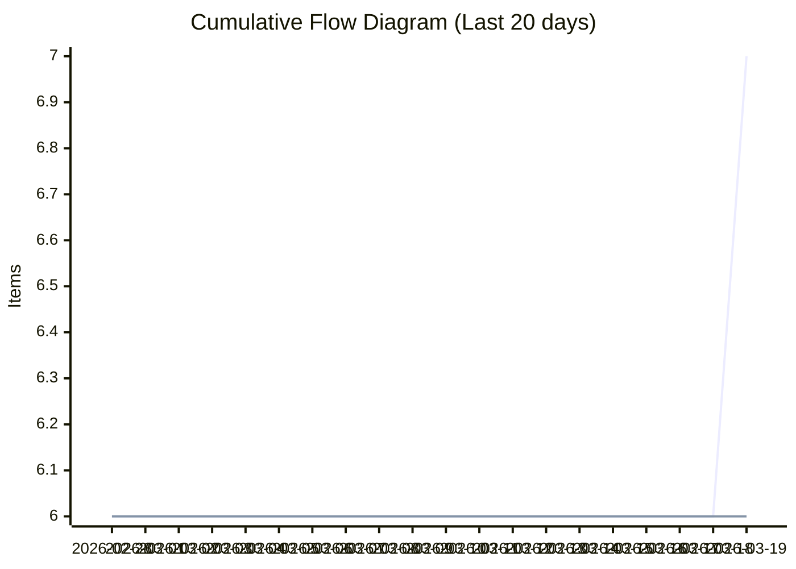
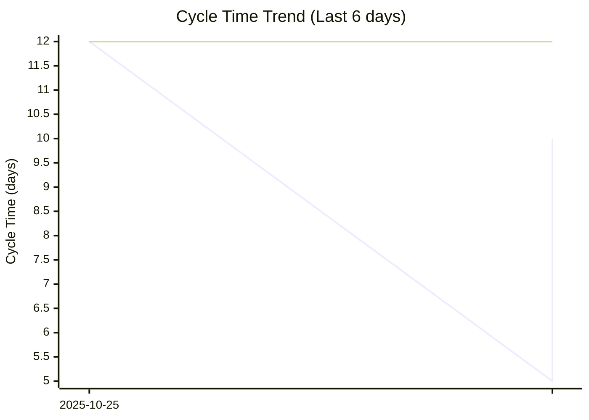
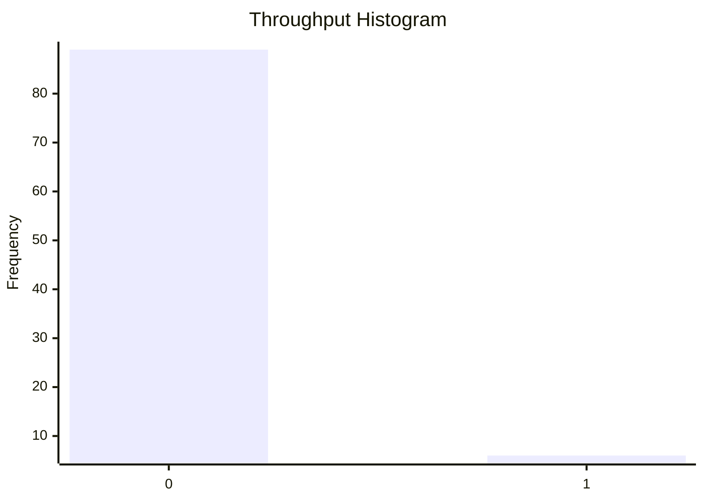

# Dashboard: Highest

## Flow Metrics Summary

* **Total Items:** 7
* **Completed Items:** 6
* **Average Throughput:** 0.06 items/day
* **Type Breakdown:** 
  Bug: 2
  Story: 2
  Task: 1
  Improvement: 1

### Aging WIP Summary

* **Active WIP:** 1 items
* **Average WIP Age:** 45.0 days
* **Oldest Item Age:** 45 days

### Cycle Time Percentiles

* **50th Percentile:** 7 days
* **75th Percentile:** 12 days
* **85th Percentile:** 12 days
* **95th Percentile:** 12 days
* **98th Percentile:** 12 days

## Aging Work In Progress


## Forecasted Cumulative Flow Diagram
```mermaid
xychart-beta
    title "Forecasted Cumulative Flow Diagram"
    x-axis ["2026-03-04", " ", " ", " ", " ", " ", " ", "2026-03-11", " ", " ", " ", " ", " ", " ", "2026-03-18", " ", " ", " ", " ", " ", " ", "2026-03-25", " ", " ", " ", " ", " ", " ", "2026-04-01", " ", " ", " ", " ", " ", " ", "2026-04-08", " ", " ", " ", " ", " ", " ", "2026-04-15", " ", " ", " ", " ", " ", " ", "2026-04-22", " ", " ", " ", " ", " ", " ", "2026-04-29", " ", " ", " ", " ", " ", " ", "2026-05-06", " ", " ", " ", " ", " ", " ", "2026-05-13", " ", " ", " ", " ", " ", " ", "2026-05-20", " ", " ", " ", " ", " ", " ", "2026-05-27", " ", " ", " ", " ", " ", " ", "2026-06-03", " ", " ", " ", " ", " ", " ", "2026-06-10", " ", " ", " ", " ", " ", " ", "2026-06-17", " ", " ", " ", " ", " ", " ", "2026-06-24", " ", " ", " ", " ", " ", " ", "2026-07-01", " "]
    y-axis "Items"
    line "Arrivals" [6, 6, 6, 6, 6, 6, 6, 6, 6, 6, 6, 6, 6, 6, 6, 7, 7, 7, 7, 7, 7, 7, 7, 7, 7, 7, 7, 7, 7, 7, 7, 7, 7, 7, 7, 7, 7, 7, 7, 7, 7, 7, 7, 7, 7, 7, 7, 7, 7, 7, 7, 7, 7, 7, 7, 7, 7, 7, 7, 7, 7, 7, 7, 7, 7, 7, 7, 7, 7, 7, 7, 7, 7, 7, 7, 7, 7, 7, 7, 7, 7, 7, 7, 7, 7, 7, 7, 7, 7, 7, 7, 7, 7, 7, 7, 7, 7, 7, 7, 7, 7, 7, 7, 7, 7, 7, 7, 7, 7, 7, 7, 7, 7, 7, 7, 7, 7, 7, 7, 7, 7]
    line "Departures" [6, 6, 6, 6, 6, 6, 6, 6, 6, 6, 6, 6, 6, 6, 6, 6, 6, 6, 6, 6, 6, 6, 6, 6, 6, 6, 6, 6, 6, 6, 6, 6, 6, 6, 6, 6, 6, 6, 6, 6, 6, 6, 6, 6, 6, 6, 6, 6, 6, 6, 6, 6, 6, 6, 6, 6, 6, 6, 6, 6, NaN, NaN, NaN, NaN, NaN, NaN, NaN, NaN, NaN, NaN, NaN, NaN, NaN, NaN, NaN, NaN, NaN, NaN, NaN, NaN, NaN, NaN, NaN, NaN, NaN, NaN, NaN, NaN, NaN, NaN, NaN, NaN, NaN, NaN, NaN, NaN, NaN, NaN, NaN, NaN, NaN, NaN, NaN, NaN, NaN, NaN, NaN, NaN, NaN, NaN, NaN, NaN, NaN, NaN, NaN, NaN, NaN, NaN, NaN, NaN, NaN]
    line "50% Confidence" [6, 6, 6, 6, 6, 6, 6, 6, 6, 6, 6, 6, 6, 6, 6, 6, 6, 6, 6, 6, 6, 6, 6, 6, 6, 6, 6, 6, 6, 6, 6, 6, 6, 6, 6, 6, 6, 6, 6, 6, 6, 6, 6, 6, 6, 6, 6, 6, 6, 6, 6, 6, 6, 6, 6, 6, 6, 6, 6, 6, 6.090909090909091, 6.181818181818182, 6.2727272727272725, 6.363636363636363, 6.454545454545455, 6.545454545454545, 6.636363636363637, 6.7272727272727275, 6.818181818181818, 6.909090909090909, 7.0, 7, 7, 7, 7, 7, 7, 7, 7, 7, 7, 7, 7, 7, 7, 7, 7, 7, 7, 7, 7, 7, 7, 7, 7, 7, 7, 7, 7, 7, 7, 7, 7, 7, 7, 7, 7, 7, 7, 7, 7, 7, 7, 7, 7, 7, 7, 7, 7, 7, 7]
    line "50% Deadline" [NaN, NaN, NaN, NaN, NaN, NaN, NaN, NaN, NaN, NaN, NaN, NaN, NaN, NaN, NaN, NaN, NaN, NaN, NaN, NaN, NaN, NaN, NaN, NaN, NaN, NaN, NaN, NaN, NaN, NaN, NaN, NaN, NaN, NaN, NaN, NaN, NaN, NaN, NaN, NaN, NaN, NaN, NaN, NaN, NaN, NaN, NaN, NaN, NaN, NaN, NaN, NaN, NaN, NaN, NaN, NaN, NaN, NaN, NaN, NaN, NaN, NaN, NaN, NaN, NaN, NaN, NaN, NaN, NaN, NaN, 7, NaN, NaN, NaN, NaN, NaN, NaN, NaN, NaN, NaN, NaN, NaN, NaN, NaN, NaN, NaN, NaN, NaN, NaN, NaN, NaN, NaN, NaN, NaN, NaN, NaN, NaN, NaN, NaN, NaN, NaN, NaN, NaN, NaN, NaN, NaN, NaN, NaN, NaN, NaN, NaN, NaN, NaN, NaN, NaN, NaN, NaN, NaN, NaN, NaN, NaN]
    line "75% Confidence" [6, 6, 6, 6, 6, 6, 6, 6, 6, 6, 6, 6, 6, 6, 6, 6, 6, 6, 6, 6, 6, 6, 6, 6, 6, 6, 6, 6, 6, 6, 6, 6, 6, 6, 6, 6, 6, 6, 6, 6, 6, 6, 6, 6, 6, 6, 6, 6, 6, 6, 6, 6, 6, 6, 6, 6, 6, 6, 6, 6, 6.045454545454546, 6.090909090909091, 6.136363636363637, 6.181818181818182, 6.2272727272727275, 6.2727272727272725, 6.318181818181818, 6.363636363636363, 6.409090909090909, 6.454545454545455, 6.5, 6.545454545454545, 6.590909090909091, 6.636363636363637, 6.681818181818182, 6.7272727272727275, 6.7727272727272725, 6.818181818181818, 6.863636363636363, 6.909090909090909, 6.954545454545455, 7.0, 7, 7, 7, 7, 7, 7, 7, 7, 7, 7, 7, 7, 7, 7, 7, 7, 7, 7, 7, 7, 7, 7, 7, 7, 7, 7, 7, 7, 7, 7, 7, 7, 7, 7, 7, 7, 7, 7, 7]
    line "75% Deadline" [NaN, NaN, NaN, NaN, NaN, NaN, NaN, NaN, NaN, NaN, NaN, NaN, NaN, NaN, NaN, NaN, NaN, NaN, NaN, NaN, NaN, NaN, NaN, NaN, NaN, NaN, NaN, NaN, NaN, NaN, NaN, NaN, NaN, NaN, NaN, NaN, NaN, NaN, NaN, NaN, NaN, NaN, NaN, NaN, NaN, NaN, NaN, NaN, NaN, NaN, NaN, NaN, NaN, NaN, NaN, NaN, NaN, NaN, NaN, NaN, NaN, NaN, NaN, NaN, NaN, NaN, NaN, NaN, NaN, NaN, NaN, NaN, NaN, NaN, NaN, NaN, NaN, NaN, NaN, NaN, NaN, 7, NaN, NaN, NaN, NaN, NaN, NaN, NaN, NaN, NaN, NaN, NaN, NaN, NaN, NaN, NaN, NaN, NaN, NaN, NaN, NaN, NaN, NaN, NaN, NaN, NaN, NaN, NaN, NaN, NaN, NaN, NaN, NaN, NaN, NaN, NaN, NaN, NaN, NaN, NaN]
    line "85% Confidence" [6, 6, 6, 6, 6, 6, 6, 6, 6, 6, 6, 6, 6, 6, 6, 6, 6, 6, 6, 6, 6, 6, 6, 6, 6, 6, 6, 6, 6, 6, 6, 6, 6, 6, 6, 6, 6, 6, 6, 6, 6, 6, 6, 6, 6, 6, 6, 6, 6, 6, 6, 6, 6, 6, 6, 6, 6, 6, 6, 6, 6.0344827586206895, 6.068965517241379, 6.103448275862069, 6.137931034482759, 6.172413793103448, 6.206896551724138, 6.241379310344827, 6.275862068965517, 6.310344827586207, 6.344827586206897, 6.379310344827586, 6.413793103448276, 6.448275862068965, 6.482758620689655, 6.517241379310345, 6.551724137931035, 6.586206896551724, 6.620689655172414, 6.655172413793103, 6.689655172413794, 6.724137931034483, 6.758620689655173, 6.793103448275862, 6.827586206896552, 6.862068965517241, 6.896551724137931, 6.931034482758621, 6.9655172413793105, 7.0, 7, 7, 7, 7, 7, 7, 7, 7, 7, 7, 7, 7, 7, 7, 7, 7, 7, 7, 7, 7, 7, 7, 7, 7, 7, 7, 7, 7, 7, 7, 7, 7]
    line "85% Deadline" [NaN, NaN, NaN, NaN, NaN, NaN, NaN, NaN, NaN, NaN, NaN, NaN, NaN, NaN, NaN, NaN, NaN, NaN, NaN, NaN, NaN, NaN, NaN, NaN, NaN, NaN, NaN, NaN, NaN, NaN, NaN, NaN, NaN, NaN, NaN, NaN, NaN, NaN, NaN, NaN, NaN, NaN, NaN, NaN, NaN, NaN, NaN, NaN, NaN, NaN, NaN, NaN, NaN, NaN, NaN, NaN, NaN, NaN, NaN, NaN, NaN, NaN, NaN, NaN, NaN, NaN, NaN, NaN, NaN, NaN, NaN, NaN, NaN, NaN, NaN, NaN, NaN, NaN, NaN, NaN, NaN, NaN, NaN, NaN, NaN, NaN, NaN, NaN, 7, NaN, NaN, NaN, NaN, NaN, NaN, NaN, NaN, NaN, NaN, NaN, NaN, NaN, NaN, NaN, NaN, NaN, NaN, NaN, NaN, NaN, NaN, NaN, NaN, NaN, NaN, NaN, NaN, NaN, NaN, NaN, NaN]
    line "95% Confidence" [6, 6, 6, 6, 6, 6, 6, 6, 6, 6, 6, 6, 6, 6, 6, 6, 6, 6, 6, 6, 6, 6, 6, 6, 6, 6, 6, 6, 6, 6, 6, 6, 6, 6, 6, 6, 6, 6, 6, 6, 6, 6, 6, 6, 6, 6, 6, 6, 6, 6, 6, 6, 6, 6, 6, 6, 6, 6, 6, 6, 6.021739130434782, 6.043478260869565, 6.065217391304348, 6.086956521739131, 6.108695652173913, 6.130434782608695, 6.1521739130434785, 6.173913043478261, 6.195652173913043, 6.217391304347826, 6.239130434782608, 6.260869565217392, 6.282608695652174, 6.304347826086957, 6.326086956521739, 6.3478260869565215, 6.369565217391305, 6.391304347826087, 6.413043478260869, 6.434782608695652, 6.456521739130435, 6.478260869565218, 6.5, 6.521739130434782, 6.543478260869565, 6.565217391304348, 6.586956521739131, 6.608695652173913, 6.630434782608695, 6.6521739130434785, 6.673913043478261, 6.695652173913043, 6.717391304347826, 6.739130434782608, 6.760869565217392, 6.782608695652174, 6.804347826086957, 6.826086956521739, 6.8478260869565215, 6.869565217391305, 6.891304347826087, 6.913043478260869, 6.934782608695652, 6.956521739130435, 6.978260869565218, 7.0, 7, 7, 7, 7, 7, 7, 7, 7, 7, 7, 7, 7, 7, 7, 7]
    line "95% Deadline" [NaN, NaN, NaN, NaN, NaN, NaN, NaN, NaN, NaN, NaN, NaN, NaN, NaN, NaN, NaN, NaN, NaN, NaN, NaN, NaN, NaN, NaN, NaN, NaN, NaN, NaN, NaN, NaN, NaN, NaN, NaN, NaN, NaN, NaN, NaN, NaN, NaN, NaN, NaN, NaN, NaN, NaN, NaN, NaN, NaN, NaN, NaN, NaN, NaN, NaN, NaN, NaN, NaN, NaN, NaN, NaN, NaN, NaN, NaN, NaN, NaN, NaN, NaN, NaN, NaN, NaN, NaN, NaN, NaN, NaN, NaN, NaN, NaN, NaN, NaN, NaN, NaN, NaN, NaN, NaN, NaN, NaN, NaN, NaN, NaN, NaN, NaN, NaN, NaN, NaN, NaN, NaN, NaN, NaN, NaN, NaN, NaN, NaN, NaN, NaN, NaN, NaN, NaN, NaN, NaN, 7, NaN, NaN, NaN, NaN, NaN, NaN, NaN, NaN, NaN, NaN, NaN, NaN, NaN, NaN, NaN]
    line "98% Confidence" [6, 6, 6, 6, 6, 6, 6, 6, 6, 6, 6, 6, 6, 6, 6, 6, 6, 6, 6, 6, 6, 6, 6, 6, 6, 6, 6, 6, 6, 6, 6, 6, 6, 6, 6, 6, 6, 6, 6, 6, 6, 6, 6, 6, 6, 6, 6, 6, 6, 6, 6, 6, 6, 6, 6, 6, 6, 6, 6, 6, 6.016393442622951, 6.032786885245901, 6.049180327868853, 6.065573770491803, 6.081967213114754, 6.098360655737705, 6.114754098360656, 6.131147540983607, 6.147540983606557, 6.163934426229508, 6.180327868852459, 6.19672131147541, 6.213114754098361, 6.229508196721311, 6.245901639344262, 6.262295081967213, 6.278688524590164, 6.295081967213115, 6.311475409836065, 6.327868852459017, 6.344262295081967, 6.360655737704918, 6.377049180327869, 6.39344262295082, 6.409836065573771, 6.426229508196721, 6.442622950819672, 6.459016393442623, 6.475409836065574, 6.491803278688525, 6.508196721311475, 6.524590163934426, 6.540983606557377, 6.557377049180328, 6.573770491803279, 6.590163934426229, 6.60655737704918, 6.622950819672131, 6.639344262295082, 6.655737704918033, 6.672131147540984, 6.688524590163935, 6.704918032786885, 6.721311475409836, 6.737704918032787, 6.754098360655738, 6.770491803278689, 6.786885245901639, 6.80327868852459, 6.8196721311475414, 6.836065573770492, 6.852459016393443, 6.868852459016393, 6.885245901639344, 6.901639344262295, 6.918032786885246, 6.934426229508197, 6.950819672131147, 6.967213114754099, 6.983606557377049, 7.0]
    line "98% Deadline" [NaN, NaN, NaN, NaN, NaN, NaN, NaN, NaN, NaN, NaN, NaN, NaN, NaN, NaN, NaN, NaN, NaN, NaN, NaN, NaN, NaN, NaN, NaN, NaN, NaN, NaN, NaN, NaN, NaN, NaN, NaN, NaN, NaN, NaN, NaN, NaN, NaN, NaN, NaN, NaN, NaN, NaN, NaN, NaN, NaN, NaN, NaN, NaN, NaN, NaN, NaN, NaN, NaN, NaN, NaN, NaN, NaN, NaN, NaN, NaN, NaN, NaN, NaN, NaN, NaN, NaN, NaN, NaN, NaN, NaN, NaN, NaN, NaN, NaN, NaN, NaN, NaN, NaN, NaN, NaN, NaN, NaN, NaN, NaN, NaN, NaN, NaN, NaN, NaN, NaN, NaN, NaN, NaN, NaN, NaN, NaN, NaN, NaN, NaN, NaN, NaN, NaN, NaN, NaN, NaN, NaN, NaN, NaN, NaN, NaN, NaN, NaN, NaN, NaN, NaN, NaN, NaN, NaN, NaN, NaN, 7]
```

**Legend:** Arrivals (blue), Departures (green), Projections (various colors). Vertical lines for: 50%, 75%, 85%, 95%, 98% confidence.

## Cumulative Flow Diagram


## Cycle Time Scatter Plot


## Throughput Histogram
