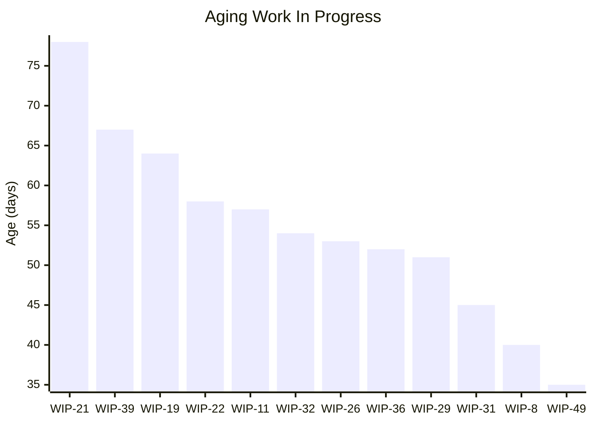
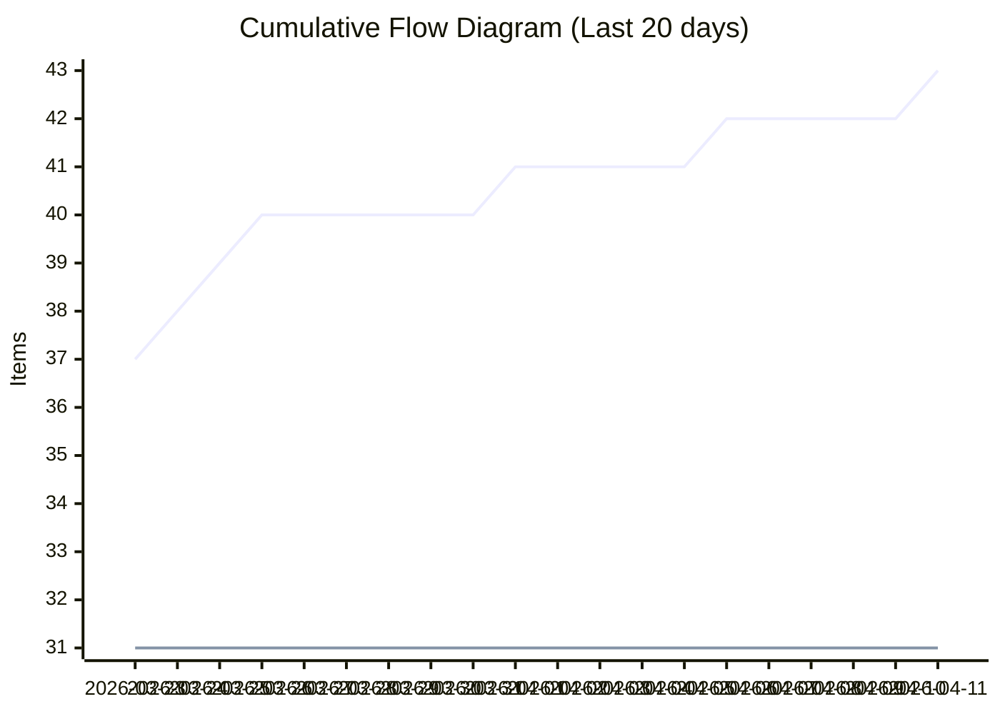
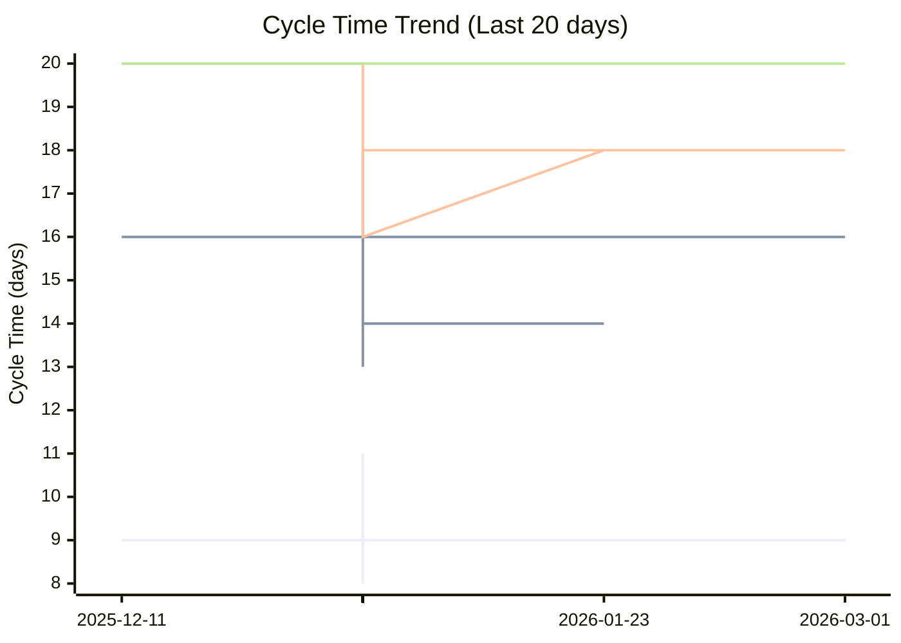
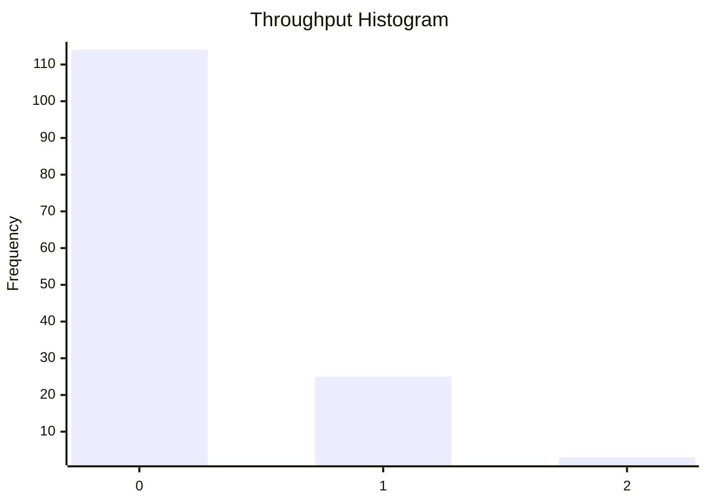

# Dashboard: Low

## Flow Metrics Summary

* **Total Items:** 43
* **Completed Items:** 31
* **Average Throughput:** 0.22 items/day
* **Type Breakdown:** 
  Improvement: 9
  Task: 8
  Bug: 8
  Story: 6

### Aging WIP Summary

* **Active WIP:** 12 items
* **Average WIP Age:** 54.5 days
* **Oldest Item Age:** 78 days

### Cycle Time Percentiles

* **50th Percentile:** 11 days
* **75th Percentile:** 18 days
* **85th Percentile:** 18 days
* **95th Percentile:** 20 days
* **98th Percentile:** 20 days

## Aging Work In Progress


## Forecasted Cumulative Flow Diagram
```mermaid
xychart-beta
    title "Forecasted Cumulative Flow Diagram"
    x-axis ["2026-03-17", " ", " ", " ", " ", " ", " ", "2026-03-24", " ", " ", " ", " ", " ", " ", "2026-03-31", " ", " ", " ", " ", " ", " ", "2026-04-07", " ", " ", " ", " ", " ", " ", "2026-04-14", " ", " ", " ", " ", " ", " ", "2026-04-21", " ", " ", " ", " ", " ", " ", "2026-04-28", " ", " ", " ", " ", " ", " ", "2026-05-05", " ", " ", " ", " ", " ", " ", "2026-05-12", " ", " ", " ", " ", " ", " ", "2026-05-19", " ", " ", " ", " ", " ", " ", "2026-05-26", " ", " ", " ", " ", " ", " ", "2026-06-02", " ", " ", " ", " ", " ", " ", "2026-06-09", " ", " ", " ", " ", " ", " ", "2026-06-16", " ", " ", " ", " ", " ", " ", "2026-06-23", " ", " ", " ", " ", " ", " ", "2026-06-30", " ", " ", " ", " ", " ", " ", "2026-07-07", " ", " ", " ", " ", " ", " ", "2026-07-14", " ", " ", " ", " ", " ", " ", "2026-07-21", " ", " ", " ", " ", " ", " ", "2026-07-28", " ", " ", " ", " ", " ", " ", "2026-08-04", " ", " ", " ", " ", " ", " ", "2026-08-11", " ", " ", " ", " ", " "]
    y-axis "Items"
    line "Arrivals" [34, 34, 35, 36, 36, 36, 37, 38, 39, 40, 40, 40, 40, 40, 40, 41, 41, 41, 41, 41, 42, 42, 42, 42, 42, 43, 43, 43, 43, 43, 43, 43, 43, 43, 43, 43, 43, 43, 43, 43, 43, 43, 43, 43, 43, 43, 43, 43, 43, 43, 43, 43, 43, 43, 43, 43, 43, 43, 43, 43, 43, 43, 43, 43, 43, 43, 43, 43, 43, 43, 43, 43, 43, 43, 43, 43, 43, 43, 43, 43, 43, 43, 43, 43, 43, 43, 43, 43, 43, 43, 43, 43, 43, 43, 43, 43, 43, 43, 43, 43, 43, 43, 43, 43, 43, 43, 43, 43, 43, 43, 43, 43, 43, 43, 43, 43, 43, 43, 43, 43, 43, 43, 43, 43, 43, 43, 43, 43, 43, 43, 43, 43, 43, 43, 43, 43, 43, 43, 43, 43, 43, 43, 43, 43, 43, 43, 43, 43, 43, 43, 43, 43, 43]
    line "Departures" [30, 30, 30, 30, 30, 31, 31, 31, 31, 31, 31, 31, 31, 31, 31, 31, 31, 31, 31, 31, 31, 31, 31, 31, 31, 31, 31, 31, 31, 31, 31, 31, 31, 31, 31, 31, 31, 31, 31, 31, 31, 31, 31, 31, 31, 31, 31, 31, 31, 31, 31, 31, 31, 31, 31, 31, 31, 31, 31, 31, NaN, NaN, NaN, NaN, NaN, NaN, NaN, NaN, NaN, NaN, NaN, NaN, NaN, NaN, NaN, NaN, NaN, NaN, NaN, NaN, NaN, NaN, NaN, NaN, NaN, NaN, NaN, NaN, NaN, NaN, NaN, NaN, NaN, NaN, NaN, NaN, NaN, NaN, NaN, NaN, NaN, NaN, NaN, NaN, NaN, NaN, NaN, NaN, NaN, NaN, NaN, NaN, NaN, NaN, NaN, NaN, NaN, NaN, NaN, NaN, NaN, NaN, NaN, NaN, NaN, NaN, NaN, NaN, NaN, NaN, NaN, NaN, NaN, NaN, NaN, NaN, NaN, NaN, NaN, NaN, NaN, NaN, NaN, NaN, NaN, NaN, NaN, NaN, NaN, NaN, NaN, NaN, NaN]
    line "50% Confidence" [30, 30, 30, 30, 30, 31, 31, 31, 31, 31, 31, 31, 31, 31, 31, 31, 31, 31, 31, 31, 31, 31, 31, 31, 31, 31, 31, 31, 31, 31, 31, 31, 31, 31, 31, 31, 31, 31, 31, 31, 31, 31, 31, 31, 31, 31, 31, 31, 31, 31, 31, 31, 31, 31, 31, 31, 31, 31, 31, 31, 31.22222222222222, 31.444444444444443, 31.666666666666668, 31.88888888888889, 32.111111111111114, 32.333333333333336, 32.55555555555556, 32.77777777777778, 33.0, 33.22222222222222, 33.44444444444444, 33.666666666666664, 33.888888888888886, 34.111111111111114, 34.333333333333336, 34.55555555555556, 34.77777777777778, 35.0, 35.22222222222222, 35.44444444444444, 35.666666666666664, 35.888888888888886, 36.111111111111114, 36.333333333333336, 36.55555555555556, 36.77777777777778, 37.0, 37.22222222222222, 37.44444444444444, 37.666666666666664, 37.888888888888886, 38.111111111111114, 38.333333333333336, 38.55555555555556, 38.77777777777778, 39.0, 39.22222222222222, 39.44444444444444, 39.666666666666664, 39.888888888888886, 40.111111111111114, 40.33333333333333, 40.55555555555556, 40.77777777777778, 41.0, 41.22222222222222, 41.44444444444444, 41.666666666666664, 41.888888888888886, 42.111111111111114, 42.33333333333333, 42.55555555555556, 42.77777777777778, 43.0, 43, 43, 43, 43, 43, 43, 43, 43, 43, 43, 43, 43, 43, 43, 43, 43, 43, 43, 43, 43, 43, 43, 43, 43, 43, 43, 43, 43, 43, 43, 43, 43, 43, 43, 43, 43, 43, 43, 43]
    line "50% Deadline" [NaN, NaN, NaN, NaN, NaN, NaN, NaN, NaN, NaN, NaN, NaN, NaN, NaN, NaN, NaN, NaN, NaN, NaN, NaN, NaN, NaN, NaN, NaN, NaN, NaN, NaN, NaN, NaN, NaN, NaN, NaN, NaN, NaN, NaN, NaN, NaN, NaN, NaN, NaN, NaN, NaN, NaN, NaN, NaN, NaN, NaN, NaN, NaN, NaN, NaN, NaN, NaN, NaN, NaN, NaN, NaN, NaN, NaN, NaN, NaN, NaN, NaN, NaN, NaN, NaN, NaN, NaN, NaN, NaN, NaN, NaN, NaN, NaN, NaN, NaN, NaN, NaN, NaN, NaN, NaN, NaN, NaN, NaN, NaN, NaN, NaN, NaN, NaN, NaN, NaN, NaN, NaN, NaN, NaN, NaN, NaN, NaN, NaN, NaN, NaN, NaN, NaN, NaN, NaN, NaN, NaN, NaN, NaN, NaN, NaN, NaN, NaN, NaN, 43, NaN, NaN, NaN, NaN, NaN, NaN, NaN, NaN, NaN, NaN, NaN, NaN, NaN, NaN, NaN, NaN, NaN, NaN, NaN, NaN, NaN, NaN, NaN, NaN, NaN, NaN, NaN, NaN, NaN, NaN, NaN, NaN, NaN, NaN, NaN, NaN, NaN, NaN, NaN]
    line "75% Confidence" [30, 30, 30, 30, 30, 31, 31, 31, 31, 31, 31, 31, 31, 31, 31, 31, 31, 31, 31, 31, 31, 31, 31, 31, 31, 31, 31, 31, 31, 31, 31, 31, 31, 31, 31, 31, 31, 31, 31, 31, 31, 31, 31, 31, 31, 31, 31, 31, 31, 31, 31, 31, 31, 31, 31, 31, 31, 31, 31, 31, 31.184615384615384, 31.369230769230768, 31.553846153846155, 31.73846153846154, 31.923076923076923, 32.10769230769231, 32.292307692307695, 32.47692307692308, 32.66153846153846, 32.84615384615385, 33.03076923076923, 33.215384615384615, 33.4, 33.58461538461538, 33.76923076923077, 33.95384615384616, 34.13846153846154, 34.323076923076925, 34.50769230769231, 34.69230769230769, 34.87692307692308, 35.06153846153846, 35.246153846153845, 35.43076923076923, 35.61538461538461, 35.8, 35.98461538461538, 36.16923076923077, 36.353846153846156, 36.53846153846154, 36.723076923076924, 36.90769230769231, 37.09230769230769, 37.276923076923076, 37.46153846153846, 37.646153846153844, 37.830769230769235, 38.01538461538462, 38.2, 38.38461538461539, 38.56923076923077, 38.753846153846155, 38.93846153846154, 39.12307692307692, 39.30769230769231, 39.49230769230769, 39.676923076923075, 39.86153846153846, 40.04615384615384, 40.23076923076923, 40.41538461538462, 40.6, 40.784615384615385, 40.96923076923077, 41.15384615384615, 41.33846153846154, 41.52307692307692, 41.70769230769231, 41.892307692307696, 42.07692307692308, 42.261538461538464, 42.44615384615385, 42.63076923076923, 42.815384615384616, 43.0, 43, 43, 43, 43, 43, 43, 43, 43, 43, 43, 43, 43, 43, 43, 43, 43, 43, 43, 43, 43, 43, 43, 43, 43, 43, 43, 43, 43]
    line "75% Deadline" [NaN, NaN, NaN, NaN, NaN, NaN, NaN, NaN, NaN, NaN, NaN, NaN, NaN, NaN, NaN, NaN, NaN, NaN, NaN, NaN, NaN, NaN, NaN, NaN, NaN, NaN, NaN, NaN, NaN, NaN, NaN, NaN, NaN, NaN, NaN, NaN, NaN, NaN, NaN, NaN, NaN, NaN, NaN, NaN, NaN, NaN, NaN, NaN, NaN, NaN, NaN, NaN, NaN, NaN, NaN, NaN, NaN, NaN, NaN, NaN, NaN, NaN, NaN, NaN, NaN, NaN, NaN, NaN, NaN, NaN, NaN, NaN, NaN, NaN, NaN, NaN, NaN, NaN, NaN, NaN, NaN, NaN, NaN, NaN, NaN, NaN, NaN, NaN, NaN, NaN, NaN, NaN, NaN, NaN, NaN, NaN, NaN, NaN, NaN, NaN, NaN, NaN, NaN, NaN, NaN, NaN, NaN, NaN, NaN, NaN, NaN, NaN, NaN, NaN, NaN, NaN, NaN, NaN, NaN, NaN, NaN, NaN, NaN, NaN, 43, NaN, NaN, NaN, NaN, NaN, NaN, NaN, NaN, NaN, NaN, NaN, NaN, NaN, NaN, NaN, NaN, NaN, NaN, NaN, NaN, NaN, NaN, NaN, NaN, NaN, NaN, NaN, NaN]
    line "85% Confidence" [30, 30, 30, 30, 30, 31, 31, 31, 31, 31, 31, 31, 31, 31, 31, 31, 31, 31, 31, 31, 31, 31, 31, 31, 31, 31, 31, 31, 31, 31, 31, 31, 31, 31, 31, 31, 31, 31, 31, 31, 31, 31, 31, 31, 31, 31, 31, 31, 31, 31, 31, 31, 31, 31, 31, 31, 31, 31, 31, 31, 31.166666666666668, 31.333333333333332, 31.5, 31.666666666666668, 31.833333333333332, 32.0, 32.166666666666664, 32.333333333333336, 32.5, 32.666666666666664, 32.833333333333336, 33.0, 33.166666666666664, 33.333333333333336, 33.5, 33.666666666666664, 33.833333333333336, 34.0, 34.166666666666664, 34.333333333333336, 34.5, 34.666666666666664, 34.833333333333336, 35.0, 35.166666666666664, 35.333333333333336, 35.5, 35.666666666666664, 35.833333333333336, 36.0, 36.166666666666664, 36.333333333333336, 36.5, 36.666666666666664, 36.833333333333336, 37.0, 37.166666666666664, 37.333333333333336, 37.5, 37.666666666666664, 37.833333333333336, 38.0, 38.166666666666664, 38.333333333333336, 38.5, 38.666666666666664, 38.833333333333336, 39.0, 39.166666666666664, 39.33333333333333, 39.5, 39.666666666666664, 39.83333333333333, 40.0, 40.166666666666664, 40.33333333333333, 40.5, 40.666666666666664, 40.83333333333333, 41.0, 41.166666666666664, 41.33333333333333, 41.5, 41.666666666666664, 41.83333333333333, 42.0, 42.166666666666664, 42.33333333333333, 42.5, 42.666666666666664, 42.83333333333333, 43.0, 43, 43, 43, 43, 43, 43, 43, 43, 43, 43, 43, 43, 43, 43, 43, 43, 43, 43, 43, 43, 43]
    line "85% Deadline" [NaN, NaN, NaN, NaN, NaN, NaN, NaN, NaN, NaN, NaN, NaN, NaN, NaN, NaN, NaN, NaN, NaN, NaN, NaN, NaN, NaN, NaN, NaN, NaN, NaN, NaN, NaN, NaN, NaN, NaN, NaN, NaN, NaN, NaN, NaN, NaN, NaN, NaN, NaN, NaN, NaN, NaN, NaN, NaN, NaN, NaN, NaN, NaN, NaN, NaN, NaN, NaN, NaN, NaN, NaN, NaN, NaN, NaN, NaN, NaN, NaN, NaN, NaN, NaN, NaN, NaN, NaN, NaN, NaN, NaN, NaN, NaN, NaN, NaN, NaN, NaN, NaN, NaN, NaN, NaN, NaN, NaN, NaN, NaN, NaN, NaN, NaN, NaN, NaN, NaN, NaN, NaN, NaN, NaN, NaN, NaN, NaN, NaN, NaN, NaN, NaN, NaN, NaN, NaN, NaN, NaN, NaN, NaN, NaN, NaN, NaN, NaN, NaN, NaN, NaN, NaN, NaN, NaN, NaN, NaN, NaN, NaN, NaN, NaN, NaN, NaN, NaN, NaN, NaN, NaN, NaN, 43, NaN, NaN, NaN, NaN, NaN, NaN, NaN, NaN, NaN, NaN, NaN, NaN, NaN, NaN, NaN, NaN, NaN, NaN, NaN, NaN, NaN]
    line "95% Confidence" [30, 30, 30, 30, 30, 31, 31, 31, 31, 31, 31, 31, 31, 31, 31, 31, 31, 31, 31, 31, 31, 31, 31, 31, 31, 31, 31, 31, 31, 31, 31, 31, 31, 31, 31, 31, 31, 31, 31, 31, 31, 31, 31, 31, 31, 31, 31, 31, 31, 31, 31, 31, 31, 31, 31, 31, 31, 31, 31, 31, 31.142857142857142, 31.285714285714285, 31.428571428571427, 31.571428571428573, 31.714285714285715, 31.857142857142858, 32.0, 32.142857142857146, 32.285714285714285, 32.42857142857143, 32.57142857142857, 32.714285714285715, 32.857142857142854, 33.0, 33.142857142857146, 33.285714285714285, 33.42857142857143, 33.57142857142857, 33.714285714285715, 33.857142857142854, 34.0, 34.142857142857146, 34.285714285714285, 34.42857142857143, 34.57142857142857, 34.714285714285715, 34.857142857142854, 35.0, 35.14285714285714, 35.285714285714285, 35.42857142857143, 35.57142857142857, 35.714285714285715, 35.857142857142854, 36.0, 36.14285714285714, 36.285714285714285, 36.42857142857143, 36.57142857142857, 36.714285714285715, 36.857142857142854, 37.0, 37.14285714285714, 37.285714285714285, 37.42857142857143, 37.57142857142857, 37.714285714285715, 37.857142857142854, 38.0, 38.14285714285714, 38.285714285714285, 38.42857142857143, 38.57142857142857, 38.714285714285715, 38.857142857142854, 39.0, 39.14285714285714, 39.285714285714285, 39.42857142857143, 39.57142857142857, 39.714285714285715, 39.857142857142854, 40.0, 40.14285714285714, 40.285714285714285, 40.42857142857143, 40.57142857142857, 40.714285714285715, 40.857142857142854, 41.0, 41.14285714285714, 41.285714285714285, 41.42857142857143, 41.57142857142857, 41.714285714285715, 41.857142857142854, 42.0, 42.14285714285714, 42.285714285714285, 42.42857142857143, 42.57142857142857, 42.714285714285715, 42.857142857142854, 43.0, 43, 43, 43, 43, 43, 43, 43, 43, 43]
    line "95% Deadline" [NaN, NaN, NaN, NaN, NaN, NaN, NaN, NaN, NaN, NaN, NaN, NaN, NaN, NaN, NaN, NaN, NaN, NaN, NaN, NaN, NaN, NaN, NaN, NaN, NaN, NaN, NaN, NaN, NaN, NaN, NaN, NaN, NaN, NaN, NaN, NaN, NaN, NaN, NaN, NaN, NaN, NaN, NaN, NaN, NaN, NaN, NaN, NaN, NaN, NaN, NaN, NaN, NaN, NaN, NaN, NaN, NaN, NaN, NaN, NaN, NaN, NaN, NaN, NaN, NaN, NaN, NaN, NaN, NaN, NaN, NaN, NaN, NaN, NaN, NaN, NaN, NaN, NaN, NaN, NaN, NaN, NaN, NaN, NaN, NaN, NaN, NaN, NaN, NaN, NaN, NaN, NaN, NaN, NaN, NaN, NaN, NaN, NaN, NaN, NaN, NaN, NaN, NaN, NaN, NaN, NaN, NaN, NaN, NaN, NaN, NaN, NaN, NaN, NaN, NaN, NaN, NaN, NaN, NaN, NaN, NaN, NaN, NaN, NaN, NaN, NaN, NaN, NaN, NaN, NaN, NaN, NaN, NaN, NaN, NaN, NaN, NaN, NaN, NaN, NaN, NaN, NaN, NaN, 43, NaN, NaN, NaN, NaN, NaN, NaN, NaN, NaN, NaN]
    line "98% Confidence" [30, 30, 30, 30, 30, 31, 31, 31, 31, 31, 31, 31, 31, 31, 31, 31, 31, 31, 31, 31, 31, 31, 31, 31, 31, 31, 31, 31, 31, 31, 31, 31, 31, 31, 31, 31, 31, 31, 31, 31, 31, 31, 31, 31, 31, 31, 31, 31, 31, 31, 31, 31, 31, 31, 31, 31, 31, 31, 31, 31, 31.129032258064516, 31.258064516129032, 31.387096774193548, 31.516129032258064, 31.64516129032258, 31.774193548387096, 31.903225806451612, 32.03225806451613, 32.16129032258065, 32.29032258064516, 32.41935483870968, 32.54838709677419, 32.67741935483871, 32.806451612903224, 32.935483870967744, 33.064516129032256, 33.193548387096776, 33.32258064516129, 33.45161290322581, 33.58064516129032, 33.70967741935484, 33.83870967741935, 33.96774193548387, 34.096774193548384, 34.225806451612904, 34.354838709677416, 34.483870967741936, 34.61290322580645, 34.74193548387097, 34.87096774193549, 35.0, 35.12903225806451, 35.25806451612903, 35.38709677419355, 35.516129032258064, 35.64516129032258, 35.774193548387096, 35.903225806451616, 36.03225806451613, 36.16129032258065, 36.29032258064516, 36.41935483870968, 36.54838709677419, 36.67741935483871, 36.806451612903224, 36.935483870967744, 37.064516129032256, 37.193548387096776, 37.32258064516129, 37.45161290322581, 37.58064516129032, 37.70967741935484, 37.83870967741935, 37.96774193548387, 38.096774193548384, 38.225806451612904, 38.354838709677416, 38.483870967741936, 38.61290322580645, 38.74193548387097, 38.87096774193549, 39.0, 39.12903225806451, 39.25806451612903, 39.38709677419355, 39.516129032258064, 39.64516129032258, 39.774193548387096, 39.903225806451616, 40.03225806451613, 40.16129032258064, 40.29032258064516, 40.41935483870968, 40.54838709677419, 40.67741935483871, 40.806451612903224, 40.935483870967744, 41.064516129032256, 41.193548387096776, 41.32258064516129, 41.45161290322581, 41.58064516129032, 41.70967741935484, 41.83870967741935, 41.96774193548387, 42.096774193548384, 42.225806451612904, 42.35483870967742, 42.483870967741936, 42.61290322580645, 42.74193548387097, 42.87096774193549, 43.0]
    line "98% Deadline" [NaN, NaN, NaN, NaN, NaN, NaN, NaN, NaN, NaN, NaN, NaN, NaN, NaN, NaN, NaN, NaN, NaN, NaN, NaN, NaN, NaN, NaN, NaN, NaN, NaN, NaN, NaN, NaN, NaN, NaN, NaN, NaN, NaN, NaN, NaN, NaN, NaN, NaN, NaN, NaN, NaN, NaN, NaN, NaN, NaN, NaN, NaN, NaN, NaN, NaN, NaN, NaN, NaN, NaN, NaN, NaN, NaN, NaN, NaN, NaN, NaN, NaN, NaN, NaN, NaN, NaN, NaN, NaN, NaN, NaN, NaN, NaN, NaN, NaN, NaN, NaN, NaN, NaN, NaN, NaN, NaN, NaN, NaN, NaN, NaN, NaN, NaN, NaN, NaN, NaN, NaN, NaN, NaN, NaN, NaN, NaN, NaN, NaN, NaN, NaN, NaN, NaN, NaN, NaN, NaN, NaN, NaN, NaN, NaN, NaN, NaN, NaN, NaN, NaN, NaN, NaN, NaN, NaN, NaN, NaN, NaN, NaN, NaN, NaN, NaN, NaN, NaN, NaN, NaN, NaN, NaN, NaN, NaN, NaN, NaN, NaN, NaN, NaN, NaN, NaN, NaN, NaN, NaN, NaN, NaN, NaN, NaN, NaN, NaN, NaN, NaN, NaN, 43]
```

**Legend:** Arrivals (blue), Departures (green), Projections (various colors). Vertical lines for: 50%, 75%, 85%, 95%, 98% confidence.

## Cumulative Flow Diagram


## Cycle Time Scatter Plot


## Throughput Histogram


## Cycle Time Bands Over Time
```
                    Cycle Time Bands Over Time
             ┌                                        ┐ 
     ≤ 1 day ┤ 0                                        
    ≤ 7 days ┤■■■■■■■■■■■■■■■■■■■■■■■■■■■■■■ 10         
   ≤ 14 days ┤■■■■■■■■■■■■■■■■■■■■■■■■■■■ 9             
   ≤ 21 days ┤■■■■■■■■■■■■■■■■■■■■■■■■■■■■■■■■■■■■ 12   
   ≤ 28 days ┤ 0                                        
   > 28 days ┤ 0                                        
             └                                        ┘ 
                          Items Completed

```