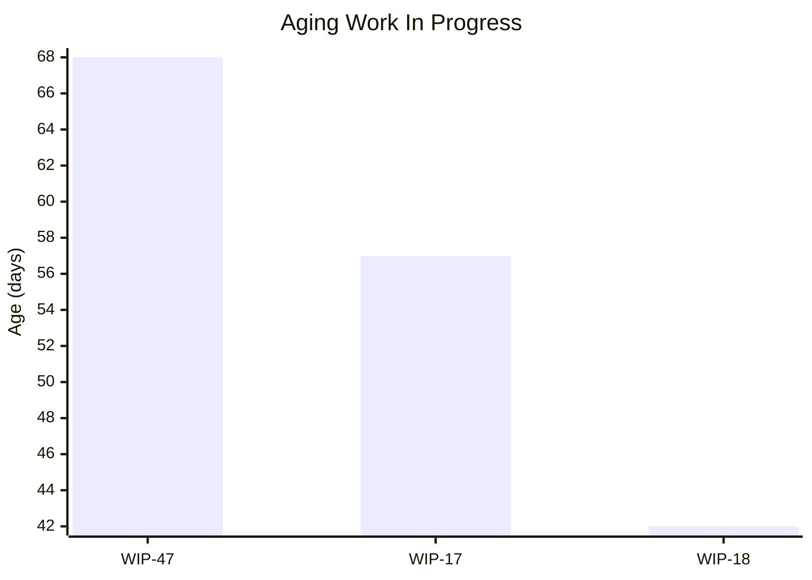
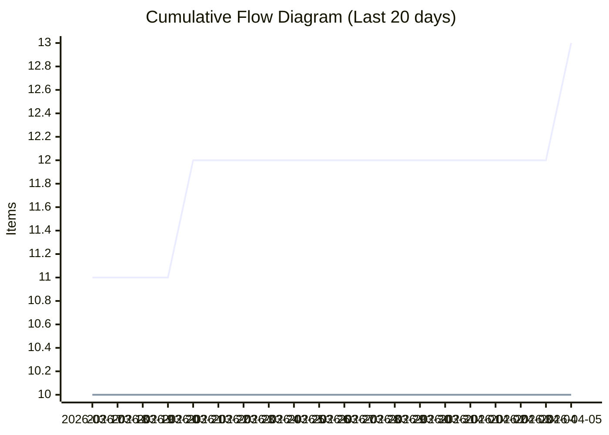
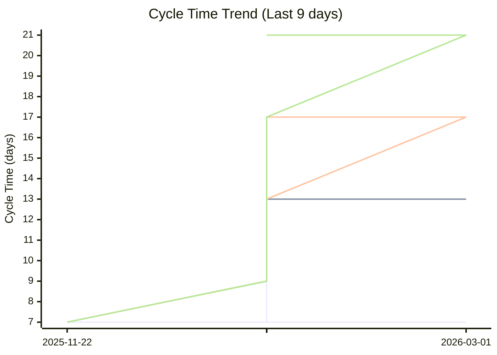
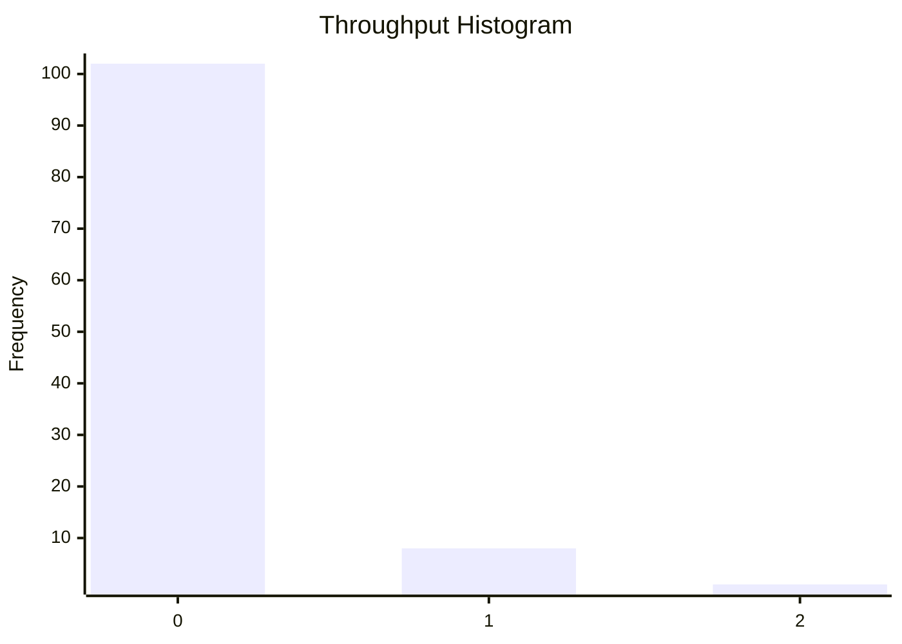

# Dashboard: Lowest

## Flow Metrics Summary

* **Total Items:** 13
* **Completed Items:** 10
* **Average Throughput:** 0.09 items/day
* **Type Breakdown:** 
  Task: 5
  Improvement: 3
  Story: 1
  Bug: 1

### Aging WIP Summary

* **Active WIP:** 3 items
* **Average WIP Age:** 55.7 days
* **Oldest Item Age:** 68 days

### Cycle Time Percentiles

* **50th Percentile:** 7 days
* **75th Percentile:** 13 days
* **85th Percentile:** 17 days
* **95th Percentile:** 21 days
* **98th Percentile:** 21 days

## Aging Work In Progress


## Forecasted Cumulative Flow Diagram
```mermaid
xychart-beta
    title "Forecasted Cumulative Flow Diagram"
    x-axis ["2026-03-18", " ", " ", " ", " ", " ", " ", "2026-03-25", " ", " ", " ", " ", " ", " ", "2026-04-01", " ", " ", " ", " ", " ", " ", "2026-04-08", " ", " ", " ", " ", " ", " ", "2026-04-15", " ", " ", " ", " ", " ", " ", "2026-04-22", " ", " ", " ", " ", " ", " ", "2026-04-29", " ", " ", " ", " ", " ", " ", "2026-05-06", " ", " ", " ", " ", " ", " ", "2026-05-13", " ", " ", " ", " ", " ", " ", "2026-05-20", " ", " ", " ", " ", " ", " ", "2026-05-27", " ", " ", " ", " ", " ", " ", "2026-06-03", " ", " ", " ", " ", " ", " ", "2026-06-10", " ", " ", " ", " ", " ", " ", "2026-06-17", " ", " ", " ", " ", " ", " ", "2026-06-24", " ", " ", " ", " ", " ", " ", "2026-07-01", " ", " ", " ", " ", " ", " ", "2026-07-08", " ", " ", " ", " ", " ", " ", "2026-07-15", " ", " ", " ", " ", " ", " ", "2026-07-22", " ", " ", " ", " ", " ", " ", "2026-07-29", " ", " ", " ", " ", " ", " ", "2026-08-05", " ", " ", " ", " ", " ", " ", "2026-08-12", " "]
    y-axis "Items"
    line "Arrivals" [11, 11, 11, 12, 12, 12, 12, 12, 12, 12, 12, 12, 12, 12, 12, 12, 12, 12, 13, 13, 13, 13, 13, 13, 13, 13, 13, 13, 13, 13, 13, 13, 13, 13, 13, 13, 13, 13, 13, 13, 13, 13, 13, 13, 13, 13, 13, 13, 13, 13, 13, 13, 13, 13, 13, 13, 13, 13, 13, 13, 13, 13, 13, 13, 13, 13, 13, 13, 13, 13, 13, 13, 13, 13, 13, 13, 13, 13, 13, 13, 13, 13, 13, 13, 13, 13, 13, 13, 13, 13, 13, 13, 13, 13, 13, 13, 13, 13, 13, 13, 13, 13, 13, 13, 13, 13, 13, 13, 13, 13, 13, 13, 13, 13, 13, 13, 13, 13, 13, 13, 13, 13, 13, 13, 13, 13, 13, 13, 13, 13, 13, 13, 13, 13, 13, 13, 13, 13, 13, 13, 13, 13, 13, 13, 13, 13, 13, 13, 13]
    line "Departures" [10, 10, 10, 10, 10, 10, 10, 10, 10, 10, 10, 10, 10, 10, 10, 10, 10, 10, 10, 10, 10, 10, 10, 10, 10, 10, 10, 10, 10, 10, 10, 10, 10, 10, 10, 10, 10, 10, 10, 10, 10, 10, 10, 10, 10, 10, 10, 10, 10, 10, 10, 10, 10, 10, 10, 10, 10, 10, 10, 10, NaN, NaN, NaN, NaN, NaN, NaN, NaN, NaN, NaN, NaN, NaN, NaN, NaN, NaN, NaN, NaN, NaN, NaN, NaN, NaN, NaN, NaN, NaN, NaN, NaN, NaN, NaN, NaN, NaN, NaN, NaN, NaN, NaN, NaN, NaN, NaN, NaN, NaN, NaN, NaN, NaN, NaN, NaN, NaN, NaN, NaN, NaN, NaN, NaN, NaN, NaN, NaN, NaN, NaN, NaN, NaN, NaN, NaN, NaN, NaN, NaN, NaN, NaN, NaN, NaN, NaN, NaN, NaN, NaN, NaN, NaN, NaN, NaN, NaN, NaN, NaN, NaN, NaN, NaN, NaN, NaN, NaN, NaN, NaN, NaN, NaN, NaN, NaN, NaN]
    line "50% Confidence" [10, 10, 10, 10, 10, 10, 10, 10, 10, 10, 10, 10, 10, 10, 10, 10, 10, 10, 10, 10, 10, 10, 10, 10, 10, 10, 10, 10, 10, 10, 10, 10, 10, 10, 10, 10, 10, 10, 10, 10, 10, 10, 10, 10, 10, 10, 10, 10, 10, 10, 10, 10, 10, 10, 10, 10, 10, 10, 10, 10, 10.096774193548388, 10.193548387096774, 10.290322580645162, 10.387096774193548, 10.483870967741936, 10.580645161290322, 10.67741935483871, 10.774193548387096, 10.870967741935484, 10.967741935483872, 11.064516129032258, 11.161290322580644, 11.258064516129032, 11.35483870967742, 11.451612903225806, 11.548387096774194, 11.64516129032258, 11.741935483870968, 11.838709677419354, 11.935483870967742, 12.032258064516128, 12.129032258064516, 12.225806451612904, 12.32258064516129, 12.419354838709678, 12.516129032258064, 12.612903225806452, 12.709677419354838, 12.806451612903226, 12.903225806451612, 13.0, 13, 13, 13, 13, 13, 13, 13, 13, 13, 13, 13, 13, 13, 13, 13, 13, 13, 13, 13, 13, 13, 13, 13, 13, 13, 13, 13, 13, 13, 13, 13, 13, 13, 13, 13, 13, 13, 13, 13, 13, 13, 13, 13, 13, 13, 13, 13, 13, 13, 13, 13, 13, 13, 13, 13, 13, 13, 13]
    line "50% Deadline" [NaN, NaN, NaN, NaN, NaN, NaN, NaN, NaN, NaN, NaN, NaN, NaN, NaN, NaN, NaN, NaN, NaN, NaN, NaN, NaN, NaN, NaN, NaN, NaN, NaN, NaN, NaN, NaN, NaN, NaN, NaN, NaN, NaN, NaN, NaN, NaN, NaN, NaN, NaN, NaN, NaN, NaN, NaN, NaN, NaN, NaN, NaN, NaN, NaN, NaN, NaN, NaN, NaN, NaN, NaN, NaN, NaN, NaN, NaN, NaN, NaN, NaN, NaN, NaN, NaN, NaN, NaN, NaN, NaN, NaN, NaN, NaN, NaN, NaN, NaN, NaN, NaN, NaN, NaN, NaN, NaN, NaN, NaN, NaN, NaN, NaN, NaN, NaN, NaN, NaN, 13, NaN, NaN, NaN, NaN, NaN, NaN, NaN, NaN, NaN, NaN, NaN, NaN, NaN, NaN, NaN, NaN, NaN, NaN, NaN, NaN, NaN, NaN, NaN, NaN, NaN, NaN, NaN, NaN, NaN, NaN, NaN, NaN, NaN, NaN, NaN, NaN, NaN, NaN, NaN, NaN, NaN, NaN, NaN, NaN, NaN, NaN, NaN, NaN, NaN, NaN, NaN, NaN, NaN, NaN, NaN, NaN, NaN, NaN]
    line "75% Confidence" [10, 10, 10, 10, 10, 10, 10, 10, 10, 10, 10, 10, 10, 10, 10, 10, 10, 10, 10, 10, 10, 10, 10, 10, 10, 10, 10, 10, 10, 10, 10, 10, 10, 10, 10, 10, 10, 10, 10, 10, 10, 10, 10, 10, 10, 10, 10, 10, 10, 10, 10, 10, 10, 10, 10, 10, 10, 10, 10, 10, 10.066666666666666, 10.133333333333333, 10.2, 10.266666666666667, 10.333333333333334, 10.4, 10.466666666666667, 10.533333333333333, 10.6, 10.666666666666666, 10.733333333333333, 10.8, 10.866666666666667, 10.933333333333334, 11.0, 11.066666666666666, 11.133333333333333, 11.2, 11.266666666666666, 11.333333333333334, 11.4, 11.466666666666667, 11.533333333333333, 11.6, 11.666666666666666, 11.733333333333334, 11.8, 11.866666666666667, 11.933333333333334, 12.0, 12.066666666666666, 12.133333333333333, 12.2, 12.266666666666666, 12.333333333333334, 12.4, 12.466666666666667, 12.533333333333333, 12.6, 12.666666666666666, 12.733333333333334, 12.8, 12.866666666666667, 12.933333333333334, 13.0, 13, 13, 13, 13, 13, 13, 13, 13, 13, 13, 13, 13, 13, 13, 13, 13, 13, 13, 13, 13, 13, 13, 13, 13, 13, 13, 13, 13, 13, 13, 13, 13, 13, 13, 13, 13, 13, 13, 13, 13, 13, 13, 13, 13]
    line "75% Deadline" [NaN, NaN, NaN, NaN, NaN, NaN, NaN, NaN, NaN, NaN, NaN, NaN, NaN, NaN, NaN, NaN, NaN, NaN, NaN, NaN, NaN, NaN, NaN, NaN, NaN, NaN, NaN, NaN, NaN, NaN, NaN, NaN, NaN, NaN, NaN, NaN, NaN, NaN, NaN, NaN, NaN, NaN, NaN, NaN, NaN, NaN, NaN, NaN, NaN, NaN, NaN, NaN, NaN, NaN, NaN, NaN, NaN, NaN, NaN, NaN, NaN, NaN, NaN, NaN, NaN, NaN, NaN, NaN, NaN, NaN, NaN, NaN, NaN, NaN, NaN, NaN, NaN, NaN, NaN, NaN, NaN, NaN, NaN, NaN, NaN, NaN, NaN, NaN, NaN, NaN, NaN, NaN, NaN, NaN, NaN, NaN, NaN, NaN, NaN, NaN, NaN, NaN, NaN, NaN, 13, NaN, NaN, NaN, NaN, NaN, NaN, NaN, NaN, NaN, NaN, NaN, NaN, NaN, NaN, NaN, NaN, NaN, NaN, NaN, NaN, NaN, NaN, NaN, NaN, NaN, NaN, NaN, NaN, NaN, NaN, NaN, NaN, NaN, NaN, NaN, NaN, NaN, NaN, NaN, NaN, NaN, NaN, NaN, NaN]
    line "85% Confidence" [10, 10, 10, 10, 10, 10, 10, 10, 10, 10, 10, 10, 10, 10, 10, 10, 10, 10, 10, 10, 10, 10, 10, 10, 10, 10, 10, 10, 10, 10, 10, 10, 10, 10, 10, 10, 10, 10, 10, 10, 10, 10, 10, 10, 10, 10, 10, 10, 10, 10, 10, 10, 10, 10, 10, 10, 10, 10, 10, 10, 10.054545454545455, 10.10909090909091, 10.163636363636364, 10.218181818181819, 10.272727272727273, 10.327272727272728, 10.381818181818181, 10.436363636363636, 10.49090909090909, 10.545454545454545, 10.6, 10.654545454545454, 10.709090909090909, 10.763636363636364, 10.818181818181818, 10.872727272727273, 10.927272727272728, 10.981818181818182, 11.036363636363637, 11.09090909090909, 11.145454545454545, 11.2, 11.254545454545454, 11.309090909090909, 11.363636363636363, 11.418181818181818, 11.472727272727273, 11.527272727272727, 11.581818181818182, 11.636363636363637, 11.690909090909091, 11.745454545454546, 11.8, 11.854545454545455, 11.909090909090908, 11.963636363636363, 12.018181818181818, 12.072727272727272, 12.127272727272727, 12.181818181818182, 12.236363636363636, 12.290909090909091, 12.345454545454546, 12.4, 12.454545454545455, 12.509090909090908, 12.563636363636363, 12.618181818181817, 12.672727272727272, 12.727272727272727, 12.781818181818181, 12.836363636363636, 12.89090909090909, 12.945454545454545, 13.0, 13, 13, 13, 13, 13, 13, 13, 13, 13, 13, 13, 13, 13, 13, 13, 13, 13, 13, 13, 13, 13, 13, 13, 13, 13, 13, 13, 13, 13, 13, 13, 13, 13, 13]
    line "85% Deadline" [NaN, NaN, NaN, NaN, NaN, NaN, NaN, NaN, NaN, NaN, NaN, NaN, NaN, NaN, NaN, NaN, NaN, NaN, NaN, NaN, NaN, NaN, NaN, NaN, NaN, NaN, NaN, NaN, NaN, NaN, NaN, NaN, NaN, NaN, NaN, NaN, NaN, NaN, NaN, NaN, NaN, NaN, NaN, NaN, NaN, NaN, NaN, NaN, NaN, NaN, NaN, NaN, NaN, NaN, NaN, NaN, NaN, NaN, NaN, NaN, NaN, NaN, NaN, NaN, NaN, NaN, NaN, NaN, NaN, NaN, NaN, NaN, NaN, NaN, NaN, NaN, NaN, NaN, NaN, NaN, NaN, NaN, NaN, NaN, NaN, NaN, NaN, NaN, NaN, NaN, NaN, NaN, NaN, NaN, NaN, NaN, NaN, NaN, NaN, NaN, NaN, NaN, NaN, NaN, NaN, NaN, NaN, NaN, NaN, NaN, NaN, NaN, NaN, NaN, 13, NaN, NaN, NaN, NaN, NaN, NaN, NaN, NaN, NaN, NaN, NaN, NaN, NaN, NaN, NaN, NaN, NaN, NaN, NaN, NaN, NaN, NaN, NaN, NaN, NaN, NaN, NaN, NaN, NaN, NaN, NaN, NaN, NaN, NaN]
    line "95% Confidence" [10, 10, 10, 10, 10, 10, 10, 10, 10, 10, 10, 10, 10, 10, 10, 10, 10, 10, 10, 10, 10, 10, 10, 10, 10, 10, 10, 10, 10, 10, 10, 10, 10, 10, 10, 10, 10, 10, 10, 10, 10, 10, 10, 10, 10, 10, 10, 10, 10, 10, 10, 10, 10, 10, 10, 10, 10, 10, 10, 10, 10.04054054054054, 10.08108108108108, 10.121621621621621, 10.162162162162161, 10.202702702702704, 10.243243243243244, 10.283783783783784, 10.324324324324325, 10.364864864864865, 10.405405405405405, 10.445945945945946, 10.486486486486486, 10.527027027027026, 10.567567567567568, 10.608108108108109, 10.64864864864865, 10.68918918918919, 10.72972972972973, 10.77027027027027, 10.81081081081081, 10.85135135135135, 10.891891891891891, 10.932432432432432, 10.972972972972974, 11.013513513513514, 11.054054054054054, 11.094594594594595, 11.135135135135135, 11.175675675675675, 11.216216216216216, 11.256756756756756, 11.297297297297298, 11.337837837837839, 11.378378378378379, 11.41891891891892, 11.45945945945946, 11.5, 11.54054054054054, 11.58108108108108, 11.621621621621621, 11.662162162162161, 11.702702702702704, 11.743243243243244, 11.783783783783784, 11.824324324324325, 11.864864864864865, 11.905405405405405, 11.945945945945946, 11.986486486486486, 12.027027027027028, 12.067567567567568, 12.108108108108109, 12.14864864864865, 12.18918918918919, 12.22972972972973, 12.27027027027027, 12.31081081081081, 12.35135135135135, 12.391891891891891, 12.432432432432432, 12.472972972972974, 12.513513513513514, 12.554054054054054, 12.594594594594595, 12.635135135135135, 12.675675675675675, 12.716216216216216, 12.756756756756758, 12.797297297297298, 12.837837837837839, 12.878378378378379, 12.91891891891892, 12.95945945945946, 13.0, 13, 13, 13, 13, 13, 13, 13, 13, 13, 13, 13, 13, 13, 13, 13]
    line "95% Deadline" [NaN, NaN, NaN, NaN, NaN, NaN, NaN, NaN, NaN, NaN, NaN, NaN, NaN, NaN, NaN, NaN, NaN, NaN, NaN, NaN, NaN, NaN, NaN, NaN, NaN, NaN, NaN, NaN, NaN, NaN, NaN, NaN, NaN, NaN, NaN, NaN, NaN, NaN, NaN, NaN, NaN, NaN, NaN, NaN, NaN, NaN, NaN, NaN, NaN, NaN, NaN, NaN, NaN, NaN, NaN, NaN, NaN, NaN, NaN, NaN, NaN, NaN, NaN, NaN, NaN, NaN, NaN, NaN, NaN, NaN, NaN, NaN, NaN, NaN, NaN, NaN, NaN, NaN, NaN, NaN, NaN, NaN, NaN, NaN, NaN, NaN, NaN, NaN, NaN, NaN, NaN, NaN, NaN, NaN, NaN, NaN, NaN, NaN, NaN, NaN, NaN, NaN, NaN, NaN, NaN, NaN, NaN, NaN, NaN, NaN, NaN, NaN, NaN, NaN, NaN, NaN, NaN, NaN, NaN, NaN, NaN, NaN, NaN, NaN, NaN, NaN, NaN, NaN, NaN, NaN, NaN, NaN, NaN, 13, NaN, NaN, NaN, NaN, NaN, NaN, NaN, NaN, NaN, NaN, NaN, NaN, NaN, NaN, NaN]
    line "98% Confidence" [10, 10, 10, 10, 10, 10, 10, 10, 10, 10, 10, 10, 10, 10, 10, 10, 10, 10, 10, 10, 10, 10, 10, 10, 10, 10, 10, 10, 10, 10, 10, 10, 10, 10, 10, 10, 10, 10, 10, 10, 10, 10, 10, 10, 10, 10, 10, 10, 10, 10, 10, 10, 10, 10, 10, 10, 10, 10, 10, 10, 10.03370786516854, 10.067415730337078, 10.101123595505618, 10.134831460674157, 10.168539325842696, 10.202247191011235, 10.235955056179776, 10.269662921348315, 10.303370786516854, 10.337078651685394, 10.370786516853933, 10.404494382022472, 10.438202247191011, 10.47191011235955, 10.50561797752809, 10.539325842696629, 10.573033707865168, 10.606741573033707, 10.640449438202246, 10.674157303370787, 10.707865168539326, 10.741573033707866, 10.775280898876405, 10.808988764044944, 10.842696629213483, 10.876404494382022, 10.910112359550562, 10.9438202247191, 10.97752808988764, 11.01123595505618, 11.044943820224718, 11.078651685393258, 11.112359550561798, 11.146067415730338, 11.179775280898877, 11.213483146067416, 11.247191011235955, 11.280898876404494, 11.314606741573034, 11.348314606741573, 11.382022471910112, 11.415730337078651, 11.44943820224719, 11.483146067415731, 11.516853932584269, 11.55056179775281, 11.584269662921349, 11.617977528089888, 11.651685393258427, 11.685393258426966, 11.719101123595506, 11.752808988764045, 11.786516853932584, 11.820224719101123, 11.853932584269662, 11.887640449438202, 11.921348314606742, 11.95505617977528, 11.98876404494382, 12.02247191011236, 12.0561797752809, 12.089887640449438, 12.123595505617978, 12.157303370786517, 12.191011235955056, 12.224719101123595, 12.258426966292134, 12.292134831460674, 12.325842696629213, 12.359550561797754, 12.393258426966291, 12.426966292134832, 12.460674157303371, 12.49438202247191, 12.52808988764045, 12.561797752808989, 12.595505617977528, 12.629213483146067, 12.662921348314606, 12.696629213483146, 12.730337078651685, 12.764044943820224, 12.797752808988765, 12.831460674157302, 12.865168539325843, 12.898876404494382, 12.932584269662922, 12.96629213483146, 13.0]
    line "98% Deadline" [NaN, NaN, NaN, NaN, NaN, NaN, NaN, NaN, NaN, NaN, NaN, NaN, NaN, NaN, NaN, NaN, NaN, NaN, NaN, NaN, NaN, NaN, NaN, NaN, NaN, NaN, NaN, NaN, NaN, NaN, NaN, NaN, NaN, NaN, NaN, NaN, NaN, NaN, NaN, NaN, NaN, NaN, NaN, NaN, NaN, NaN, NaN, NaN, NaN, NaN, NaN, NaN, NaN, NaN, NaN, NaN, NaN, NaN, NaN, NaN, NaN, NaN, NaN, NaN, NaN, NaN, NaN, NaN, NaN, NaN, NaN, NaN, NaN, NaN, NaN, NaN, NaN, NaN, NaN, NaN, NaN, NaN, NaN, NaN, NaN, NaN, NaN, NaN, NaN, NaN, NaN, NaN, NaN, NaN, NaN, NaN, NaN, NaN, NaN, NaN, NaN, NaN, NaN, NaN, NaN, NaN, NaN, NaN, NaN, NaN, NaN, NaN, NaN, NaN, NaN, NaN, NaN, NaN, NaN, NaN, NaN, NaN, NaN, NaN, NaN, NaN, NaN, NaN, NaN, NaN, NaN, NaN, NaN, NaN, NaN, NaN, NaN, NaN, NaN, NaN, NaN, NaN, NaN, NaN, NaN, NaN, NaN, NaN, 13]
```

**Legend:** Arrivals (blue), Departures (green), Projections (various colors). Vertical lines for: 50%, 75%, 85%, 95%, 98% confidence.

## Cumulative Flow Diagram


## Cycle Time Scatter Plot


## Throughput Histogram


## Cycle Time Bands Over Time
```
                    Cycle Time Bands Over Time
             ┌                                        ┐ 
     ≤ 1 day ┤ 0                                        
    ≤ 7 days ┤■■■■■■■■■■■■■■■■■■■■■■■■■■■■■■■■■■■■■ 5   
   ≤ 14 days ┤■■■■■■■■■■■■■■■■■■■■■■ 3                  
   ≤ 21 days ┤■■■■■■■■■■■■■■■ 2                         
   ≤ 28 days ┤ 0                                        
   > 28 days ┤ 0                                        
             └                                        ┘ 
                          Items Completed

```