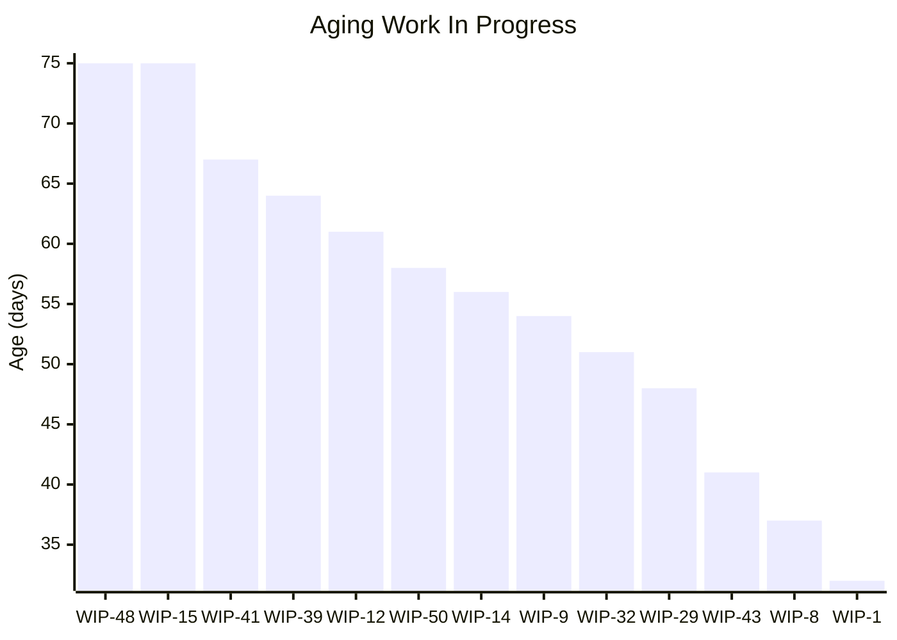
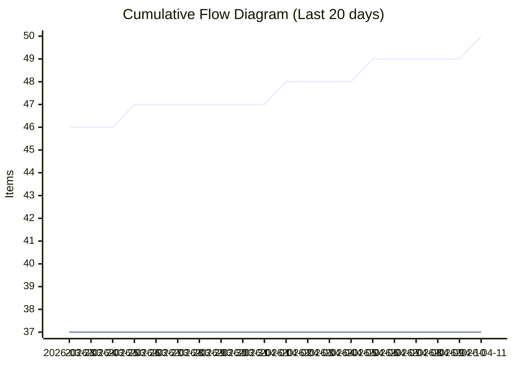
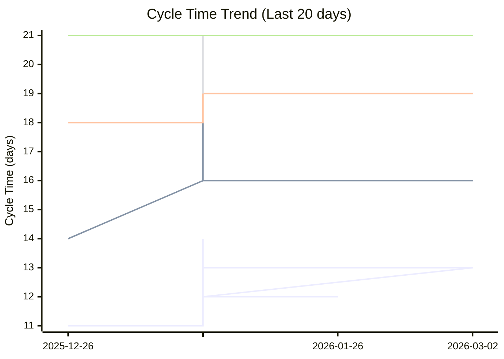
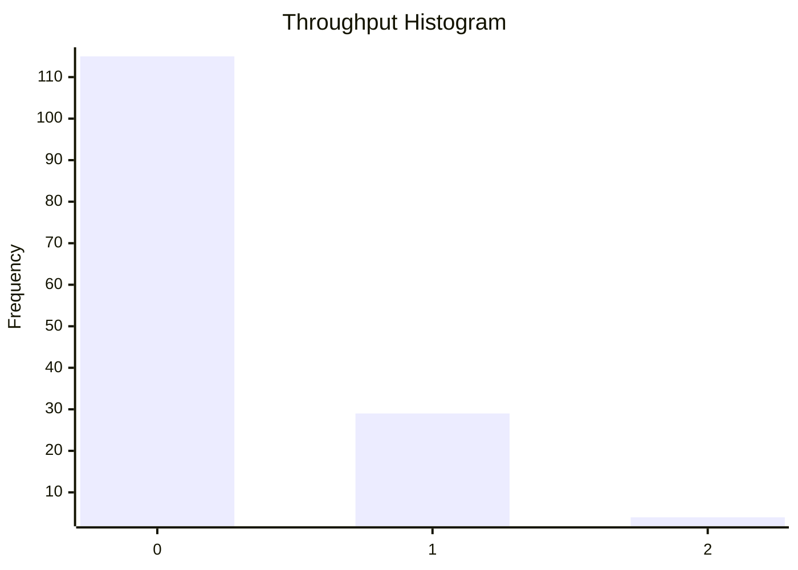

# Dashboard: Bug

## Flow Metrics Summary

* **Total Items:** 50
* **Completed Items:** 37
* **Average Throughput:** 0.25 items/day
* **Priority Breakdown:** 
  Highest: 2
  High: 10
  Medium: 16
  Low: 8
  Lowest: 1

### Aging WIP Summary

* **Active WIP:** 13 items
* **Average WIP Age:** 55.3 days
* **Oldest Item Age:** 75 days

### Cycle Time Percentiles

* **50th Percentile:** 14 days
* **75th Percentile:** 18 days
* **85th Percentile:** 19 days
* **95th Percentile:** 21 days
* **98th Percentile:** 21 days

## Aging Work In Progress


## Forecasted Cumulative Flow Diagram
```mermaid
xychart-beta
    title "Forecasted Cumulative Flow Diagram"
    x-axis ["2026-03-14", " ", " ", " ", " ", " ", " ", "2026-03-21", " ", " ", " ", " ", " ", " ", "2026-03-28", " ", " ", " ", " ", " ", " ", "2026-04-04", " ", " ", " ", " ", " ", " ", "2026-04-11", " ", " ", " ", " ", " ", " ", "2026-04-18", " ", " ", " ", " ", " ", " ", "2026-04-25", " ", " ", " ", " ", " ", " ", "2026-05-02", " ", " ", " ", " ", " ", " ", "2026-05-09", " ", " ", " ", " ", " ", " ", "2026-05-16", " ", " ", " ", " ", " ", " ", "2026-05-23", " ", " ", " ", " ", " ", " ", "2026-05-30", " ", " ", " ", " ", " ", " ", "2026-06-06", " ", " ", " ", " ", " ", " ", "2026-06-13", " ", " ", " ", " ", " ", " ", "2026-06-20", " ", " ", " ", " ", " ", " ", "2026-06-27", " ", " ", " ", " ", " ", " ", "2026-07-04", " ", " ", " ", " ", " ", " ", "2026-07-11", " ", " ", " ", " ", " ", " ", "2026-07-18", " ", " ", " ", " ", " ", " ", "2026-07-25", " ", " ", " ", " ", " ", " ", "2026-08-01", " ", " ", " ", " ", " "]
    y-axis "Items"
    line "Arrivals" [42, 42, 43, 43, 44, 44, 45, 45, 45, 46, 46, 46, 47, 47, 47, 47, 47, 47, 47, 48, 48, 48, 48, 49, 49, 49, 49, 49, 50, 50, 50, 50, 50, 50, 50, 50, 50, 50, 50, 50, 50, 50, 50, 50, 50, 50, 50, 50, 50, 50, 50, 50, 50, 50, 50, 50, 50, 50, 50, 50, 50, 50, 50, 50, 50, 50, 50, 50, 50, 50, 50, 50, 50, 50, 50, 50, 50, 50, 50, 50, 50, 50, 50, 50, 50, 50, 50, 50, 50, 50, 50, 50, 50, 50, 50, 50, 50, 50, 50, 50, 50, 50, 50, 50, 50, 50, 50, 50, 50, 50, 50, 50, 50, 50, 50, 50, 50, 50, 50, 50, 50, 50, 50, 50, 50, 50, 50, 50, 50, 50, 50, 50, 50, 50, 50, 50, 50, 50, 50, 50, 50, 50, 50, 50, 50, 50]
    line "Departures" [35, 35, 36, 36, 36, 36, 36, 37, 37, 37, 37, 37, 37, 37, 37, 37, 37, 37, 37, 37, 37, 37, 37, 37, 37, 37, 37, 37, 37, 37, 37, 37, 37, 37, 37, 37, 37, 37, 37, 37, 37, 37, 37, 37, 37, 37, 37, 37, 37, 37, 37, 37, 37, 37, 37, 37, 37, 37, 37, 37, NaN, NaN, NaN, NaN, NaN, NaN, NaN, NaN, NaN, NaN, NaN, NaN, NaN, NaN, NaN, NaN, NaN, NaN, NaN, NaN, NaN, NaN, NaN, NaN, NaN, NaN, NaN, NaN, NaN, NaN, NaN, NaN, NaN, NaN, NaN, NaN, NaN, NaN, NaN, NaN, NaN, NaN, NaN, NaN, NaN, NaN, NaN, NaN, NaN, NaN, NaN, NaN, NaN, NaN, NaN, NaN, NaN, NaN, NaN, NaN, NaN, NaN, NaN, NaN, NaN, NaN, NaN, NaN, NaN, NaN, NaN, NaN, NaN, NaN, NaN, NaN, NaN, NaN, NaN, NaN, NaN, NaN, NaN, NaN, NaN, NaN]
    line "50% Confidence" [35, 35, 36, 36, 36, 36, 36, 37, 37, 37, 37, 37, 37, 37, 37, 37, 37, 37, 37, 37, 37, 37, 37, 37, 37, 37, 37, 37, 37, 37, 37, 37, 37, 37, 37, 37, 37, 37, 37, 37, 37, 37, 37, 37, 37, 37, 37, 37, 37, 37, 37, 37, 37, 37, 37, 37, 37, 37, 37, 37, 37.254901960784316, 37.509803921568626, 37.76470588235294, 38.01960784313725, 38.27450980392157, 38.529411764705884, 38.78431372549019, 39.03921568627451, 39.294117647058826, 39.549019607843135, 39.80392156862745, 40.05882352941177, 40.31372549019608, 40.568627450980394, 40.8235294117647, 41.07843137254902, 41.333333333333336, 41.588235294117645, 41.84313725490196, 42.09803921568627, 42.35294117647059, 42.6078431372549, 42.86274509803921, 43.11764705882353, 43.372549019607845, 43.627450980392155, 43.88235294117647, 44.13725490196079, 44.3921568627451, 44.64705882352941, 44.90196078431372, 45.15686274509804, 45.41176470588235, 45.666666666666664, 45.92156862745098, 46.17647058823529, 46.431372549019606, 46.68627450980392, 46.94117647058823, 47.19607843137255, 47.450980392156865, 47.705882352941174, 47.96078431372549, 48.21568627450981, 48.470588235294116, 48.72549019607843, 48.98039215686275, 49.23529411764706, 49.49019607843137, 49.745098039215684, 50.0, 50, 50, 50, 50, 50, 50, 50, 50, 50, 50, 50, 50, 50, 50, 50, 50, 50, 50, 50, 50, 50, 50, 50, 50, 50, 50, 50, 50, 50, 50, 50, 50, 50, 50, 50]
    line "50% Deadline" [NaN, NaN, NaN, NaN, NaN, NaN, NaN, NaN, NaN, NaN, NaN, NaN, NaN, NaN, NaN, NaN, NaN, NaN, NaN, NaN, NaN, NaN, NaN, NaN, NaN, NaN, NaN, NaN, NaN, NaN, NaN, NaN, NaN, NaN, NaN, NaN, NaN, NaN, NaN, NaN, NaN, NaN, NaN, NaN, NaN, NaN, NaN, NaN, NaN, NaN, NaN, NaN, NaN, NaN, NaN, NaN, NaN, NaN, NaN, NaN, NaN, NaN, NaN, NaN, NaN, NaN, NaN, NaN, NaN, NaN, NaN, NaN, NaN, NaN, NaN, NaN, NaN, NaN, NaN, NaN, NaN, NaN, NaN, NaN, NaN, NaN, NaN, NaN, NaN, NaN, NaN, NaN, NaN, NaN, NaN, NaN, NaN, NaN, NaN, NaN, NaN, NaN, NaN, NaN, NaN, NaN, NaN, NaN, NaN, NaN, 50, NaN, NaN, NaN, NaN, NaN, NaN, NaN, NaN, NaN, NaN, NaN, NaN, NaN, NaN, NaN, NaN, NaN, NaN, NaN, NaN, NaN, NaN, NaN, NaN, NaN, NaN, NaN, NaN, NaN, NaN, NaN, NaN, NaN, NaN, NaN]
    line "75% Confidence" [35, 35, 36, 36, 36, 36, 36, 37, 37, 37, 37, 37, 37, 37, 37, 37, 37, 37, 37, 37, 37, 37, 37, 37, 37, 37, 37, 37, 37, 37, 37, 37, 37, 37, 37, 37, 37, 37, 37, 37, 37, 37, 37, 37, 37, 37, 37, 37, 37, 37, 37, 37, 37, 37, 37, 37, 37, 37, 37, 37, 37.21311475409836, 37.42622950819672, 37.63934426229508, 37.85245901639344, 38.0655737704918, 38.278688524590166, 38.49180327868852, 38.704918032786885, 38.91803278688525, 39.131147540983605, 39.34426229508197, 39.557377049180324, 39.77049180327869, 39.98360655737705, 40.19672131147541, 40.40983606557377, 40.622950819672134, 40.83606557377049, 41.049180327868854, 41.26229508196721, 41.47540983606557, 41.68852459016394, 41.90163934426229, 42.114754098360656, 42.32786885245902, 42.540983606557376, 42.75409836065574, 42.967213114754095, 43.18032786885246, 43.39344262295082, 43.60655737704918, 43.81967213114754, 44.0327868852459, 44.24590163934426, 44.459016393442624, 44.67213114754098, 44.885245901639344, 45.09836065573771, 45.31147540983606, 45.52459016393443, 45.73770491803279, 45.950819672131146, 46.16393442622951, 46.377049180327866, 46.59016393442623, 46.803278688524586, 47.01639344262295, 47.22950819672131, 47.44262295081967, 47.65573770491803, 47.868852459016395, 48.08196721311475, 48.295081967213115, 48.50819672131148, 48.721311475409834, 48.9344262295082, 49.14754098360656, 49.36065573770492, 49.57377049180328, 49.78688524590164, 50.0, 50, 50, 50, 50, 50, 50, 50, 50, 50, 50, 50, 50, 50, 50, 50, 50, 50, 50, 50, 50, 50, 50, 50, 50, 50]
    line "75% Deadline" [NaN, NaN, NaN, NaN, NaN, NaN, NaN, NaN, NaN, NaN, NaN, NaN, NaN, NaN, NaN, NaN, NaN, NaN, NaN, NaN, NaN, NaN, NaN, NaN, NaN, NaN, NaN, NaN, NaN, NaN, NaN, NaN, NaN, NaN, NaN, NaN, NaN, NaN, NaN, NaN, NaN, NaN, NaN, NaN, NaN, NaN, NaN, NaN, NaN, NaN, NaN, NaN, NaN, NaN, NaN, NaN, NaN, NaN, NaN, NaN, NaN, NaN, NaN, NaN, NaN, NaN, NaN, NaN, NaN, NaN, NaN, NaN, NaN, NaN, NaN, NaN, NaN, NaN, NaN, NaN, NaN, NaN, NaN, NaN, NaN, NaN, NaN, NaN, NaN, NaN, NaN, NaN, NaN, NaN, NaN, NaN, NaN, NaN, NaN, NaN, NaN, NaN, NaN, NaN, NaN, NaN, NaN, NaN, NaN, NaN, NaN, NaN, NaN, NaN, NaN, NaN, NaN, NaN, NaN, NaN, 50, NaN, NaN, NaN, NaN, NaN, NaN, NaN, NaN, NaN, NaN, NaN, NaN, NaN, NaN, NaN, NaN, NaN, NaN, NaN, NaN, NaN, NaN, NaN, NaN, NaN]
    line "85% Confidence" [35, 35, 36, 36, 36, 36, 36, 37, 37, 37, 37, 37, 37, 37, 37, 37, 37, 37, 37, 37, 37, 37, 37, 37, 37, 37, 37, 37, 37, 37, 37, 37, 37, 37, 37, 37, 37, 37, 37, 37, 37, 37, 37, 37, 37, 37, 37, 37, 37, 37, 37, 37, 37, 37, 37, 37, 37, 37, 37, 37, 37.19402985074627, 37.38805970149254, 37.582089552238806, 37.776119402985074, 37.97014925373134, 38.16417910447761, 38.35820895522388, 38.55223880597015, 38.74626865671642, 38.940298507462686, 39.134328358208954, 39.32835820895522, 39.52238805970149, 39.71641791044776, 39.91044776119403, 40.1044776119403, 40.298507462686565, 40.492537313432834, 40.6865671641791, 40.88059701492537, 41.07462686567164, 41.26865671641791, 41.46268656716418, 41.656716417910445, 41.850746268656714, 42.04477611940298, 42.23880597014925, 42.43283582089552, 42.626865671641795, 42.82089552238806, 43.01492537313433, 43.208955223880594, 43.40298507462687, 43.59701492537313, 43.791044776119406, 43.98507462686567, 44.17910447761194, 44.37313432835821, 44.56716417910448, 44.76119402985075, 44.95522388059702, 45.149253731343286, 45.343283582089555, 45.53731343283582, 45.73134328358209, 45.92537313432836, 46.11940298507463, 46.3134328358209, 46.507462686567166, 46.701492537313435, 46.8955223880597, 47.08955223880597, 47.28358208955224, 47.47761194029851, 47.67164179104478, 47.865671641791046, 48.059701492537314, 48.25373134328358, 48.44776119402985, 48.64179104477612, 48.83582089552239, 49.02985074626866, 49.223880597014926, 49.417910447761194, 49.61194029850746, 49.80597014925373, 50.0, 50, 50, 50, 50, 50, 50, 50, 50, 50, 50, 50, 50, 50, 50, 50, 50, 50, 50, 50]
    line "85% Deadline" [NaN, NaN, NaN, NaN, NaN, NaN, NaN, NaN, NaN, NaN, NaN, NaN, NaN, NaN, NaN, NaN, NaN, NaN, NaN, NaN, NaN, NaN, NaN, NaN, NaN, NaN, NaN, NaN, NaN, NaN, NaN, NaN, NaN, NaN, NaN, NaN, NaN, NaN, NaN, NaN, NaN, NaN, NaN, NaN, NaN, NaN, NaN, NaN, NaN, NaN, NaN, NaN, NaN, NaN, NaN, NaN, NaN, NaN, NaN, NaN, NaN, NaN, NaN, NaN, NaN, NaN, NaN, NaN, NaN, NaN, NaN, NaN, NaN, NaN, NaN, NaN, NaN, NaN, NaN, NaN, NaN, NaN, NaN, NaN, NaN, NaN, NaN, NaN, NaN, NaN, NaN, NaN, NaN, NaN, NaN, NaN, NaN, NaN, NaN, NaN, NaN, NaN, NaN, NaN, NaN, NaN, NaN, NaN, NaN, NaN, NaN, NaN, NaN, NaN, NaN, NaN, NaN, NaN, NaN, NaN, NaN, NaN, NaN, NaN, NaN, NaN, 50, NaN, NaN, NaN, NaN, NaN, NaN, NaN, NaN, NaN, NaN, NaN, NaN, NaN, NaN, NaN, NaN, NaN, NaN, NaN]
    line "95% Confidence" [35, 35, 36, 36, 36, 36, 36, 37, 37, 37, 37, 37, 37, 37, 37, 37, 37, 37, 37, 37, 37, 37, 37, 37, 37, 37, 37, 37, 37, 37, 37, 37, 37, 37, 37, 37, 37, 37, 37, 37, 37, 37, 37, 37, 37, 37, 37, 37, 37, 37, 37, 37, 37, 37, 37, 37, 37, 37, 37, 37, 37.164556962025316, 37.32911392405063, 37.49367088607595, 37.65822784810126, 37.822784810126585, 37.9873417721519, 38.151898734177216, 38.31645569620253, 38.48101265822785, 38.64556962025316, 38.81012658227848, 38.9746835443038, 39.139240506329116, 39.30379746835443, 39.46835443037975, 39.63291139240506, 39.79746835443038, 39.962025316455694, 40.12658227848101, 40.291139240506325, 40.45569620253165, 40.620253164556964, 40.78481012658228, 40.949367088607595, 41.11392405063291, 41.278481012658226, 41.44303797468354, 41.607594936708864, 41.77215189873418, 41.936708860759495, 42.10126582278481, 42.265822784810126, 42.43037974683544, 42.59493670886076, 42.75949367088607, 42.92405063291139, 43.08860759493671, 43.25316455696203, 43.41772151898734, 43.58227848101266, 43.74683544303797, 43.91139240506329, 44.075949367088604, 44.24050632911393, 44.40506329113924, 44.56962025316456, 44.734177215189874, 44.89873417721519, 45.063291139240505, 45.22784810126582, 45.392405063291136, 45.55696202531645, 45.72151898734177, 45.88607594936709, 46.050632911392405, 46.21518987341772, 46.379746835443036, 46.54430379746835, 46.708860759493675, 46.87341772151899, 47.037974683544306, 47.20253164556962, 47.36708860759494, 47.53164556962025, 47.69620253164557, 47.860759493670884, 48.0253164556962, 48.189873417721515, 48.35443037974683, 48.51898734177215, 48.68354430379747, 48.848101265822784, 49.0126582278481, 49.177215189873415, 49.34177215189874, 49.50632911392405, 49.67088607594937, 49.835443037974684, 50.0, 50, 50, 50, 50, 50, 50, 50]
    line "95% Deadline" [NaN, NaN, NaN, NaN, NaN, NaN, NaN, NaN, NaN, NaN, NaN, NaN, NaN, NaN, NaN, NaN, NaN, NaN, NaN, NaN, NaN, NaN, NaN, NaN, NaN, NaN, NaN, NaN, NaN, NaN, NaN, NaN, NaN, NaN, NaN, NaN, NaN, NaN, NaN, NaN, NaN, NaN, NaN, NaN, NaN, NaN, NaN, NaN, NaN, NaN, NaN, NaN, NaN, NaN, NaN, NaN, NaN, NaN, NaN, NaN, NaN, NaN, NaN, NaN, NaN, NaN, NaN, NaN, NaN, NaN, NaN, NaN, NaN, NaN, NaN, NaN, NaN, NaN, NaN, NaN, NaN, NaN, NaN, NaN, NaN, NaN, NaN, NaN, NaN, NaN, NaN, NaN, NaN, NaN, NaN, NaN, NaN, NaN, NaN, NaN, NaN, NaN, NaN, NaN, NaN, NaN, NaN, NaN, NaN, NaN, NaN, NaN, NaN, NaN, NaN, NaN, NaN, NaN, NaN, NaN, NaN, NaN, NaN, NaN, NaN, NaN, NaN, NaN, NaN, NaN, NaN, NaN, NaN, NaN, NaN, NaN, NaN, NaN, 50, NaN, NaN, NaN, NaN, NaN, NaN, NaN]
    line "98% Confidence" [35, 35, 36, 36, 36, 36, 36, 37, 37, 37, 37, 37, 37, 37, 37, 37, 37, 37, 37, 37, 37, 37, 37, 37, 37, 37, 37, 37, 37, 37, 37, 37, 37, 37, 37, 37, 37, 37, 37, 37, 37, 37, 37, 37, 37, 37, 37, 37, 37, 37, 37, 37, 37, 37, 37, 37, 37, 37, 37, 37, 37.151162790697676, 37.30232558139535, 37.45348837209303, 37.604651162790695, 37.75581395348837, 37.906976744186046, 38.05813953488372, 38.2093023255814, 38.36046511627907, 38.51162790697674, 38.66279069767442, 38.81395348837209, 38.96511627906977, 39.116279069767444, 39.26744186046512, 39.41860465116279, 39.56976744186046, 39.72093023255814, 39.872093023255815, 40.02325581395349, 40.174418604651166, 40.325581395348834, 40.47674418604651, 40.627906976744185, 40.77906976744186, 40.93023255813954, 41.08139534883721, 41.23255813953488, 41.383720930232556, 41.53488372093023, 41.68604651162791, 41.83720930232558, 41.98837209302326, 42.13953488372093, 42.2906976744186, 42.44186046511628, 42.593023255813954, 42.74418604651163, 42.895348837209305, 43.04651162790698, 43.19767441860465, 43.348837209302324, 43.5, 43.651162790697676, 43.80232558139535, 43.95348837209302, 44.104651162790695, 44.25581395348837, 44.406976744186046, 44.55813953488372, 44.7093023255814, 44.86046511627907, 45.01162790697674, 45.16279069767442, 45.31395348837209, 45.46511627906977, 45.616279069767444, 45.76744186046511, 45.91860465116279, 46.06976744186046, 46.22093023255814, 46.372093023255815, 46.52325581395349, 46.674418604651166, 46.825581395348834, 46.97674418604651, 47.127906976744185, 47.27906976744186, 47.43023255813954, 47.581395348837205, 47.73255813953488, 47.883720930232556, 48.03488372093023, 48.18604651162791, 48.33720930232558, 48.48837209302326, 48.63953488372093, 48.7906976744186, 48.94186046511628, 49.093023255813954, 49.24418604651163, 49.3953488372093, 49.54651162790698, 49.69767441860465, 49.848837209302324, 50.0]
    line "98% Deadline" [NaN, NaN, NaN, NaN, NaN, NaN, NaN, NaN, NaN, NaN, NaN, NaN, NaN, NaN, NaN, NaN, NaN, NaN, NaN, NaN, NaN, NaN, NaN, NaN, NaN, NaN, NaN, NaN, NaN, NaN, NaN, NaN, NaN, NaN, NaN, NaN, NaN, NaN, NaN, NaN, NaN, NaN, NaN, NaN, NaN, NaN, NaN, NaN, NaN, NaN, NaN, NaN, NaN, NaN, NaN, NaN, NaN, NaN, NaN, NaN, NaN, NaN, NaN, NaN, NaN, NaN, NaN, NaN, NaN, NaN, NaN, NaN, NaN, NaN, NaN, NaN, NaN, NaN, NaN, NaN, NaN, NaN, NaN, NaN, NaN, NaN, NaN, NaN, NaN, NaN, NaN, NaN, NaN, NaN, NaN, NaN, NaN, NaN, NaN, NaN, NaN, NaN, NaN, NaN, NaN, NaN, NaN, NaN, NaN, NaN, NaN, NaN, NaN, NaN, NaN, NaN, NaN, NaN, NaN, NaN, NaN, NaN, NaN, NaN, NaN, NaN, NaN, NaN, NaN, NaN, NaN, NaN, NaN, NaN, NaN, NaN, NaN, NaN, NaN, NaN, NaN, NaN, NaN, NaN, NaN, 50]
```

**Legend:** Arrivals (blue), Departures (green), Projections (various colors). Vertical lines for: 50%, 75%, 85%, 95%, 98% confidence.

## Cumulative Flow Diagram


## Cycle Time Scatter Plot


## Throughput Histogram


## Cycle Time Bands Over Time
```
                    Cycle Time Bands Over Time
             ┌                                        ┐ 
     ≤ 1 day ┤ 0                                        
    ≤ 7 days ┤■■■■■■■■■■■■■■■■■■■ 9                     
   ≤ 14 days ┤■■■■■■■■■■■■■■■■■■■■■■■ 11                
   ≤ 21 days ┤■■■■■■■■■■■■■■■■■■■■■■■■■■■■■■■■■■■■ 17   
   ≤ 28 days ┤ 0                                        
   > 28 days ┤ 0                                        
             └                                        ┘ 
                          Items Completed

```