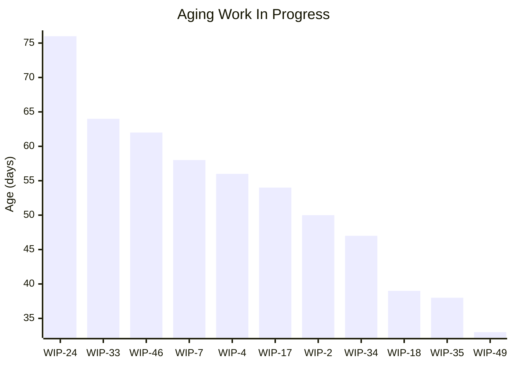
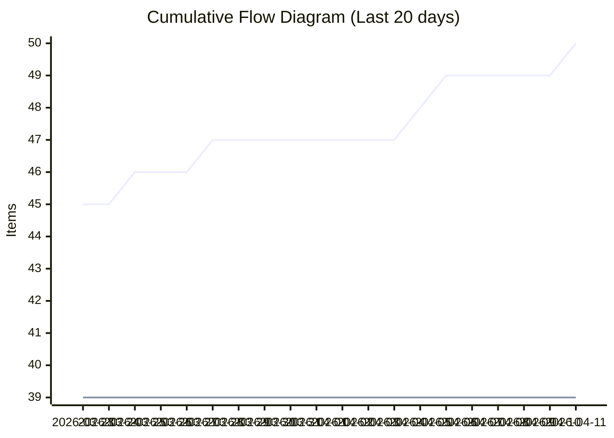
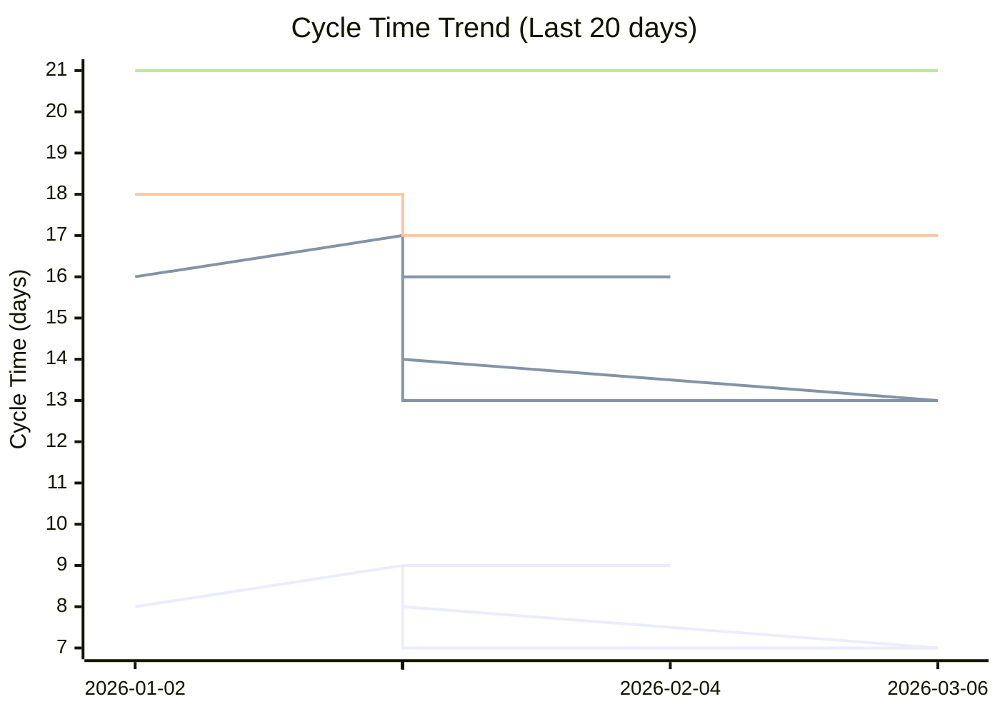
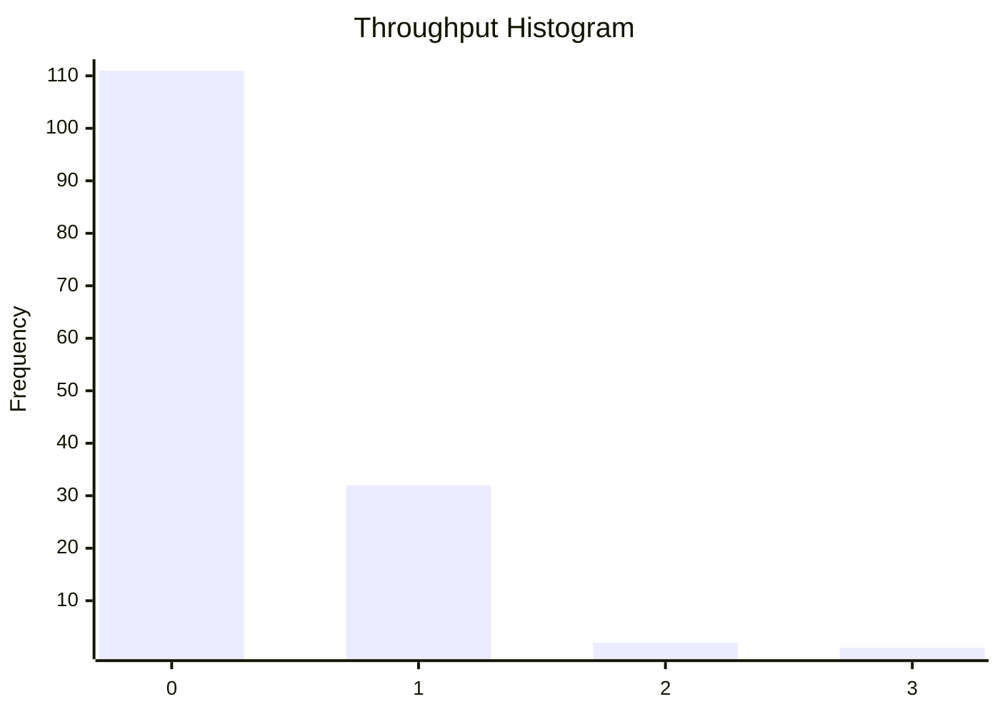

# Dashboard: Improvement

## Flow Metrics Summary

* **Total Items:** 50
* **Completed Items:** 39
* **Average Throughput:** 0.27 items/day
* **Priority Breakdown:** 
  Highest: 1
  High: 8
  Medium: 18
  Low: 9
  Lowest: 3

### Aging WIP Summary

* **Active WIP:** 11 items
* **Average WIP Age:** 52.5 days
* **Oldest Item Age:** 76 days

### Cycle Time Percentiles

* **50th Percentile:** 8 days
* **75th Percentile:** 16 days
* **85th Percentile:** 18 days
* **95th Percentile:** 21 days
* **98th Percentile:** 21 days

## Aging Work In Progress


## Forecasted Cumulative Flow Diagram
```mermaid
xychart-beta
    title "Forecasted Cumulative Flow Diagram"
    x-axis ["2026-03-15", " ", " ", " ", " ", " ", " ", "2026-03-22", " ", " ", " ", " ", " ", " ", "2026-03-29", " ", " ", " ", " ", " ", " ", "2026-04-05", " ", " ", " ", " ", " ", " ", "2026-04-12", " ", " ", " ", " ", " ", " ", "2026-04-19", " ", " ", " ", " ", " ", " ", "2026-04-26", " ", " ", " ", " ", " ", " ", "2026-05-03", " ", " ", " ", " ", " ", " ", "2026-05-10", " ", " ", " ", " ", " ", " ", "2026-05-17", " ", " ", " ", " ", " ", " ", "2026-05-24", " ", " ", " ", " ", " ", " ", "2026-05-31", " ", " ", " ", " ", " ", " ", "2026-06-07", " ", " ", " ", " ", " ", " ", "2026-06-14", " ", " ", " ", " ", " ", " ", "2026-06-21", " ", " ", " ", " ", " ", " ", "2026-06-28", " ", " ", " ", " ", " ", " ", "2026-07-05", " ", " ", " ", " ", " ", " ", "2026-07-12", " ", " ", " ", " ", " ", " ", "2026-07-19", " ", " ", " "]
    y-axis "Items"
    line "Arrivals" [42, 42, 43, 43, 44, 44, 45, 45, 45, 45, 46, 46, 46, 47, 47, 47, 47, 47, 47, 47, 47, 48, 49, 49, 49, 49, 49, 50, 50, 50, 50, 50, 50, 50, 50, 50, 50, 50, 50, 50, 50, 50, 50, 50, 50, 50, 50, 50, 50, 50, 50, 50, 50, 50, 50, 50, 50, 50, 50, 50, 50, 50, 50, 50, 50, 50, 50, 50, 50, 50, 50, 50, 50, 50, 50, 50, 50, 50, 50, 50, 50, 50, 50, 50, 50, 50, 50, 50, 50, 50, 50, 50, 50, 50, 50, 50, 50, 50, 50, 50, 50, 50, 50, 50, 50, 50, 50, 50, 50, 50, 50, 50, 50, 50, 50, 50, 50, 50, 50, 50, 50, 50, 50, 50, 50, 50, 50, 50, 50, 50]
    line "Departures" [36, 37, 37, 37, 38, 38, 38, 39, 39, 39, 39, 39, 39, 39, 39, 39, 39, 39, 39, 39, 39, 39, 39, 39, 39, 39, 39, 39, 39, 39, 39, 39, 39, 39, 39, 39, 39, 39, 39, 39, 39, 39, 39, 39, 39, 39, 39, 39, 39, 39, 39, 39, 39, 39, 39, 39, 39, 39, 39, 39, NaN, NaN, NaN, NaN, NaN, NaN, NaN, NaN, NaN, NaN, NaN, NaN, NaN, NaN, NaN, NaN, NaN, NaN, NaN, NaN, NaN, NaN, NaN, NaN, NaN, NaN, NaN, NaN, NaN, NaN, NaN, NaN, NaN, NaN, NaN, NaN, NaN, NaN, NaN, NaN, NaN, NaN, NaN, NaN, NaN, NaN, NaN, NaN, NaN, NaN, NaN, NaN, NaN, NaN, NaN, NaN, NaN, NaN, NaN, NaN, NaN, NaN, NaN, NaN, NaN, NaN, NaN, NaN, NaN, NaN]
    line "50% Confidence" [36, 37, 37, 37, 38, 38, 38, 39, 39, 39, 39, 39, 39, 39, 39, 39, 39, 39, 39, 39, 39, 39, 39, 39, 39, 39, 39, 39, 39, 39, 39, 39, 39, 39, 39, 39, 39, 39, 39, 39, 39, 39, 39, 39, 39, 39, 39, 39, 39, 39, 39, 39, 39, 39, 39, 39, 39, 39, 39, 39, 39.275, 39.55, 39.825, 40.1, 40.375, 40.65, 40.925, 41.2, 41.475, 41.75, 42.025, 42.3, 42.575, 42.85, 43.125, 43.4, 43.675, 43.95, 44.225, 44.5, 44.775, 45.05, 45.325, 45.6, 45.875, 46.15, 46.425, 46.7, 46.975, 47.25, 47.525, 47.8, 48.075, 48.35, 48.625, 48.9, 49.175, 49.45, 49.725, 50.0, 50, 50, 50, 50, 50, 50, 50, 50, 50, 50, 50, 50, 50, 50, 50, 50, 50, 50, 50, 50, 50, 50, 50, 50, 50, 50, 50, 50, 50, 50]
    line "50% Deadline" [NaN, NaN, NaN, NaN, NaN, NaN, NaN, NaN, NaN, NaN, NaN, NaN, NaN, NaN, NaN, NaN, NaN, NaN, NaN, NaN, NaN, NaN, NaN, NaN, NaN, NaN, NaN, NaN, NaN, NaN, NaN, NaN, NaN, NaN, NaN, NaN, NaN, NaN, NaN, NaN, NaN, NaN, NaN, NaN, NaN, NaN, NaN, NaN, NaN, NaN, NaN, NaN, NaN, NaN, NaN, NaN, NaN, NaN, NaN, NaN, NaN, NaN, NaN, NaN, NaN, NaN, NaN, NaN, NaN, NaN, NaN, NaN, NaN, NaN, NaN, NaN, NaN, NaN, NaN, NaN, NaN, NaN, NaN, NaN, NaN, NaN, NaN, NaN, NaN, NaN, NaN, NaN, NaN, NaN, NaN, NaN, NaN, NaN, NaN, 50, NaN, NaN, NaN, NaN, NaN, NaN, NaN, NaN, NaN, NaN, NaN, NaN, NaN, NaN, NaN, NaN, NaN, NaN, NaN, NaN, NaN, NaN, NaN, NaN, NaN, NaN, NaN, NaN, NaN, NaN]
    line "75% Confidence" [36, 37, 37, 37, 38, 38, 38, 39, 39, 39, 39, 39, 39, 39, 39, 39, 39, 39, 39, 39, 39, 39, 39, 39, 39, 39, 39, 39, 39, 39, 39, 39, 39, 39, 39, 39, 39, 39, 39, 39, 39, 39, 39, 39, 39, 39, 39, 39, 39, 39, 39, 39, 39, 39, 39, 39, 39, 39, 39, 39, 39.224489795918366, 39.44897959183673, 39.673469387755105, 39.89795918367347, 40.12244897959184, 40.3469387755102, 40.57142857142857, 40.795918367346935, 41.02040816326531, 41.244897959183675, 41.46938775510204, 41.69387755102041, 41.91836734693877, 42.142857142857146, 42.36734693877551, 42.59183673469388, 42.816326530612244, 43.04081632653061, 43.265306122448976, 43.48979591836735, 43.714285714285715, 43.93877551020408, 44.16326530612245, 44.38775510204081, 44.61224489795919, 44.83673469387755, 45.06122448979592, 45.285714285714285, 45.51020408163265, 45.734693877551024, 45.95918367346939, 46.183673469387756, 46.40816326530612, 46.63265306122449, 46.857142857142854, 47.08163265306122, 47.30612244897959, 47.53061224489796, 47.755102040816325, 47.97959183673469, 48.20408163265306, 48.42857142857143, 48.6530612244898, 48.87755102040816, 49.10204081632653, 49.326530612244895, 49.55102040816327, 49.775510204081634, 50.0, 50, 50, 50, 50, 50, 50, 50, 50, 50, 50, 50, 50, 50, 50, 50, 50, 50, 50, 50, 50, 50]
    line "75% Deadline" [NaN, NaN, NaN, NaN, NaN, NaN, NaN, NaN, NaN, NaN, NaN, NaN, NaN, NaN, NaN, NaN, NaN, NaN, NaN, NaN, NaN, NaN, NaN, NaN, NaN, NaN, NaN, NaN, NaN, NaN, NaN, NaN, NaN, NaN, NaN, NaN, NaN, NaN, NaN, NaN, NaN, NaN, NaN, NaN, NaN, NaN, NaN, NaN, NaN, NaN, NaN, NaN, NaN, NaN, NaN, NaN, NaN, NaN, NaN, NaN, NaN, NaN, NaN, NaN, NaN, NaN, NaN, NaN, NaN, NaN, NaN, NaN, NaN, NaN, NaN, NaN, NaN, NaN, NaN, NaN, NaN, NaN, NaN, NaN, NaN, NaN, NaN, NaN, NaN, NaN, NaN, NaN, NaN, NaN, NaN, NaN, NaN, NaN, NaN, NaN, NaN, NaN, NaN, NaN, NaN, NaN, NaN, NaN, 50, NaN, NaN, NaN, NaN, NaN, NaN, NaN, NaN, NaN, NaN, NaN, NaN, NaN, NaN, NaN, NaN, NaN, NaN, NaN, NaN, NaN]
    line "85% Confidence" [36, 37, 37, 37, 38, 38, 38, 39, 39, 39, 39, 39, 39, 39, 39, 39, 39, 39, 39, 39, 39, 39, 39, 39, 39, 39, 39, 39, 39, 39, 39, 39, 39, 39, 39, 39, 39, 39, 39, 39, 39, 39, 39, 39, 39, 39, 39, 39, 39, 39, 39, 39, 39, 39, 39, 39, 39, 39, 39, 39, 39.2037037037037, 39.407407407407405, 39.611111111111114, 39.81481481481482, 40.01851851851852, 40.22222222222222, 40.425925925925924, 40.629629629629626, 40.833333333333336, 41.03703703703704, 41.24074074074074, 41.44444444444444, 41.648148148148145, 41.851851851851855, 42.05555555555556, 42.25925925925926, 42.46296296296296, 42.666666666666664, 42.87037037037037, 43.074074074074076, 43.27777777777778, 43.48148148148148, 43.68518518518518, 43.888888888888886, 44.092592592592595, 44.2962962962963, 44.5, 44.7037037037037, 44.907407407407405, 45.111111111111114, 45.31481481481482, 45.51851851851852, 45.72222222222222, 45.925925925925924, 46.129629629629626, 46.333333333333336, 46.53703703703704, 46.74074074074074, 46.94444444444444, 47.148148148148145, 47.35185185185185, 47.55555555555556, 47.75925925925926, 47.96296296296296, 48.166666666666664, 48.37037037037037, 48.574074074074076, 48.77777777777778, 48.98148148148148, 49.18518518518518, 49.388888888888886, 49.592592592592595, 49.7962962962963, 50.0, 50, 50, 50, 50, 50, 50, 50, 50, 50, 50, 50, 50, 50, 50, 50, 50]
    line "85% Deadline" [NaN, NaN, NaN, NaN, NaN, NaN, NaN, NaN, NaN, NaN, NaN, NaN, NaN, NaN, NaN, NaN, NaN, NaN, NaN, NaN, NaN, NaN, NaN, NaN, NaN, NaN, NaN, NaN, NaN, NaN, NaN, NaN, NaN, NaN, NaN, NaN, NaN, NaN, NaN, NaN, NaN, NaN, NaN, NaN, NaN, NaN, NaN, NaN, NaN, NaN, NaN, NaN, NaN, NaN, NaN, NaN, NaN, NaN, NaN, NaN, NaN, NaN, NaN, NaN, NaN, NaN, NaN, NaN, NaN, NaN, NaN, NaN, NaN, NaN, NaN, NaN, NaN, NaN, NaN, NaN, NaN, NaN, NaN, NaN, NaN, NaN, NaN, NaN, NaN, NaN, NaN, NaN, NaN, NaN, NaN, NaN, NaN, NaN, NaN, NaN, NaN, NaN, NaN, NaN, NaN, NaN, NaN, NaN, NaN, NaN, NaN, NaN, NaN, 50, NaN, NaN, NaN, NaN, NaN, NaN, NaN, NaN, NaN, NaN, NaN, NaN, NaN, NaN, NaN, NaN]
    line "95% Confidence" [36, 37, 37, 37, 38, 38, 38, 39, 39, 39, 39, 39, 39, 39, 39, 39, 39, 39, 39, 39, 39, 39, 39, 39, 39, 39, 39, 39, 39, 39, 39, 39, 39, 39, 39, 39, 39, 39, 39, 39, 39, 39, 39, 39, 39, 39, 39, 39, 39, 39, 39, 39, 39, 39, 39, 39, 39, 39, 39, 39, 39.17460317460318, 39.34920634920635, 39.523809523809526, 39.698412698412696, 39.87301587301587, 40.04761904761905, 40.22222222222222, 40.3968253968254, 40.57142857142857, 40.74603174603175, 40.92063492063492, 41.095238095238095, 41.26984126984127, 41.44444444444444, 41.61904761904762, 41.79365079365079, 41.96825396825397, 42.142857142857146, 42.317460317460316, 42.492063492063494, 42.666666666666664, 42.84126984126984, 43.01587301587301, 43.19047619047619, 43.36507936507937, 43.53968253968254, 43.714285714285715, 43.888888888888886, 44.06349206349206, 44.23809523809524, 44.41269841269841, 44.58730158730159, 44.76190476190476, 44.93650793650794, 45.111111111111114, 45.285714285714285, 45.46031746031746, 45.63492063492063, 45.80952380952381, 45.98412698412699, 46.15873015873016, 46.333333333333336, 46.507936507936506, 46.682539682539684, 46.857142857142854, 47.03174603174603, 47.2063492063492, 47.38095238095238, 47.55555555555556, 47.73015873015873, 47.904761904761905, 48.079365079365076, 48.25396825396825, 48.42857142857143, 48.6031746031746, 48.77777777777778, 48.95238095238095, 49.12698412698413, 49.301587301587304, 49.476190476190474, 49.65079365079365, 49.82539682539682, 50.0, 50, 50, 50, 50, 50, 50, 50]
    line "95% Deadline" [NaN, NaN, NaN, NaN, NaN, NaN, NaN, NaN, NaN, NaN, NaN, NaN, NaN, NaN, NaN, NaN, NaN, NaN, NaN, NaN, NaN, NaN, NaN, NaN, NaN, NaN, NaN, NaN, NaN, NaN, NaN, NaN, NaN, NaN, NaN, NaN, NaN, NaN, NaN, NaN, NaN, NaN, NaN, NaN, NaN, NaN, NaN, NaN, NaN, NaN, NaN, NaN, NaN, NaN, NaN, NaN, NaN, NaN, NaN, NaN, NaN, NaN, NaN, NaN, NaN, NaN, NaN, NaN, NaN, NaN, NaN, NaN, NaN, NaN, NaN, NaN, NaN, NaN, NaN, NaN, NaN, NaN, NaN, NaN, NaN, NaN, NaN, NaN, NaN, NaN, NaN, NaN, NaN, NaN, NaN, NaN, NaN, NaN, NaN, NaN, NaN, NaN, NaN, NaN, NaN, NaN, NaN, NaN, NaN, NaN, NaN, NaN, NaN, NaN, NaN, NaN, NaN, NaN, NaN, NaN, NaN, NaN, 50, NaN, NaN, NaN, NaN, NaN, NaN, NaN]
    line "98% Confidence" [36, 37, 37, 37, 38, 38, 38, 39, 39, 39, 39, 39, 39, 39, 39, 39, 39, 39, 39, 39, 39, 39, 39, 39, 39, 39, 39, 39, 39, 39, 39, 39, 39, 39, 39, 39, 39, 39, 39, 39, 39, 39, 39, 39, 39, 39, 39, 39, 39, 39, 39, 39, 39, 39, 39, 39, 39, 39, 39, 39, 39.15714285714286, 39.31428571428572, 39.47142857142857, 39.628571428571426, 39.785714285714285, 39.94285714285714, 40.1, 40.25714285714286, 40.41428571428571, 40.57142857142857, 40.72857142857143, 40.885714285714286, 41.042857142857144, 41.2, 41.357142857142854, 41.51428571428571, 41.67142857142857, 41.82857142857143, 41.98571428571429, 42.142857142857146, 42.3, 42.457142857142856, 42.614285714285714, 42.77142857142857, 42.92857142857143, 43.08571428571429, 43.24285714285714, 43.4, 43.55714285714286, 43.714285714285715, 43.871428571428574, 44.028571428571425, 44.18571428571428, 44.34285714285714, 44.5, 44.65714285714286, 44.81428571428572, 44.971428571428575, 45.128571428571426, 45.285714285714285, 45.44285714285714, 45.6, 45.75714285714286, 45.91428571428571, 46.07142857142857, 46.22857142857143, 46.385714285714286, 46.542857142857144, 46.7, 46.857142857142854, 47.01428571428571, 47.17142857142857, 47.32857142857143, 47.48571428571429, 47.64285714285714, 47.8, 47.957142857142856, 48.114285714285714, 48.27142857142857, 48.42857142857143, 48.58571428571429, 48.74285714285714, 48.9, 49.05714285714286, 49.214285714285715, 49.371428571428574, 49.528571428571425, 49.68571428571428, 49.84285714285714, 50.0]
    line "98% Deadline" [NaN, NaN, NaN, NaN, NaN, NaN, NaN, NaN, NaN, NaN, NaN, NaN, NaN, NaN, NaN, NaN, NaN, NaN, NaN, NaN, NaN, NaN, NaN, NaN, NaN, NaN, NaN, NaN, NaN, NaN, NaN, NaN, NaN, NaN, NaN, NaN, NaN, NaN, NaN, NaN, NaN, NaN, NaN, NaN, NaN, NaN, NaN, NaN, NaN, NaN, NaN, NaN, NaN, NaN, NaN, NaN, NaN, NaN, NaN, NaN, NaN, NaN, NaN, NaN, NaN, NaN, NaN, NaN, NaN, NaN, NaN, NaN, NaN, NaN, NaN, NaN, NaN, NaN, NaN, NaN, NaN, NaN, NaN, NaN, NaN, NaN, NaN, NaN, NaN, NaN, NaN, NaN, NaN, NaN, NaN, NaN, NaN, NaN, NaN, NaN, NaN, NaN, NaN, NaN, NaN, NaN, NaN, NaN, NaN, NaN, NaN, NaN, NaN, NaN, NaN, NaN, NaN, NaN, NaN, NaN, NaN, NaN, NaN, NaN, NaN, NaN, NaN, NaN, NaN, 50]
```

**Legend:** Arrivals (blue), Departures (green), Projections (various colors). Vertical lines for: 50%, 75%, 85%, 95%, 98% confidence.

## Cumulative Flow Diagram


## Cycle Time Scatter Plot


## Throughput Histogram


## Cycle Time Bands Over Time
```
                    Cycle Time Bands Over Time
             ┌                                        ┐ 
     ≤ 1 day ┤ 0                                        
    ≤ 7 days ┤■■■■■■■■■■■■■■■■■■■■■■■■■■■■■■■■■■■■ 19   
   ≤ 14 days ┤■■■■■■■■■■■■■■■■■■■ 10                    
   ≤ 21 days ┤■■■■■■■■■■■■■■■■■■■ 10                    
   ≤ 28 days ┤ 0                                        
   > 28 days ┤ 0                                        
             └                                        ┘ 
                          Items Completed

```