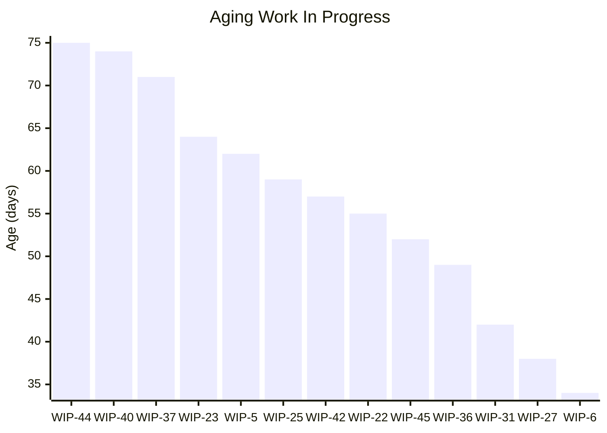
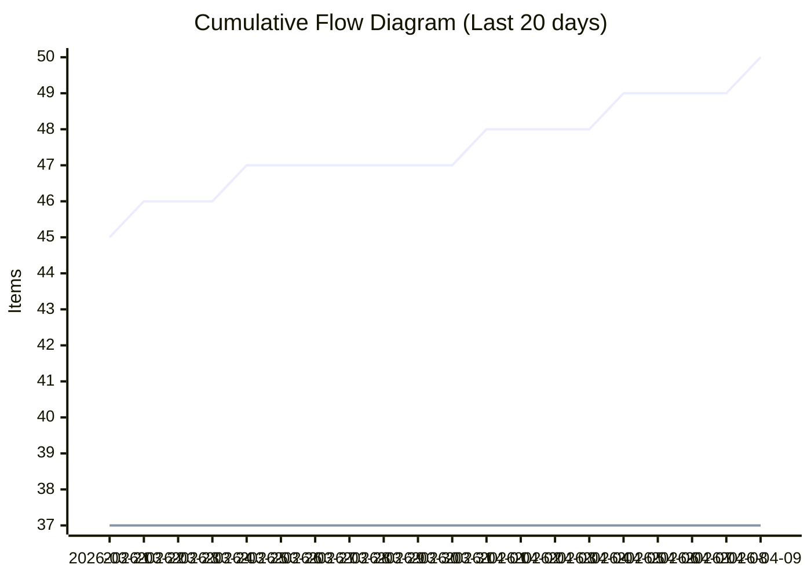
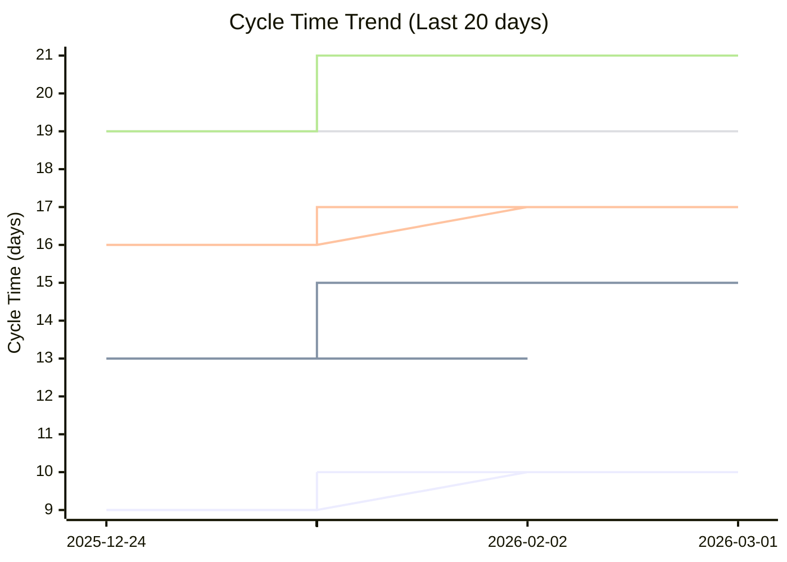
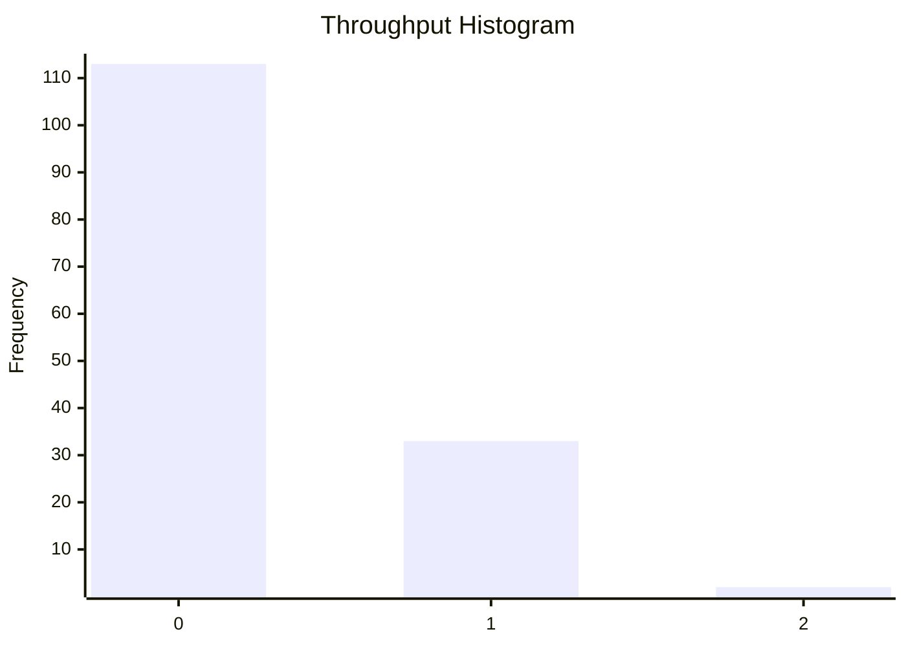

# Dashboard: Story

## Flow Metrics Summary

* **Total Items:** 50
* **Completed Items:** 37
* **Average Throughput:** 0.25 items/day
* **Priority Breakdown:** 
  Highest: 2
  High: 8
  Medium: 20
  Low: 6
  Lowest: 1

### Aging WIP Summary

* **Active WIP:** 13 items
* **Average WIP Age:** 56.3 days
* **Oldest Item Age:** 75 days

### Cycle Time Percentiles

* **50th Percentile:** 10 days
* **75th Percentile:** 15 days
* **85th Percentile:** 17 days
* **95th Percentile:** 20 days
* **98th Percentile:** 21 days

## Aging Work In Progress


## Forecasted Cumulative Flow Diagram
```mermaid
xychart-beta
    title "Forecasted Cumulative Flow Diagram"
    x-axis ["2026-03-14", " ", " ", " ", " ", " ", " ", "2026-03-21", " ", " ", " ", " ", " ", " ", "2026-03-28", " ", " ", " ", " ", " ", " ", "2026-04-04", " ", " ", " ", " ", " ", " ", "2026-04-11", " ", " ", " ", " ", " ", " ", "2026-04-18", " ", " ", " ", " ", " ", " ", "2026-04-25", " ", " ", " ", " ", " ", " ", "2026-05-02", " ", " ", " ", " ", " ", " ", "2026-05-09", " ", " ", " ", " ", " ", " ", "2026-05-16", " ", " ", " ", " ", " ", " ", "2026-05-23", " ", " ", " ", " ", " ", " ", "2026-05-30", " ", " ", " ", " ", " ", " ", "2026-06-06", " ", " ", " ", " ", " ", " ", "2026-06-13", " ", " ", " ", " ", " ", " ", "2026-06-20", " ", " ", " ", " ", " ", " ", "2026-06-27", " ", " ", " ", " ", " ", " ", "2026-07-04", " ", " ", " ", " ", " ", " ", "2026-07-11", " ", " ", " ", " ", " ", " ", "2026-07-18", " ", " ", " ", " ", " ", " ", "2026-07-25", " ", " ", " ", " ", " ", " ", "2026-08-01", " ", " "]
    y-axis "Items"
    line "Arrivals" [42, 43, 43, 44, 44, 45, 45, 45, 46, 46, 46, 47, 47, 47, 47, 47, 47, 47, 48, 48, 48, 48, 49, 49, 49, 49, 50, 50, 50, 50, 50, 50, 50, 50, 50, 50, 50, 50, 50, 50, 50, 50, 50, 50, 50, 50, 50, 50, 50, 50, 50, 50, 50, 50, 50, 50, 50, 50, 50, 50, 50, 50, 50, 50, 50, 50, 50, 50, 50, 50, 50, 50, 50, 50, 50, 50, 50, 50, 50, 50, 50, 50, 50, 50, 50, 50, 50, 50, 50, 50, 50, 50, 50, 50, 50, 50, 50, 50, 50, 50, 50, 50, 50, 50, 50, 50, 50, 50, 50, 50, 50, 50, 50, 50, 50, 50, 50, 50, 50, 50, 50, 50, 50, 50, 50, 50, 50, 50, 50, 50, 50, 50, 50, 50, 50, 50, 50, 50, 50, 50, 50, 50, 50]
    line "Departures" [36, 37, 37, 37, 37, 37, 37, 37, 37, 37, 37, 37, 37, 37, 37, 37, 37, 37, 37, 37, 37, 37, 37, 37, 37, 37, 37, 37, 37, 37, 37, 37, 37, 37, 37, 37, 37, 37, 37, 37, 37, 37, 37, 37, 37, 37, 37, 37, 37, 37, 37, 37, 37, 37, 37, 37, 37, 37, 37, 37, NaN, NaN, NaN, NaN, NaN, NaN, NaN, NaN, NaN, NaN, NaN, NaN, NaN, NaN, NaN, NaN, NaN, NaN, NaN, NaN, NaN, NaN, NaN, NaN, NaN, NaN, NaN, NaN, NaN, NaN, NaN, NaN, NaN, NaN, NaN, NaN, NaN, NaN, NaN, NaN, NaN, NaN, NaN, NaN, NaN, NaN, NaN, NaN, NaN, NaN, NaN, NaN, NaN, NaN, NaN, NaN, NaN, NaN, NaN, NaN, NaN, NaN, NaN, NaN, NaN, NaN, NaN, NaN, NaN, NaN, NaN, NaN, NaN, NaN, NaN, NaN, NaN, NaN, NaN, NaN, NaN, NaN, NaN]
    line "50% Confidence" [36, 37, 37, 37, 37, 37, 37, 37, 37, 37, 37, 37, 37, 37, 37, 37, 37, 37, 37, 37, 37, 37, 37, 37, 37, 37, 37, 37, 37, 37, 37, 37, 37, 37, 37, 37, 37, 37, 37, 37, 37, 37, 37, 37, 37, 37, 37, 37, 37, 37, 37, 37, 37, 37, 37, 37, 37, 37, 37, 37, 37.254901960784316, 37.509803921568626, 37.76470588235294, 38.01960784313725, 38.27450980392157, 38.529411764705884, 38.78431372549019, 39.03921568627451, 39.294117647058826, 39.549019607843135, 39.80392156862745, 40.05882352941177, 40.31372549019608, 40.568627450980394, 40.8235294117647, 41.07843137254902, 41.333333333333336, 41.588235294117645, 41.84313725490196, 42.09803921568627, 42.35294117647059, 42.6078431372549, 42.86274509803921, 43.11764705882353, 43.372549019607845, 43.627450980392155, 43.88235294117647, 44.13725490196079, 44.3921568627451, 44.64705882352941, 44.90196078431372, 45.15686274509804, 45.41176470588235, 45.666666666666664, 45.92156862745098, 46.17647058823529, 46.431372549019606, 46.68627450980392, 46.94117647058823, 47.19607843137255, 47.450980392156865, 47.705882352941174, 47.96078431372549, 48.21568627450981, 48.470588235294116, 48.72549019607843, 48.98039215686275, 49.23529411764706, 49.49019607843137, 49.745098039215684, 50.0, 50, 50, 50, 50, 50, 50, 50, 50, 50, 50, 50, 50, 50, 50, 50, 50, 50, 50, 50, 50, 50, 50, 50, 50, 50, 50, 50, 50, 50, 50, 50, 50]
    line "50% Deadline" [NaN, NaN, NaN, NaN, NaN, NaN, NaN, NaN, NaN, NaN, NaN, NaN, NaN, NaN, NaN, NaN, NaN, NaN, NaN, NaN, NaN, NaN, NaN, NaN, NaN, NaN, NaN, NaN, NaN, NaN, NaN, NaN, NaN, NaN, NaN, NaN, NaN, NaN, NaN, NaN, NaN, NaN, NaN, NaN, NaN, NaN, NaN, NaN, NaN, NaN, NaN, NaN, NaN, NaN, NaN, NaN, NaN, NaN, NaN, NaN, NaN, NaN, NaN, NaN, NaN, NaN, NaN, NaN, NaN, NaN, NaN, NaN, NaN, NaN, NaN, NaN, NaN, NaN, NaN, NaN, NaN, NaN, NaN, NaN, NaN, NaN, NaN, NaN, NaN, NaN, NaN, NaN, NaN, NaN, NaN, NaN, NaN, NaN, NaN, NaN, NaN, NaN, NaN, NaN, NaN, NaN, NaN, NaN, NaN, NaN, 50, NaN, NaN, NaN, NaN, NaN, NaN, NaN, NaN, NaN, NaN, NaN, NaN, NaN, NaN, NaN, NaN, NaN, NaN, NaN, NaN, NaN, NaN, NaN, NaN, NaN, NaN, NaN, NaN, NaN, NaN, NaN, NaN]
    line "75% Confidence" [36, 37, 37, 37, 37, 37, 37, 37, 37, 37, 37, 37, 37, 37, 37, 37, 37, 37, 37, 37, 37, 37, 37, 37, 37, 37, 37, 37, 37, 37, 37, 37, 37, 37, 37, 37, 37, 37, 37, 37, 37, 37, 37, 37, 37, 37, 37, 37, 37, 37, 37, 37, 37, 37, 37, 37, 37, 37, 37, 37, 37.21311475409836, 37.42622950819672, 37.63934426229508, 37.85245901639344, 38.0655737704918, 38.278688524590166, 38.49180327868852, 38.704918032786885, 38.91803278688525, 39.131147540983605, 39.34426229508197, 39.557377049180324, 39.77049180327869, 39.98360655737705, 40.19672131147541, 40.40983606557377, 40.622950819672134, 40.83606557377049, 41.049180327868854, 41.26229508196721, 41.47540983606557, 41.68852459016394, 41.90163934426229, 42.114754098360656, 42.32786885245902, 42.540983606557376, 42.75409836065574, 42.967213114754095, 43.18032786885246, 43.39344262295082, 43.60655737704918, 43.81967213114754, 44.0327868852459, 44.24590163934426, 44.459016393442624, 44.67213114754098, 44.885245901639344, 45.09836065573771, 45.31147540983606, 45.52459016393443, 45.73770491803279, 45.950819672131146, 46.16393442622951, 46.377049180327866, 46.59016393442623, 46.803278688524586, 47.01639344262295, 47.22950819672131, 47.44262295081967, 47.65573770491803, 47.868852459016395, 48.08196721311475, 48.295081967213115, 48.50819672131148, 48.721311475409834, 48.9344262295082, 49.14754098360656, 49.36065573770492, 49.57377049180328, 49.78688524590164, 50.0, 50, 50, 50, 50, 50, 50, 50, 50, 50, 50, 50, 50, 50, 50, 50, 50, 50, 50, 50, 50, 50, 50]
    line "75% Deadline" [NaN, NaN, NaN, NaN, NaN, NaN, NaN, NaN, NaN, NaN, NaN, NaN, NaN, NaN, NaN, NaN, NaN, NaN, NaN, NaN, NaN, NaN, NaN, NaN, NaN, NaN, NaN, NaN, NaN, NaN, NaN, NaN, NaN, NaN, NaN, NaN, NaN, NaN, NaN, NaN, NaN, NaN, NaN, NaN, NaN, NaN, NaN, NaN, NaN, NaN, NaN, NaN, NaN, NaN, NaN, NaN, NaN, NaN, NaN, NaN, NaN, NaN, NaN, NaN, NaN, NaN, NaN, NaN, NaN, NaN, NaN, NaN, NaN, NaN, NaN, NaN, NaN, NaN, NaN, NaN, NaN, NaN, NaN, NaN, NaN, NaN, NaN, NaN, NaN, NaN, NaN, NaN, NaN, NaN, NaN, NaN, NaN, NaN, NaN, NaN, NaN, NaN, NaN, NaN, NaN, NaN, NaN, NaN, NaN, NaN, NaN, NaN, NaN, NaN, NaN, NaN, NaN, NaN, NaN, NaN, 50, NaN, NaN, NaN, NaN, NaN, NaN, NaN, NaN, NaN, NaN, NaN, NaN, NaN, NaN, NaN, NaN, NaN, NaN, NaN, NaN, NaN, NaN]
    line "85% Confidence" [36, 37, 37, 37, 37, 37, 37, 37, 37, 37, 37, 37, 37, 37, 37, 37, 37, 37, 37, 37, 37, 37, 37, 37, 37, 37, 37, 37, 37, 37, 37, 37, 37, 37, 37, 37, 37, 37, 37, 37, 37, 37, 37, 37, 37, 37, 37, 37, 37, 37, 37, 37, 37, 37, 37, 37, 37, 37, 37, 37, 37.196969696969695, 37.39393939393939, 37.59090909090909, 37.78787878787879, 37.984848484848484, 38.18181818181818, 38.378787878787875, 38.57575757575758, 38.77272727272727, 38.96969696969697, 39.166666666666664, 39.36363636363636, 39.56060606060606, 39.75757575757576, 39.95454545454545, 40.15151515151515, 40.34848484848485, 40.54545454545455, 40.74242424242424, 40.93939393939394, 41.13636363636363, 41.333333333333336, 41.53030303030303, 41.72727272727273, 41.92424242424242, 42.121212121212125, 42.31818181818182, 42.515151515151516, 42.71212121212121, 42.90909090909091, 43.10606060606061, 43.303030303030305, 43.5, 43.696969696969695, 43.89393939393939, 44.09090909090909, 44.28787878787879, 44.484848484848484, 44.68181818181818, 44.878787878787875, 45.07575757575758, 45.27272727272727, 45.46969696969697, 45.666666666666664, 45.86363636363636, 46.06060606060606, 46.25757575757576, 46.45454545454545, 46.65151515151515, 46.848484848484844, 47.04545454545455, 47.24242424242424, 47.43939393939394, 47.63636363636364, 47.83333333333333, 48.03030303030303, 48.22727272727273, 48.42424242424242, 48.621212121212125, 48.81818181818182, 49.015151515151516, 49.21212121212121, 49.40909090909091, 49.60606060606061, 49.803030303030305, 50.0, 50, 50, 50, 50, 50, 50, 50, 50, 50, 50, 50, 50, 50, 50, 50, 50, 50]
    line "85% Deadline" [NaN, NaN, NaN, NaN, NaN, NaN, NaN, NaN, NaN, NaN, NaN, NaN, NaN, NaN, NaN, NaN, NaN, NaN, NaN, NaN, NaN, NaN, NaN, NaN, NaN, NaN, NaN, NaN, NaN, NaN, NaN, NaN, NaN, NaN, NaN, NaN, NaN, NaN, NaN, NaN, NaN, NaN, NaN, NaN, NaN, NaN, NaN, NaN, NaN, NaN, NaN, NaN, NaN, NaN, NaN, NaN, NaN, NaN, NaN, NaN, NaN, NaN, NaN, NaN, NaN, NaN, NaN, NaN, NaN, NaN, NaN, NaN, NaN, NaN, NaN, NaN, NaN, NaN, NaN, NaN, NaN, NaN, NaN, NaN, NaN, NaN, NaN, NaN, NaN, NaN, NaN, NaN, NaN, NaN, NaN, NaN, NaN, NaN, NaN, NaN, NaN, NaN, NaN, NaN, NaN, NaN, NaN, NaN, NaN, NaN, NaN, NaN, NaN, NaN, NaN, NaN, NaN, NaN, NaN, NaN, NaN, NaN, NaN, NaN, NaN, 50, NaN, NaN, NaN, NaN, NaN, NaN, NaN, NaN, NaN, NaN, NaN, NaN, NaN, NaN, NaN, NaN, NaN]
    line "95% Confidence" [36, 37, 37, 37, 37, 37, 37, 37, 37, 37, 37, 37, 37, 37, 37, 37, 37, 37, 37, 37, 37, 37, 37, 37, 37, 37, 37, 37, 37, 37, 37, 37, 37, 37, 37, 37, 37, 37, 37, 37, 37, 37, 37, 37, 37, 37, 37, 37, 37, 37, 37, 37, 37, 37, 37, 37, 37, 37, 37, 37, 37.171052631578945, 37.3421052631579, 37.51315789473684, 37.68421052631579, 37.85526315789474, 38.026315789473685, 38.19736842105263, 38.36842105263158, 38.53947368421053, 38.71052631578947, 38.88157894736842, 39.05263157894737, 39.223684210526315, 39.39473684210526, 39.56578947368421, 39.73684210526316, 39.9078947368421, 40.078947368421055, 40.25, 40.421052631578945, 40.5921052631579, 40.76315789473684, 40.93421052631579, 41.10526315789474, 41.276315789473685, 41.44736842105263, 41.618421052631575, 41.78947368421053, 41.96052631578947, 42.131578947368425, 42.30263157894737, 42.473684210526315, 42.64473684210526, 42.81578947368421, 42.98684210526316, 43.1578947368421, 43.328947368421055, 43.5, 43.671052631578945, 43.8421052631579, 44.01315789473684, 44.18421052631579, 44.35526315789474, 44.526315789473685, 44.69736842105263, 44.868421052631575, 45.03947368421053, 45.21052631578947, 45.381578947368425, 45.55263157894737, 45.723684210526315, 45.89473684210526, 46.06578947368421, 46.23684210526316, 46.40789473684211, 46.578947368421055, 46.75, 46.921052631578945, 47.0921052631579, 47.26315789473684, 47.43421052631579, 47.60526315789474, 47.776315789473685, 47.94736842105263, 48.118421052631575, 48.28947368421053, 48.46052631578947, 48.631578947368425, 48.80263157894737, 48.973684210526315, 49.14473684210526, 49.31578947368421, 49.48684210526316, 49.65789473684211, 49.828947368421055, 50.0, 50, 50, 50, 50, 50, 50, 50]
    line "95% Deadline" [NaN, NaN, NaN, NaN, NaN, NaN, NaN, NaN, NaN, NaN, NaN, NaN, NaN, NaN, NaN, NaN, NaN, NaN, NaN, NaN, NaN, NaN, NaN, NaN, NaN, NaN, NaN, NaN, NaN, NaN, NaN, NaN, NaN, NaN, NaN, NaN, NaN, NaN, NaN, NaN, NaN, NaN, NaN, NaN, NaN, NaN, NaN, NaN, NaN, NaN, NaN, NaN, NaN, NaN, NaN, NaN, NaN, NaN, NaN, NaN, NaN, NaN, NaN, NaN, NaN, NaN, NaN, NaN, NaN, NaN, NaN, NaN, NaN, NaN, NaN, NaN, NaN, NaN, NaN, NaN, NaN, NaN, NaN, NaN, NaN, NaN, NaN, NaN, NaN, NaN, NaN, NaN, NaN, NaN, NaN, NaN, NaN, NaN, NaN, NaN, NaN, NaN, NaN, NaN, NaN, NaN, NaN, NaN, NaN, NaN, NaN, NaN, NaN, NaN, NaN, NaN, NaN, NaN, NaN, NaN, NaN, NaN, NaN, NaN, NaN, NaN, NaN, NaN, NaN, NaN, NaN, NaN, NaN, NaN, NaN, 50, NaN, NaN, NaN, NaN, NaN, NaN, NaN]
    line "98% Confidence" [36, 37, 37, 37, 37, 37, 37, 37, 37, 37, 37, 37, 37, 37, 37, 37, 37, 37, 37, 37, 37, 37, 37, 37, 37, 37, 37, 37, 37, 37, 37, 37, 37, 37, 37, 37, 37, 37, 37, 37, 37, 37, 37, 37, 37, 37, 37, 37, 37, 37, 37, 37, 37, 37, 37, 37, 37, 37, 37, 37, 37.1566265060241, 37.31325301204819, 37.46987951807229, 37.626506024096386, 37.78313253012048, 37.93975903614458, 38.096385542168676, 38.25301204819277, 38.40963855421687, 38.566265060240966, 38.72289156626506, 38.87951807228916, 39.036144578313255, 39.19277108433735, 39.34939759036145, 39.506024096385545, 39.66265060240964, 39.81927710843374, 39.975903614457835, 40.13253012048193, 40.28915662650603, 40.445783132530124, 40.602409638554214, 40.75903614457831, 40.91566265060241, 41.0722891566265, 41.2289156626506, 41.3855421686747, 41.54216867469879, 41.69879518072289, 41.855421686746986, 42.01204819277108, 42.16867469879518, 42.325301204819276, 42.48192771084337, 42.63855421686747, 42.795180722891565, 42.95180722891566, 43.10843373493976, 43.265060240963855, 43.42168674698795, 43.57831325301205, 43.734939759036145, 43.89156626506024, 44.04819277108434, 44.204819277108435, 44.36144578313253, 44.51807228915663, 44.674698795180724, 44.83132530120482, 44.98795180722892, 45.144578313253014, 45.30120481927711, 45.45783132530121, 45.6144578313253, 45.7710843373494, 45.9277108433735, 46.08433734939759, 46.24096385542168, 46.39759036144578, 46.554216867469876, 46.71084337349397, 46.86746987951807, 47.024096385542165, 47.18072289156626, 47.33734939759036, 47.493975903614455, 47.65060240963855, 47.80722891566265, 47.963855421686745, 48.12048192771084, 48.27710843373494, 48.433734939759034, 48.59036144578313, 48.74698795180723, 48.903614457831324, 49.06024096385542, 49.21686746987952, 49.373493975903614, 49.53012048192771, 49.68674698795181, 49.8433734939759, 50.0]
    line "98% Deadline" [NaN, NaN, NaN, NaN, NaN, NaN, NaN, NaN, NaN, NaN, NaN, NaN, NaN, NaN, NaN, NaN, NaN, NaN, NaN, NaN, NaN, NaN, NaN, NaN, NaN, NaN, NaN, NaN, NaN, NaN, NaN, NaN, NaN, NaN, NaN, NaN, NaN, NaN, NaN, NaN, NaN, NaN, NaN, NaN, NaN, NaN, NaN, NaN, NaN, NaN, NaN, NaN, NaN, NaN, NaN, NaN, NaN, NaN, NaN, NaN, NaN, NaN, NaN, NaN, NaN, NaN, NaN, NaN, NaN, NaN, NaN, NaN, NaN, NaN, NaN, NaN, NaN, NaN, NaN, NaN, NaN, NaN, NaN, NaN, NaN, NaN, NaN, NaN, NaN, NaN, NaN, NaN, NaN, NaN, NaN, NaN, NaN, NaN, NaN, NaN, NaN, NaN, NaN, NaN, NaN, NaN, NaN, NaN, NaN, NaN, NaN, NaN, NaN, NaN, NaN, NaN, NaN, NaN, NaN, NaN, NaN, NaN, NaN, NaN, NaN, NaN, NaN, NaN, NaN, NaN, NaN, NaN, NaN, NaN, NaN, NaN, NaN, NaN, NaN, NaN, NaN, NaN, 50]
```

**Legend:** Arrivals (blue), Departures (green), Projections (various colors). Vertical lines for: 50%, 75%, 85%, 95%, 98% confidence.

## Cumulative Flow Diagram


## Cycle Time Scatter Plot


## Throughput Histogram


## Cycle Time Bands Over Time
```
                    Cycle Time Bands Over Time
             ┌                                        ┐ 
     ≤ 1 day ┤ 0                                        
    ≤ 7 days ┤■■■■■■■■■■■■■■■■■■■■■■■■■■■■■■■■■ 13      
   ≤ 14 days ┤■■■■■■■■■■■■■■■■■■■■■■■■■■■■■■■■■■■■ 14   
   ≤ 21 days ┤■■■■■■■■■■■■■■■■■■■■■■■■■■ 10             
   ≤ 28 days ┤ 0                                        
   > 28 days ┤ 0                                        
             └                                        ┘ 
                          Items Completed

```