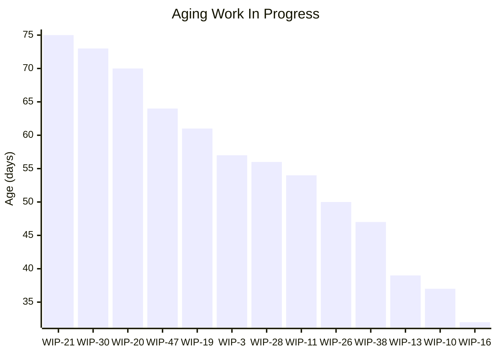
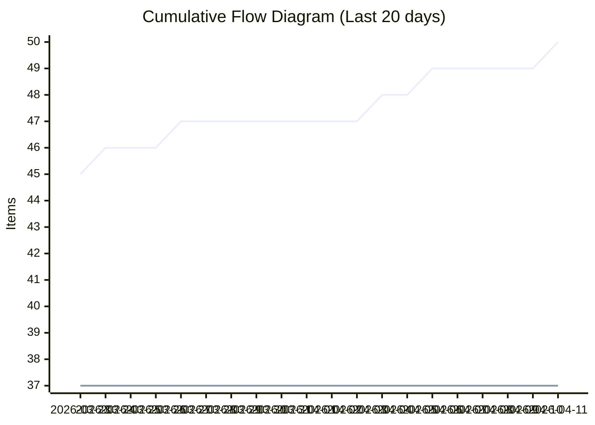
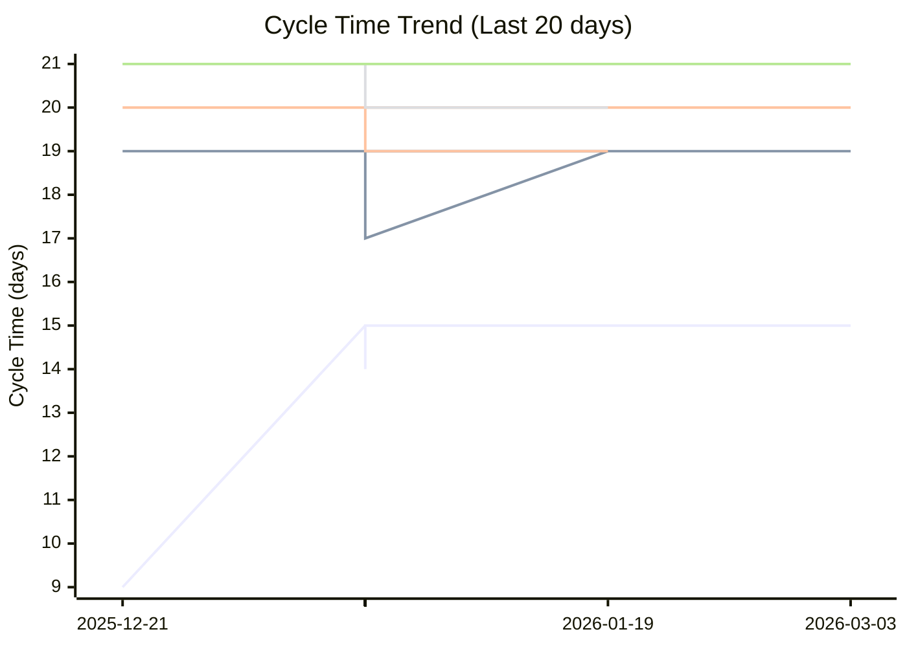
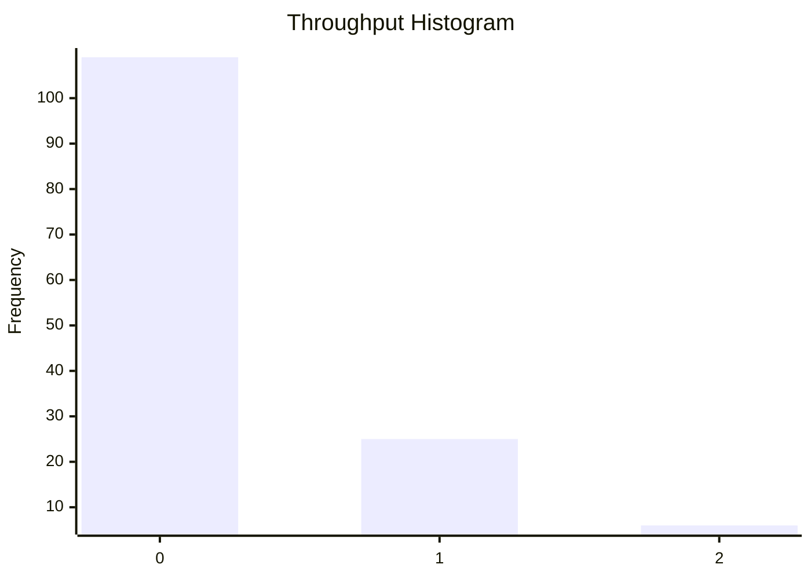

# Dashboard: Task

## Flow Metrics Summary

* **Total Items:** 50
* **Completed Items:** 37
* **Average Throughput:** 0.26 items/day
* **Priority Breakdown:** 
  Highest: 1
  High: 9
  Medium: 14
  Low: 8
  Lowest: 5

### Aging WIP Summary

* **Active WIP:** 13 items
* **Average WIP Age:** 55.0 days
* **Oldest Item Age:** 75 days

### Cycle Time Percentiles

* **50th Percentile:** 15 days
* **75th Percentile:** 18 days
* **85th Percentile:** 20 days
* **95th Percentile:** 21 days
* **98th Percentile:** 21 days

## Aging Work In Progress


## Forecasted Cumulative Flow Diagram
```mermaid
xychart-beta
    title "Forecasted Cumulative Flow Diagram"
    x-axis ["2026-03-14", " ", " ", " ", " ", " ", " ", "2026-03-21", " ", " ", " ", " ", " ", " ", "2026-03-28", " ", " ", " ", " ", " ", " ", "2026-04-04", " ", " ", " ", " ", " ", " ", "2026-04-11", " ", " ", " ", " ", " ", " ", "2026-04-18", " ", " ", " ", " ", " ", " ", "2026-04-25", " ", " ", " ", " ", " ", " ", "2026-05-02", " ", " ", " ", " ", " ", " ", "2026-05-09", " ", " ", " ", " ", " ", " ", "2026-05-16", " ", " ", " ", " ", " ", " ", "2026-05-23", " ", " ", " ", " ", " ", " ", "2026-05-30", " ", " ", " ", " ", " ", " ", "2026-06-06", " ", " ", " ", " ", " ", " ", "2026-06-13", " ", " ", " ", " ", " ", " ", "2026-06-20", " ", " ", " ", " ", " ", " ", "2026-06-27", " ", " ", " ", " ", " ", " ", "2026-07-04", " ", " ", " ", " ", " ", " ", "2026-07-11", " ", " ", " ", " ", " ", " ", "2026-07-18", " ", " ", " ", " ", " ", " ", "2026-07-25", " ", " ", " ", " ", " ", " ", "2026-08-01", " ", " "]
    y-axis "Items"
    line "Arrivals" [42, 42, 42, 43, 44, 44, 45, 45, 45, 45, 46, 46, 46, 47, 47, 47, 47, 47, 47, 47, 47, 48, 48, 49, 49, 49, 49, 49, 50, 50, 50, 50, 50, 50, 50, 50, 50, 50, 50, 50, 50, 50, 50, 50, 50, 50, 50, 50, 50, 50, 50, 50, 50, 50, 50, 50, 50, 50, 50, 50, 50, 50, 50, 50, 50, 50, 50, 50, 50, 50, 50, 50, 50, 50, 50, 50, 50, 50, 50, 50, 50, 50, 50, 50, 50, 50, 50, 50, 50, 50, 50, 50, 50, 50, 50, 50, 50, 50, 50, 50, 50, 50, 50, 50, 50, 50, 50, 50, 50, 50, 50, 50, 50, 50, 50, 50, 50, 50, 50, 50, 50, 50, 50, 50, 50, 50, 50, 50, 50, 50, 50, 50, 50, 50, 50, 50, 50, 50, 50, 50, 50, 50, 50]
    line "Departures" [36, 36, 36, 37, 37, 37, 37, 37, 37, 37, 37, 37, 37, 37, 37, 37, 37, 37, 37, 37, 37, 37, 37, 37, 37, 37, 37, 37, 37, 37, 37, 37, 37, 37, 37, 37, 37, 37, 37, 37, 37, 37, 37, 37, 37, 37, 37, 37, 37, 37, 37, 37, 37, 37, 37, 37, 37, 37, 37, 37, NaN, NaN, NaN, NaN, NaN, NaN, NaN, NaN, NaN, NaN, NaN, NaN, NaN, NaN, NaN, NaN, NaN, NaN, NaN, NaN, NaN, NaN, NaN, NaN, NaN, NaN, NaN, NaN, NaN, NaN, NaN, NaN, NaN, NaN, NaN, NaN, NaN, NaN, NaN, NaN, NaN, NaN, NaN, NaN, NaN, NaN, NaN, NaN, NaN, NaN, NaN, NaN, NaN, NaN, NaN, NaN, NaN, NaN, NaN, NaN, NaN, NaN, NaN, NaN, NaN, NaN, NaN, NaN, NaN, NaN, NaN, NaN, NaN, NaN, NaN, NaN, NaN, NaN, NaN, NaN, NaN, NaN, NaN]
    line "50% Confidence" [36, 36, 36, 37, 37, 37, 37, 37, 37, 37, 37, 37, 37, 37, 37, 37, 37, 37, 37, 37, 37, 37, 37, 37, 37, 37, 37, 37, 37, 37, 37, 37, 37, 37, 37, 37, 37, 37, 37, 37, 37, 37, 37, 37, 37, 37, 37, 37, 37, 37, 37, 37, 37, 37, 37, 37, 37, 37, 37, 37, 37.265306122448976, 37.53061224489796, 37.795918367346935, 38.06122448979592, 38.326530612244895, 38.59183673469388, 38.857142857142854, 39.12244897959184, 39.38775510204081, 39.6530612244898, 39.91836734693877, 40.183673469387756, 40.44897959183673, 40.714285714285715, 40.97959183673469, 41.244897959183675, 41.51020408163265, 41.775510204081634, 42.04081632653061, 42.30612244897959, 42.57142857142857, 42.83673469387755, 43.10204081632653, 43.36734693877551, 43.63265306122449, 43.89795918367347, 44.16326530612245, 44.42857142857143, 44.69387755102041, 44.95918367346939, 45.224489795918366, 45.48979591836735, 45.755102040816325, 46.02040816326531, 46.285714285714285, 46.55102040816327, 46.816326530612244, 47.08163265306123, 47.3469387755102, 47.61224489795919, 47.87755102040816, 48.142857142857146, 48.40816326530612, 48.673469387755105, 48.93877551020408, 49.204081632653065, 49.46938775510204, 49.734693877551024, 50.0, 50, 50, 50, 50, 50, 50, 50, 50, 50, 50, 50, 50, 50, 50, 50, 50, 50, 50, 50, 50, 50, 50, 50, 50, 50, 50, 50, 50, 50, 50, 50, 50, 50, 50]
    line "50% Deadline" [NaN, NaN, NaN, NaN, NaN, NaN, NaN, NaN, NaN, NaN, NaN, NaN, NaN, NaN, NaN, NaN, NaN, NaN, NaN, NaN, NaN, NaN, NaN, NaN, NaN, NaN, NaN, NaN, NaN, NaN, NaN, NaN, NaN, NaN, NaN, NaN, NaN, NaN, NaN, NaN, NaN, NaN, NaN, NaN, NaN, NaN, NaN, NaN, NaN, NaN, NaN, NaN, NaN, NaN, NaN, NaN, NaN, NaN, NaN, NaN, NaN, NaN, NaN, NaN, NaN, NaN, NaN, NaN, NaN, NaN, NaN, NaN, NaN, NaN, NaN, NaN, NaN, NaN, NaN, NaN, NaN, NaN, NaN, NaN, NaN, NaN, NaN, NaN, NaN, NaN, NaN, NaN, NaN, NaN, NaN, NaN, NaN, NaN, NaN, NaN, NaN, NaN, NaN, NaN, NaN, NaN, NaN, NaN, 50, NaN, NaN, NaN, NaN, NaN, NaN, NaN, NaN, NaN, NaN, NaN, NaN, NaN, NaN, NaN, NaN, NaN, NaN, NaN, NaN, NaN, NaN, NaN, NaN, NaN, NaN, NaN, NaN, NaN, NaN, NaN, NaN, NaN, NaN]
    line "75% Confidence" [36, 36, 36, 37, 37, 37, 37, 37, 37, 37, 37, 37, 37, 37, 37, 37, 37, 37, 37, 37, 37, 37, 37, 37, 37, 37, 37, 37, 37, 37, 37, 37, 37, 37, 37, 37, 37, 37, 37, 37, 37, 37, 37, 37, 37, 37, 37, 37, 37, 37, 37, 37, 37, 37, 37, 37, 37, 37, 37, 37, 37.224137931034484, 37.44827586206897, 37.672413793103445, 37.89655172413793, 38.12068965517241, 38.3448275862069, 38.56896551724138, 38.793103448275865, 39.01724137931034, 39.241379310344826, 39.46551724137931, 39.689655172413794, 39.91379310344828, 40.13793103448276, 40.36206896551724, 40.58620689655172, 40.810344827586206, 41.03448275862069, 41.258620689655174, 41.48275862068965, 41.706896551724135, 41.93103448275862, 42.1551724137931, 42.37931034482759, 42.60344827586207, 42.827586206896555, 43.05172413793103, 43.275862068965516, 43.5, 43.724137931034484, 43.94827586206897, 44.172413793103445, 44.39655172413793, 44.62068965517241, 44.8448275862069, 45.06896551724138, 45.293103448275865, 45.51724137931035, 45.741379310344826, 45.96551724137931, 46.189655172413794, 46.41379310344828, 46.63793103448276, 46.86206896551724, 47.08620689655172, 47.310344827586206, 47.53448275862069, 47.758620689655174, 47.98275862068965, 48.20689655172414, 48.43103448275862, 48.6551724137931, 48.87931034482759, 49.10344827586207, 49.327586206896555, 49.55172413793103, 49.775862068965516, 50.0, 50, 50, 50, 50, 50, 50, 50, 50, 50, 50, 50, 50, 50, 50, 50, 50, 50, 50, 50, 50, 50, 50, 50, 50, 50]
    line "75% Deadline" [NaN, NaN, NaN, NaN, NaN, NaN, NaN, NaN, NaN, NaN, NaN, NaN, NaN, NaN, NaN, NaN, NaN, NaN, NaN, NaN, NaN, NaN, NaN, NaN, NaN, NaN, NaN, NaN, NaN, NaN, NaN, NaN, NaN, NaN, NaN, NaN, NaN, NaN, NaN, NaN, NaN, NaN, NaN, NaN, NaN, NaN, NaN, NaN, NaN, NaN, NaN, NaN, NaN, NaN, NaN, NaN, NaN, NaN, NaN, NaN, NaN, NaN, NaN, NaN, NaN, NaN, NaN, NaN, NaN, NaN, NaN, NaN, NaN, NaN, NaN, NaN, NaN, NaN, NaN, NaN, NaN, NaN, NaN, NaN, NaN, NaN, NaN, NaN, NaN, NaN, NaN, NaN, NaN, NaN, NaN, NaN, NaN, NaN, NaN, NaN, NaN, NaN, NaN, NaN, NaN, NaN, NaN, NaN, NaN, NaN, NaN, NaN, NaN, NaN, NaN, NaN, NaN, 50, NaN, NaN, NaN, NaN, NaN, NaN, NaN, NaN, NaN, NaN, NaN, NaN, NaN, NaN, NaN, NaN, NaN, NaN, NaN, NaN, NaN, NaN, NaN, NaN, NaN]
    line "85% Confidence" [36, 36, 36, 37, 37, 37, 37, 37, 37, 37, 37, 37, 37, 37, 37, 37, 37, 37, 37, 37, 37, 37, 37, 37, 37, 37, 37, 37, 37, 37, 37, 37, 37, 37, 37, 37, 37, 37, 37, 37, 37, 37, 37, 37, 37, 37, 37, 37, 37, 37, 37, 37, 37, 37, 37, 37, 37, 37, 37, 37, 37.2, 37.4, 37.6, 37.8, 38.0, 38.2, 38.4, 38.6, 38.8, 39.0, 39.2, 39.4, 39.6, 39.8, 40.0, 40.2, 40.4, 40.6, 40.8, 41.0, 41.2, 41.4, 41.6, 41.8, 42.0, 42.2, 42.4, 42.6, 42.8, 43.0, 43.2, 43.4, 43.6, 43.8, 44.0, 44.2, 44.4, 44.6, 44.8, 45.0, 45.2, 45.4, 45.6, 45.8, 46.0, 46.2, 46.4, 46.6, 46.8, 47.0, 47.2, 47.4, 47.6, 47.8, 48.0, 48.2, 48.4, 48.6, 48.8, 49.0, 49.2, 49.4, 49.6, 49.8, 50.0, 50, 50, 50, 50, 50, 50, 50, 50, 50, 50, 50, 50, 50, 50, 50, 50, 50, 50]
    line "85% Deadline" [NaN, NaN, NaN, NaN, NaN, NaN, NaN, NaN, NaN, NaN, NaN, NaN, NaN, NaN, NaN, NaN, NaN, NaN, NaN, NaN, NaN, NaN, NaN, NaN, NaN, NaN, NaN, NaN, NaN, NaN, NaN, NaN, NaN, NaN, NaN, NaN, NaN, NaN, NaN, NaN, NaN, NaN, NaN, NaN, NaN, NaN, NaN, NaN, NaN, NaN, NaN, NaN, NaN, NaN, NaN, NaN, NaN, NaN, NaN, NaN, NaN, NaN, NaN, NaN, NaN, NaN, NaN, NaN, NaN, NaN, NaN, NaN, NaN, NaN, NaN, NaN, NaN, NaN, NaN, NaN, NaN, NaN, NaN, NaN, NaN, NaN, NaN, NaN, NaN, NaN, NaN, NaN, NaN, NaN, NaN, NaN, NaN, NaN, NaN, NaN, NaN, NaN, NaN, NaN, NaN, NaN, NaN, NaN, NaN, NaN, NaN, NaN, NaN, NaN, NaN, NaN, NaN, NaN, NaN, NaN, NaN, NaN, NaN, NaN, 50, NaN, NaN, NaN, NaN, NaN, NaN, NaN, NaN, NaN, NaN, NaN, NaN, NaN, NaN, NaN, NaN, NaN, NaN]
    line "95% Confidence" [36, 36, 36, 37, 37, 37, 37, 37, 37, 37, 37, 37, 37, 37, 37, 37, 37, 37, 37, 37, 37, 37, 37, 37, 37, 37, 37, 37, 37, 37, 37, 37, 37, 37, 37, 37, 37, 37, 37, 37, 37, 37, 37, 37, 37, 37, 37, 37, 37, 37, 37, 37, 37, 37, 37, 37, 37, 37, 37, 37, 37.17333333333333, 37.346666666666664, 37.52, 37.693333333333335, 37.86666666666667, 38.04, 38.21333333333333, 38.38666666666667, 38.56, 38.733333333333334, 38.906666666666666, 39.08, 39.25333333333333, 39.42666666666667, 39.6, 39.77333333333333, 39.946666666666665, 40.12, 40.29333333333334, 40.46666666666667, 40.64, 40.81333333333333, 40.986666666666665, 41.16, 41.333333333333336, 41.50666666666667, 41.68, 41.85333333333333, 42.02666666666667, 42.2, 42.373333333333335, 42.54666666666667, 42.72, 42.89333333333333, 43.06666666666666, 43.24, 43.413333333333334, 43.586666666666666, 43.76, 43.93333333333334, 44.10666666666667, 44.28, 44.45333333333333, 44.626666666666665, 44.8, 44.973333333333336, 45.14666666666667, 45.32, 45.49333333333333, 45.66666666666667, 45.84, 46.013333333333335, 46.18666666666667, 46.36, 46.53333333333333, 46.70666666666666, 46.88, 47.053333333333335, 47.22666666666667, 47.4, 47.57333333333334, 47.74666666666667, 47.92, 48.093333333333334, 48.266666666666666, 48.44, 48.61333333333333, 48.78666666666667, 48.96, 49.13333333333333, 49.306666666666665, 49.480000000000004, 49.653333333333336, 49.82666666666667, 50.0, 50, 50, 50, 50, 50, 50, 50, 50]
    line "95% Deadline" [NaN, NaN, NaN, NaN, NaN, NaN, NaN, NaN, NaN, NaN, NaN, NaN, NaN, NaN, NaN, NaN, NaN, NaN, NaN, NaN, NaN, NaN, NaN, NaN, NaN, NaN, NaN, NaN, NaN, NaN, NaN, NaN, NaN, NaN, NaN, NaN, NaN, NaN, NaN, NaN, NaN, NaN, NaN, NaN, NaN, NaN, NaN, NaN, NaN, NaN, NaN, NaN, NaN, NaN, NaN, NaN, NaN, NaN, NaN, NaN, NaN, NaN, NaN, NaN, NaN, NaN, NaN, NaN, NaN, NaN, NaN, NaN, NaN, NaN, NaN, NaN, NaN, NaN, NaN, NaN, NaN, NaN, NaN, NaN, NaN, NaN, NaN, NaN, NaN, NaN, NaN, NaN, NaN, NaN, NaN, NaN, NaN, NaN, NaN, NaN, NaN, NaN, NaN, NaN, NaN, NaN, NaN, NaN, NaN, NaN, NaN, NaN, NaN, NaN, NaN, NaN, NaN, NaN, NaN, NaN, NaN, NaN, NaN, NaN, NaN, NaN, NaN, NaN, NaN, NaN, NaN, NaN, NaN, NaN, 50, NaN, NaN, NaN, NaN, NaN, NaN, NaN, NaN]
    line "98% Confidence" [36, 36, 36, 37, 37, 37, 37, 37, 37, 37, 37, 37, 37, 37, 37, 37, 37, 37, 37, 37, 37, 37, 37, 37, 37, 37, 37, 37, 37, 37, 37, 37, 37, 37, 37, 37, 37, 37, 37, 37, 37, 37, 37, 37, 37, 37, 37, 37, 37, 37, 37, 37, 37, 37, 37, 37, 37, 37, 37, 37, 37.1566265060241, 37.31325301204819, 37.46987951807229, 37.626506024096386, 37.78313253012048, 37.93975903614458, 38.096385542168676, 38.25301204819277, 38.40963855421687, 38.566265060240966, 38.72289156626506, 38.87951807228916, 39.036144578313255, 39.19277108433735, 39.34939759036145, 39.506024096385545, 39.66265060240964, 39.81927710843374, 39.975903614457835, 40.13253012048193, 40.28915662650603, 40.445783132530124, 40.602409638554214, 40.75903614457831, 40.91566265060241, 41.0722891566265, 41.2289156626506, 41.3855421686747, 41.54216867469879, 41.69879518072289, 41.855421686746986, 42.01204819277108, 42.16867469879518, 42.325301204819276, 42.48192771084337, 42.63855421686747, 42.795180722891565, 42.95180722891566, 43.10843373493976, 43.265060240963855, 43.42168674698795, 43.57831325301205, 43.734939759036145, 43.89156626506024, 44.04819277108434, 44.204819277108435, 44.36144578313253, 44.51807228915663, 44.674698795180724, 44.83132530120482, 44.98795180722892, 45.144578313253014, 45.30120481927711, 45.45783132530121, 45.6144578313253, 45.7710843373494, 45.9277108433735, 46.08433734939759, 46.24096385542168, 46.39759036144578, 46.554216867469876, 46.71084337349397, 46.86746987951807, 47.024096385542165, 47.18072289156626, 47.33734939759036, 47.493975903614455, 47.65060240963855, 47.80722891566265, 47.963855421686745, 48.12048192771084, 48.27710843373494, 48.433734939759034, 48.59036144578313, 48.74698795180723, 48.903614457831324, 49.06024096385542, 49.21686746987952, 49.373493975903614, 49.53012048192771, 49.68674698795181, 49.8433734939759, 50.0]
    line "98% Deadline" [NaN, NaN, NaN, NaN, NaN, NaN, NaN, NaN, NaN, NaN, NaN, NaN, NaN, NaN, NaN, NaN, NaN, NaN, NaN, NaN, NaN, NaN, NaN, NaN, NaN, NaN, NaN, NaN, NaN, NaN, NaN, NaN, NaN, NaN, NaN, NaN, NaN, NaN, NaN, NaN, NaN, NaN, NaN, NaN, NaN, NaN, NaN, NaN, NaN, NaN, NaN, NaN, NaN, NaN, NaN, NaN, NaN, NaN, NaN, NaN, NaN, NaN, NaN, NaN, NaN, NaN, NaN, NaN, NaN, NaN, NaN, NaN, NaN, NaN, NaN, NaN, NaN, NaN, NaN, NaN, NaN, NaN, NaN, NaN, NaN, NaN, NaN, NaN, NaN, NaN, NaN, NaN, NaN, NaN, NaN, NaN, NaN, NaN, NaN, NaN, NaN, NaN, NaN, NaN, NaN, NaN, NaN, NaN, NaN, NaN, NaN, NaN, NaN, NaN, NaN, NaN, NaN, NaN, NaN, NaN, NaN, NaN, NaN, NaN, NaN, NaN, NaN, NaN, NaN, NaN, NaN, NaN, NaN, NaN, NaN, NaN, NaN, NaN, NaN, NaN, NaN, NaN, 50]
```

**Legend:** Arrivals (blue), Departures (green), Projections (various colors). Vertical lines for: 50%, 75%, 85%, 95%, 98% confidence.

## Cumulative Flow Diagram


## Cycle Time Scatter Plot


## Throughput Histogram


## Cycle Time Bands Over Time
```
                    Cycle Time Bands Over Time
             ┌                                        ┐ 
     ≤ 1 day ┤ 0                                        
    ≤ 7 days ┤■■■■■■■■■■■■■■■■ 9                        
   ≤ 14 days ┤■■■■■■■■■■■■■■ 8                          
   ≤ 21 days ┤■■■■■■■■■■■■■■■■■■■■■■■■■■■■■■■■■■■■ 20   
   ≤ 28 days ┤ 0                                        
   > 28 days ┤ 0                                        
             └                                        ┘ 
                          Items Completed

```