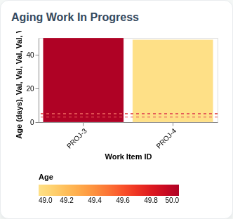
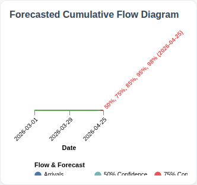
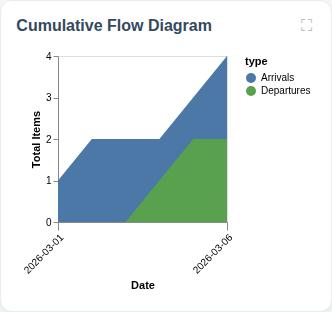
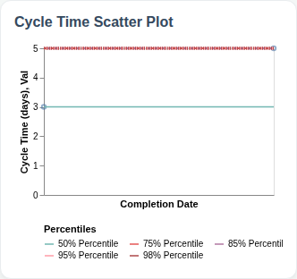
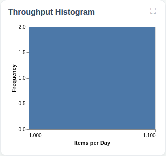

# Full Predictability Dashboard

## Flow Metrics Summary

* **Total Items:** 4
* **Completed Items:** 2
* **Average Throughput:** 1.0 items/day

### Aging WIP Summary

* **Active WIP:** 2 items
* **Average WIP Age:** 49.5 days
* **Oldest Item Age:** 50 days

### Cycle Time Percentiles

* **50th Percentile:** 3 days
* **75th Percentile:** 5 days
* **85th Percentile:** 5 days
* **95th Percentile:** 5 days
* **98th Percentile:** 5 days

## Aging Work In Progress

## Forecasted Cumulative Flow Diagram

## Cumulative Flow Diagram

## Cycle Time Scatter Plot

## Throughput Histogram
