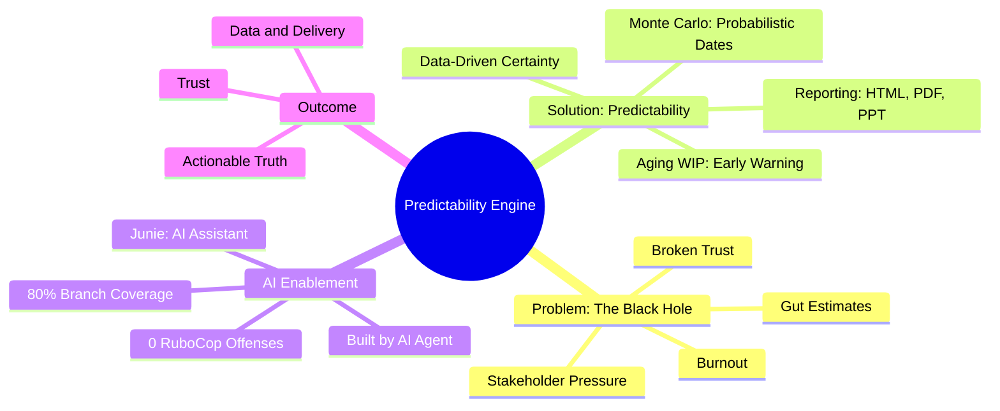

# The Predictability Engine: A 3-Minute Pitch

## 1. The Story: The "Black Hole" of Delivery

We’ve all been there. It’s Monday morning, and your stakeholder asks the one question that makes every engineer’s heart sink: *"When will it be done?"*

Imagine Sarah, a lead developer. She looks at her team’s Jira board. It's a sea of tickets. She estimates, adds a "buffer," and says, *"Three weeks."* But Sarah is guessing. She’s fighting "The Black Hole"—that place where work enters, but its exit date is a mystery. 

Three weeks pass. The project is 60% done. The stakeholder is frustrated, and Sarah’s team is burnt out. Trust is broken. This happens because most teams are using "Estimates and Excuses" instead of "Data and Delivery."

## 2. The Solution: Predictability as a Service

This is why we built the **Predictability Engine**. We wanted to replace "gut feelings" with "data-driven certainty."

The Predictability Engine isn't just a dashboard; it’s a high-precision tool for modern delivery teams. It takes your raw Jira or CSV data and transforms it into actionable insights using the same statistical models used in high-frequency trading and weather forecasting.

- **Monte Carlo Simulations:** We don't just give you a date; we give you a probability. *"There is an 85% chance we finish by May 15th."*
- **Aging WIP Analysis:** We find the tickets that are "dying" in your process before they become delays.
- **Harmonized Reporting:** One command generates a full landscape dashboard in HTML, PDF, or even a single-slide PowerPoint for your executives.

## 3. How AI Enables Us: The Force Multiplier

But here is the real story: **This entire engine was built by an AI Agent.** 

By leveraging Agentic AI, we achieved in days what traditional development cycles take months to do. We didn't just write code; we enforced **0 RuboCop offenses** and **80%+ branch coverage** from the very first commit. The AI didn't just build the engine; it **lives inside it**. 

With our integrated AI assistant, you don’t need to be a data scientist to understand your flow. You can ask: *"Junie, why did our throughput drop last week?"* or *"Which items are at risk of missing our 85% SLE?"* and get an instant, intelligent response.

## Summary: Hierarchical Breakdown

- **The Problem: "The Black Hole"**
  - Monday morning stakeholder queries
  - Gut-based estimation ("Sarah's Guess")
  - Arbitrary buffers
  - Truncated progress (e.g., "60% done")
  - Broken trust & burnout
  - "Estimates and Excuses" culture

- **The Solution: Predictability as a Service**
  - Data-driven certainty vs. gut feelings
  - High-precision modern delivery tool
  - Jira/CSV raw data transformation
  - High-frequency trading/weather models
  - **Key Features:**
    - **Monte Carlo Simulations:** Probabilistic dates (e.g., "85% chance")
    - **Aging WIP Analysis:** Early detection of "dying" work
    - **Harmonized Reporting:** One-command HTML/PDF/PPT dashboards

- **The Force Multiplier: Agentic AI**
  - Built by AI Agent in days (not months)
  - Quality enforcement:
    - 0 RuboCop offenses
    - 80%+ branch coverage
  - Integrated AI Assistant (Junie):
    - Natural language queries
    - Root cause analysis
    - SLE risk monitoring

- **Call to Action: Stop Guessing**
  - Transition: "Estimates and Excuses" -> "Data and Delivery"
  - Actionable Truth
  - Trust through data points

## Visual Mindmap (Mermaid)

